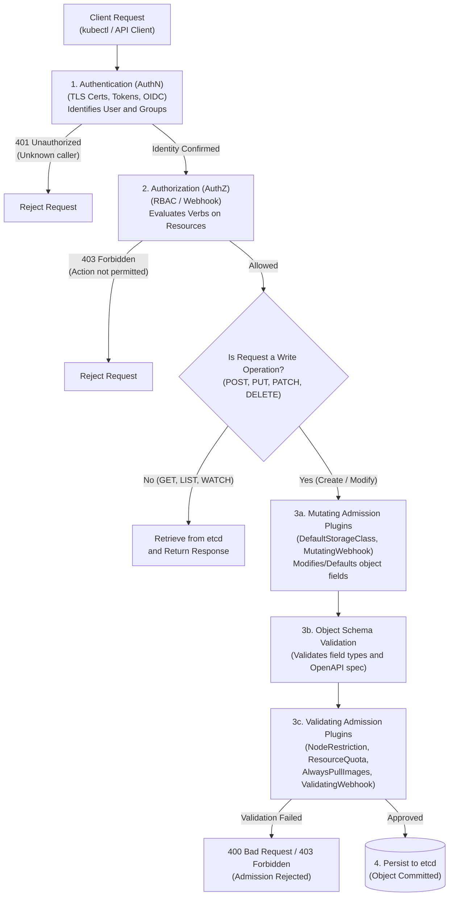
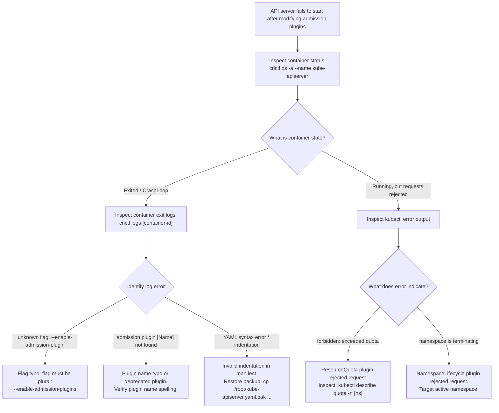

# Kubernetes Admission Controllers & API Request Lifecycle - CKA Exam Notes

> **Exam Domain**: Cluster Architecture, Installation & Configuration (25%) / Security & Scheduling  
> **Weight / Importance**: High (Foundational security and governance mechanism tested via `kube-apiserver` static pod configuration, enabling/disabling built-in plugins, and diagnosing admission rejections)  
> **Target Version**: Verified against v1.31 / v1.32 (Current CKA Curriculum)  
> **Allowed Docs Search Keywords**: `Admission Controllers`, `enable-admission-plugins`, `NodeRestriction`, `DefaultStorageClass`, `AlwaysPullImages`  
> **Source**: Generated from `scheduling/12-admission-controller-raw.md`

---

## 1. Quick-Reference Summary

- **API Server Request Processing Pipeline**:
  - Every API request targeting a state change (`POST`, `PUT`, `PATCH`, `DELETE`) passes through a strict sequential pipeline:
    $$\text{Authentication (AuthN)} \longrightarrow \text{Authorization (AuthZ / RBAC)} \longrightarrow \text{Admission Control} \longrightarrow \text{Schema Validation} \longrightarrow \text{etcd}$$
- **Read Requests Bypass Admission Control**:
  - Read-only operations (`GET`, `LIST`, `WATCH`) undergo Authentication and Authorization, but **completely bypass Admission Controllers**.
- **Why RBAC Alone is Insufficient**:
  - **RBAC regulates API verbs on resource types**: It checks *who* can execute *what verb* (`create`, `delete`, `get`) on *which resource* (`pods`, `services`) in a given namespace or resource name.
  - **RBAC cannot inspect object content**: RBAC cannot enforce that containers do not run as root (`runAsUser: 0`), cannot restrict image registries, cannot enforce CPU/memory limits, and cannot mutate default storage classes or inject sidecars. Admission controllers bridge this gap.
- **Two Admission Phases**:
  - **Mutating Phase**: Modifies or defaults object specs (runs sequentially first).
  - **Validating Phase**: Evaluates final object specs against policies and allows or rejects the request (runs in parallel second).
- **Core Built-in Admission Plugins**:
  - **`NodeRestriction`**: Limits Kubelet authority; prevents compromised nodes from modifying other nodes or pods.
  - **`NamespaceLifecycle`**: Rejects requests to non-existent or terminating namespaces; protects default system namespaces. (Replaces legacy `NamespaceExists`).
  - **`DefaultStorageClass`**: Automatically injects `storageClassName` into PVCs if omitted.
  - **`AlwaysPullImages`**: Mutates `imagePullPolicy` to `Always` to enforce authentication on shared node image caches.
  - **`ResourceQuota`** & **`LimitRanger`**: Enforce compute limits and namespace quotas.
- **Configuring `kube-apiserver`**:
  - Add plugins: `--enable-admission-plugins=NodeRestriction,AlwaysPullImages`
  - Remove plugins: `--disable-admission-plugins=DefaultStorageClass`
  - Manifest path: `/etc/kubernetes/manifests/kube-apiserver.yaml`

---

## 2. Conceptual Overview & Mental Model

### Dual-Layer Architectural Understanding

- **Simple English Explanation (How It Works)**:
  - **The Multi-Stage Gatekeeper Model**:
    When an operator or automated system executes `kubectl apply -f pod.yaml`, the client sends an HTTP request containing a JSON payload to `kube-apiserver`.
    Before that payload can be saved into the cluster's persistent `etcd` database, it must clear three distinct verification gates:
    1. **Authentication (AuthN)**: Answers *"Who is making the request?"* The API server verifies the caller's TLS client certificate, bearer token, or webhook signature. If valid, the request is stamped with a User identity (e.g., `system:admin` or `jane`) and Groups.
    2. **Authorization (AuthZ / RBAC)**: Answers *"Does this identity have permission to perform this action?"* The API server evaluates Role-Based Access Control rules to determine whether the user is permitted to perform the HTTP verb (`create`) on the requested resource endpoint (`pods` in namespace `default`).
    3. **Admission Control**: Answers *"Is the actual content of this object permissible, and does it require modification?"* The API server passes the deserialized object body through active admission plugins. Plugins can mutate the object (e.g., inject default values or sidecars) or validate the object (e.g., verify that resource quotas are not exceeded and privileged security flags are absent).
    4. **etcd Persistence**: Only when every gate approves is the object written to `etcd`.



- **Standard / Production Definition**:
  - **Admission Controller**: A compiled-in software module inside `kube-apiserver` that intercepts authenticated and authorized API requests prior to object persistence in `etcd`. Admission controllers operate in two phases—mutating and validating—to enforce governance policies, inject configuration defaults, enforce security boundaries, and validate complex resource relationships that cannot be expressed via standard RBAC rules.

---

## 3. Deep-Dive Technical Breakdown

### 3.1 The Security Flow: Securing Kubernetes


Every administrative action or workload deployment follows an end-to-end chain of trust from the client terminal to the control plane.

#### Phase 1: Authentication (AuthN)


- Determines the authenticated user, UID, and group memberships.
- Primary mechanisms:
  - **X.509 Client Certificates**: Common in `kubeconfig` files (`client-certificate-data` and `client-key-data`). The certificate's `CN` (Common Name) represents the Username (e.g. `CN=system:node:worker-1`), and `O` (Organization) fields represent Groups (e.g. `O=system:nodes`).
  - **Bearer Tokens**: ServiceAccount tokens (`JWT`), bootstrap tokens, or static token files.
  - **OpenID Connect (OIDC)**: Integration with external identity providers (Google, Okta, Azure AD).
  - **Webhook Token Authentication**: Delegates verification to an external HTTP webhook service.

---

#### Phase 2: Authorization (AuthZ) & RBAC


Kubernetes evaluates the authenticated identity against active authorization modes configured via `--authorization-mode=Node,RBAC`:
- **Node Authorization**: Dedicated authorizer for Kubelets to access their assigned pods, secrets, and configmaps.
- **RBAC (Role-Based Access Control)**: Regulates access via `Roles`, `ClusterRoles`, `RoleBindings`, and `ClusterRoleBindings`.

```yaml
# developer-role.yaml
apiVersion: rbac.authorization.k8s.io/v1
kind: Role
metadata:
  namespace: default
  name: developer
rules:
  - apiGroups: [""]
    resources: ["pods"]
    verbs: ["list", "get", "create", "update", "delete"]
```


RBAC can constrain actions by:
- **API Group**: Core (`""`), `apps`, `batch`, `networking.k8s.io`, etc.
- **Resources**: `pods`, `services`, `deployments`, `persistentvolumeclaims`.
- **Verbs**: `get`, `list`, `watch`, `create`, `update`, `patch`, `delete`.
- **Resource Names**: Restricting operations to specific named instances (e.g. `resourceNames: ["blue", "orange"]`).

---

#### Phase 3: The Critical Limitations of RBAC


While RBAC excels at answering *"Can user Jane create pods in the production namespace?"*, it is structurally blind to the contents of the pod specification:

| Security / Governance Requirement | Can RBAC Enforce This? | Why RBAC Fails | How Admission Controllers Solve This |
| :--- | :--- | :--- | :--- |
| **Block Root Containers** (`runAsUser: 0`) | **No** | RBAC checks only verbs (`create`) on resource types (`pods`). | `ValidatingAdmissionPolicy` or validating webhooks inspect `spec.securityContext.runAsUser`. |
| **Allowed Image Registries** (e.g. `corp.io/*` only) | **No** | RBAC cannot parse container image strings. | Admission controllers parse container images and reject untrusted registries. |
| **Inject Default StorageClass** | **No** | RBAC cannot modify incoming request payloads. | `DefaultStorageClass` mutates the PVC spec before writing to etcd. |
| **Enforce Resource Quotas** | **No** | RBAC does not track aggregate cluster or namespace CPU/RAM usage. | `ResourceQuota` counts existing compute usage and blocks pods exceeding quotas. |
| **Prevent Node Compromise Escalation** | **No** | RBAC cannot restrict which node-specific labels a Kubelet can modify. | `NodeRestriction` blocks Kubelets from altering labels outside their authority. |

---

### 3.2 Built-in Admission Controllers


Kubernetes ships with a rich suite of compiled-in admission controllers:

| Admission Plugin | Phase | Default Status | Concrete Role & Operational Mechanics |
| :--- | :--- | :--- | :--- |
| **`NodeRestriction`** | Validating | **Enabled** | Restricts Kubelet API permissions. Kubelets can only modify their own `Node` API object and pods scheduled to their node. Prevents compromised worker nodes from altering cluster-wide state or stealing secrets. |
| **`NamespaceLifecycle`** | Validating | **Enabled** | Enforces that no new objects are scheduled into terminating namespaces. Prevents deletion of protected namespaces (`default`, `kube-system`, `kube-public`). |
| **`DefaultStorageClass`** | Mutating | **Enabled** | Observes PVC creation requests omitting `spec.storageClassName` and automatically populates the field with the cluster's default `StorageClass`. |
| **`DefaultTolerationSeconds`** | Mutating | **Enabled** | Automatically injects a 300-second toleration for `node.kubernetes.io/not-ready` and `node.kubernetes.io/unreachable` onto pods lacking explicit eviction tolerations. |
| **`AlwaysPullImages`** | Mutating & Validating | *Disabled* | Mutates every pod's `imagePullPolicy` to `Always`. Critical in multi-tenant clusters so users cannot bypass image pull authentication by referencing images cached on shared worker nodes. |
| **`LimitRanger`** | Mutating & Validating | **Enabled** | Enforces container CPU/memory constraints defined in namespace `LimitRange` objects; injects default resource requests/limits if omitted. |
| **`ResourceQuota`** | Validating | **Enabled** | Evaluates total CPU, memory, and object count across the namespace; rejects pod creation if namespace quotas would be exceeded. |
| **`ServiceAccount`** | Mutating & Validating | **Enabled** | Automatically assigns `serviceAccountName: default` and mounts projected ServiceAccount tokens if the pod omits explicit credentials. |
| **`EventRateLimit`** | Validating | *Disabled* | Enforces token-bucket rate limits on `Event` creation requests to defend the API server and etcd against event-flooding denial-of-service attacks. |
| **`NamespaceAutoProvision`** | Mutating | *Deprecated* | Automatically created namespaces if a pod targeted a non-existent namespace. (Disabled and discouraged in modern production clusters). |

---

### 3.3 Enabling and Disabling Plugins in `kube-apiserver`


Admission plugins are configured directly as command-line arguments on the `kube-apiserver` process:

#### In a Kubeadm Cluster (Static Pod Manifest)
Edit `/etc/kubernetes/manifests/kube-apiserver.yaml`:
```yaml
apiVersion: v1
kind: Pod
metadata:
  name: kube-apiserver
  namespace: kube-system
spec:
  containers:
  - command:
    - kube-apiserver
    - --authorization-mode=Node,RBAC
    - --advertise-address=192.168.1.10
    - --enable-admission-plugins=NodeRestriction,AlwaysPullImages
    - --disable-admission-plugins=DefaultStorageClass
    image: registry.k8s.io/kube-apiserver:v1.31.0
    name: kube-apiserver
```

#### In a Hard-Way / Systemd Cluster
Edit `/etc/systemd/system/kube-apiserver.service`:
```ini
[Service]
ExecStart=/usr/local/bin/kube-apiserver \
  --authorization-mode=Node,RBAC \
  --enable-admission-plugins=NodeRestriction,AlwaysPullImages \
  --disable-admission-plugins=DefaultStorageClass \
  --v=2
```

---

## 4. Declarative Manifests & Scaffolding Patterns

### Complete Workflow: Enabling and Verifying `AlwaysPullImages`

#### Step 1: Backup Existing API Server Manifest
Before editing static pod manifests in an exam or production environment, always create a safe backup:
```bash
cp /etc/kubernetes/manifests/kube-apiserver.yaml /root/kube-apiserver.yaml.bak
```

#### Step 2: Add Admission Plugin Flag
Edit `/etc/kubernetes/manifests/kube-apiserver.yaml` and locate `--enable-admission-plugins`:
```yaml
    - --enable-admission-plugins=NodeRestriction,AlwaysPullImages
```

#### Step 3: Monitor Static Pod Restart
The host Kubelet detects manifest file modifications within seconds:
```bash
# Watch API server container restart via crictl:
crictl ps --name kube-apiserver

# Wait for kubectl to return healthy:
kubectl get nodes
```

#### Step 4: Verify Plugin in Action
Create a test pod without declaring `imagePullPolicy`:
```yaml
# test-pod.yaml
apiVersion: v1
kind: Pod
metadata:
  name: test-pull-policy
spec:
  containers:
  - name: web
    image: nginx:alpine
```
```bash
kubectl apply -f test-pod.yaml
kubectl get pod test-pull-policy -o jsonpath='{.spec.containers[0].imagePullPolicy}{"\n"}'
# Output: Always (Mutated automatically by AlwaysPullImages!)
```

---

## 5. Command Translation & Operational Mapping Tables

### Comparison of API Request Evaluation Stages

| Evaluation Gate | Primary Question Answered | Operational Scope | Can It Modify Objects? | Triggered on Read Ops? (`GET`/`LIST`) |
| :--- | :--- | :--- | :--- | :--- |
| **Authentication** | *Who are you?* | User identity, Groups, UID | No | **Yes** |
| **Authorization** | *What verbs can you execute?* | Verbs on resource endpoints | No | **Yes** |
| **Mutating Admission** | *How should this object be populated?* | Object specification / defaults | **Yes** (Mutates YAML) | **No** (Write ops only) |
| **Schema Validation** | *Is the YAML schema syntactically valid?* | Field types, OpenAPI constraints | No | **No** (Write ops only) |
| **Validating Admission** | *Is the object content legally permissible?* | Governance, quotas, security | No (Allow or Deny only) | **No** (Write ops only) |

---

## 6. High-Yield CLI & Verification Commands

```bash
# 1. View compiled-in default admission plugins supported by the binary
kube-apiserver -h | grep enable-admission-plugins

# 2. View active admission plugins configured on running API server pod
kubectl describe pod -n kube-system kube-apiserver-control-plane | grep enable-admission-plugins

# 3. Alternative verification directly from the manifest file
grep -E "enable-admission-plugins|disable-admission-plugins" /etc/kubernetes/manifests/kube-apiserver.yaml

# 4. View active plugins from running process table (useful if control plane is external)
ps aux | grep kube-apiserver | grep -o -- "--enable-admission-plugins=[^ ]*"

# 5. Check API server logs for admission rejection events
kubectl logs -n kube-system kube-apiserver-control-plane | grep -i "admission"
```

---

## 7. Troubleshooting & Diagnostic Runbook

### Decision Tree: Troubleshooting API Server Admission Failures



### Step-by-Step Triage Sequence

#### Scenario: API Server Disappears After Adding an Admission Plugin
1. **Symptom**: `kubectl get nodes` returns `The connection to the server <ip>:6443 was refused`.
2. **Investigation**:
   - Because `kube-apiserver` is dead, `kubectl` cannot connect. You must triage at the host OS level using `crictl`:
     ```bash
     crictl ps -a --name kube-apiserver
     ```
   - Extract the container ID of the most recent exited container:
     ```bash
     crictl logs <container-id>
     ```
3. **Common Root Causes**:
   - **Pluralization Typo**: Using `--enable-admission-plugin` (singular) instead of `--enable-admission-plugins` (plural).
   - **Invalid Plugin Name**: Specifying a non-existent or miscapitalized plugin (e.g., `NodeRestrictions` with a trailing `s`).
   - **YAML Formatting**: Adding a tab instead of spaces, or misaligning the hyphen under `- command:`.
4. **Recovery**:
   - Correct the flag in `/etc/kubernetes/manifests/kube-apiserver.yaml` or restore `/root/kube-apiserver.yaml.bak`.
   - Kubelet will automatically detect the fixed manifest and launch a healthy API server instance within 10–20 seconds.

---

## 8. CKA Exam Tips, Gotchas & Traps

> [!WARNING]
> **Static Pod Modification Caution**:
> When modifying `/etc/kubernetes/manifests/kube-apiserver.yaml` during an exam, **any syntax error will crash the API server**, rendering `kubectl` completely non-functional! Always maintain a backup copy outside the manifests folder (`cp ... /root/`).

> [!IMPORTANT]
> **Flag Spelling: Plural vs. Singular**:
> The command-line flags are strictly **plural**:
> - `--enable-admission-plugins` (NOT `--enable-admission-plugin`)
> - `--disable-admission-plugins` (NOT `--disable-admission-plugin`)

> [!TIP]
> **Comma-Separated Lists Without Spaces**:
> When enabling multiple plugins, format them as a single comma-separated string without spaces:
> `--enable-admission-plugins=NodeRestriction,AlwaysPullImages`  
> Adding a space after a comma will truncate the command argument and crash the process.

> [!CAUTION]
> **Read Operations Bypass Admission Controllers**:
> Remember for conceptual and diagnostic questions: `GET`, `LIST`, and `WATCH` calls **never touch admission controllers**. If an unauthorized read is succeeding, check your **RBAC RoleBindings**, not admission controllers!

---

## 9. Self-Test / Active Recall

1. **What is the exact order of the three main gates that a write request passes through in `kube-apiserver` before persisting to `etcd`?**
2. **Do `kubectl get pods` and `kubectl logs` requests get evaluated by admission controllers? Why or why not?**
3. **What is the fundamental limitation of RBAC that makes admission controllers necessary in a secure cluster?**
4. **What is the key functional difference between a Mutating admission controller and a Validating admission controller?**
5. **Which admission controller is responsible for ensuring that a compromised worker node cannot modify resources outside its assigned boundaries?**
6. **If you want every Pod deployed to a cluster to always pull its container image regardless of what the user specified, which admission plugin should you enable?**
7. **Which flag is passed to the `kube-apiserver` binary to disable a default built-in plugin like `DefaultStorageClass`?**

<details>
<summary>Reveal Answers</summary>

1. Authentication $\rightarrow$ Authorization $\rightarrow$ Admission Control (followed by schema validation and etcd persistence).
2. **No.** Read operations (`GET`, `LIST`, `WATCH`) bypass admission control completely because they do not mutate or create cluster state.
3. RBAC only governs API verbs on resource types and names; it cannot inspect, validate, or mutate the actual content/fields inside an object's specification (e.g. blocking root users, enforcing registries).
4. Mutating controllers run first and can modify/default fields within the object. Validating controllers run second and can only allow or deny (reject) the request; they cannot mutate fields.
5. `NodeRestriction`.
6. `AlwaysPullImages`.
7. `--disable-admission-plugins=DefaultStorageClass`.
</details>

---

### Official Documentation Bookmarks

Allowed for reference during the live exam at [kubernetes.io/docs](https://kubernetes.io/docs/home/):

| Topic | Direct Search Term | Recommended Anchor |
| :--- | :--- | :--- |
| **Admission Controllers** | `Admission Controllers Reference` | Reference > Accessing the API > Admission Controllers |
| **Enabling Admission Plugins** | `enable-admission-plugins` | Reference > Accessing the API > Using Admission Controllers |
| **NodeRestriction** | `NodeRestriction plugin` | Reference > Accessing the API > Admission Controllers > NodeRestriction |
| **AlwaysPullImages** | `AlwaysPullImages plugin` | Reference > Accessing the API > Admission Controllers > AlwaysPullImages |
