# Validating & Mutating Admission Webhooks - CKA Exam Notes

> **Exam Domain**: Cluster Architecture, Installation & Configuration (25%) / Security & Scheduling  
> **Weight / Importance**: High (Core Kubernetes extensibility and security topic testing your ability to configure, secure, and debug dynamic admission webhooks)  
> **Target Version**: Verified against v1.31 / v1.32 (Current CKA Curriculum)  
> **Allowed Docs Search Keywords**: `Dynamic Admission Control`, `ValidatingWebhookConfiguration`, `MutatingWebhookConfiguration`, `AdmissionReview`, `caBundle`  
> **Source**: Generated from `scheduling/13-validating-and-mutating-admission-controller-raw.md`

---

## 1. Quick-Reference Summary

- **Mutating vs. Validating Controllers**:
  - **Mutating Admission Controllers**: Executed **first** in serial order. Can alter, inject defaults, or transform the incoming object specification (e.g., `DefaultStorageClass`, sidecar injection).
  - **Validating Admission Controllers**: Executed **second** in parallel. Evaluates the final (mutated) object against policy rules. Can only **allow or deny** the request; cannot modify the object.
  - **Ordering Rationale**: Mutating controllers must run first so that any modifications they introduce are strictly validated by validating controllers before persisting to `etcd`.
- **Dynamic Admission Webhooks**:
  - While built-in plugins are compiled into `kube-apiserver`, dynamic webhooks allow operators to execute custom validation and mutation logic hosted on HTTP servers.
  - Handled by two built-in plugins: **`MutatingAdmissionWebhook`** and **`ValidatingAdmissionWebhook`**.
- **The AdmissionReview Protocol (`admission.k8s.io/v1`)**:
  - `kube-apiserver` issues an HTTPS `POST` containing an `AdmissionReview` JSON payload with a `request` object (`uid`, `userInfo`, `object`, `oldObject`, `operation`).
  - Webhook responds with an `AdmissionReview` JSON containing a `response` object (`uid`, `allowed: true/false`, optional `status.message`).
  - Mutating responses return an RFC 6902 JSONPatch (`patchType: "JSONPatch"` and a base64-encoded `patch` string).
- **Mandatory TLS & `caBundle`**:
  - Communication between `kube-apiserver` and the webhook server **must use HTTPS/TLS**. Plain HTTP is strictly rejected.
  - The webhook configuration requires a base64-encoded CA certificate in **`clientConfig.caBundle`** so the API server can verify the webhook's TLS certificate.
- **Critical Configuration Fields (`admissionregistration.k8s.io/v1`)**:
  - **`failurePolicy`**: `Fail` (default: request is rejected if webhook is unreachable) vs. `Ignore` (request proceeds if webhook fails).
  - **`admissionReviewVersions`**: Mandatory array (must include `["v1"]`).
  - **`sideEffects`**: Mandatory field (standard value: `None`).
  - **`namespaceSelector`**: Excludes system namespaces (`kube-system`) to prevent circular deadlocks.

---

## 2. Conceptual Overview & Mental Model

### Dual-Layer Architectural Understanding

- **Simple English Explanation (How It Works)**:
  - **Why Dynamic Webhooks are Needed**:
    Built-in admission controllers (like `NodeRestriction` or `ResourceQuota`) are hardcoded inside the `kube-apiserver` binary. If your organization requires custom enterprise rules—such as requiring every pod to declare a billing cost-center tag, prohibiting ../Images from unapproved registries, or automatically injecting an Envoy sidecar container—you cannot recompile the Kubernetes source code.
  - **How Kubernetes Delegates to Webhooks**:
    Kubernetes provides an HTTP callback mechanism called **Dynamic Admission Control**:
    1. An operator creates an admission configuration resource in the cluster (`ValidatingWebhookConfiguration` or `MutatingWebhookConfiguration`).
    2. When a user submits a resource matching the configuration's rules (e.g. creating a Pod), `kube-apiserver` intercepts the request after Authentication and Authorization.
    3. The API server bundles the requested YAML specification into a structured JSON payload called an **`AdmissionReview`** and sends an HTTPS `POST` request to the configured Webhook Server.
    4. The webhook server runs custom code, inspects the payload, and returns a JSON decision:
       - **Validating Webhook**: Returns `allowed: true` to accept, or `allowed: false` with an explanatory message to abort the `kubectl` command.
       - **Mutating Webhook**: Returns a list of JSONPatch operations that dynamically modify the object before it reaches the validating phase.

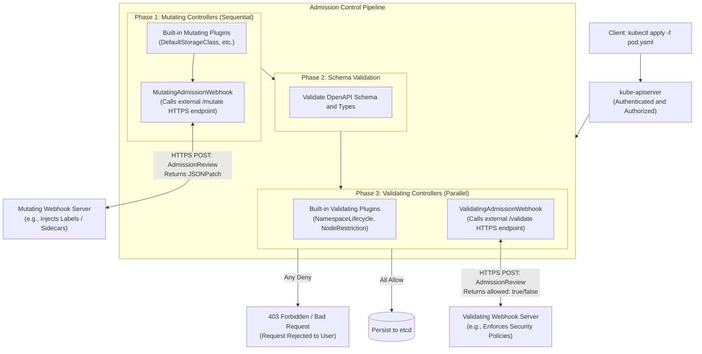

- **Standard / Production Definition**:
  - **Dynamic Admission Webhook**: An HTTP callback mechanism governed by `MutatingWebhookConfiguration` and `ValidatingWebhookConfiguration` API resources. It allows external HTTP services to intercept, mutate, and validate Kubernetes API objects prior to persistence in `etcd`, enabling extensible policy enforcement, governance, and automated workload injection.

---

## 3. Deep-Dive Technical Breakdown

### 3.1 Mutating vs. Validating Admission Controllers

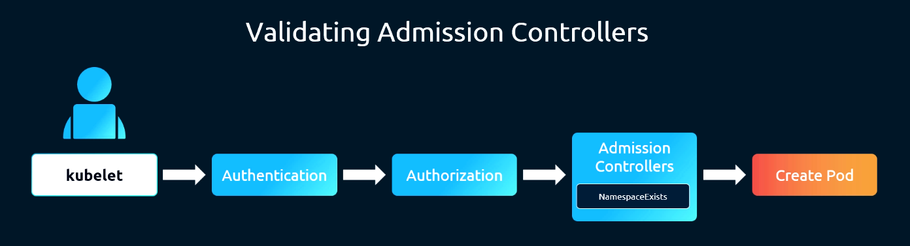
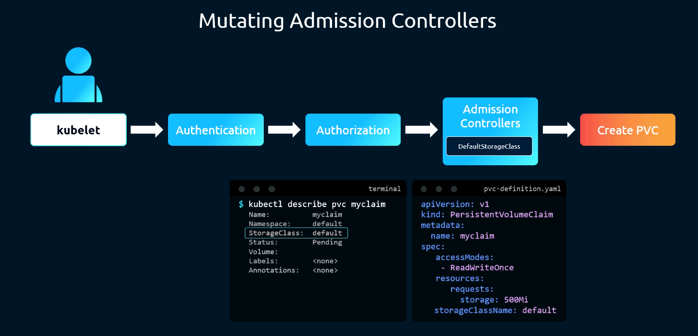
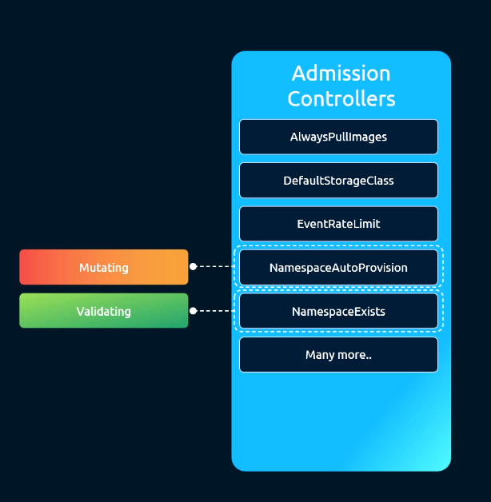

The admission pipeline strictly separates object mutation from object validation:

| Attribute | Mutating Admission Phase | Validating Admission Phase |
| :--- | :--- | :--- |
| **Execution Order** | **Runs First** | **Runs Second** |
| **Execution Concurrency** | Serial / Sequential (mutations cascade) | Parallel (all run concurrently) |
| **Primary Capability** | Can modify, inject defaults, or transform object fields | Can only evaluate final object; cannot modify fields |
| **Response Payload** | Returns `allowed: true/false` + JSONPatch array | Returns `allowed: true/false` + error message |
| **Built-in Examples** | `DefaultStorageClass`, `DefaultTolerationSeconds` | `NamespaceLifecycle`, `NodeRestriction`, `ResourceQuota` |
| **Webhook Object** | `MutatingWebhookConfiguration` | `ValidatingWebhookConfiguration` |

> [!IMPORTANT]
> **Why Mutating Runs First**:
> If a mutating webhook injects a sidecar container, an environment variable, or a storage class, that newly injected data **must be verified** by validating admission controllers (e.g., checking that the sidecar image doesn't violate registry policies, or that the storage class exists).

---

### 3.2 The AdmissionReview Protocol & Request/Response Contract

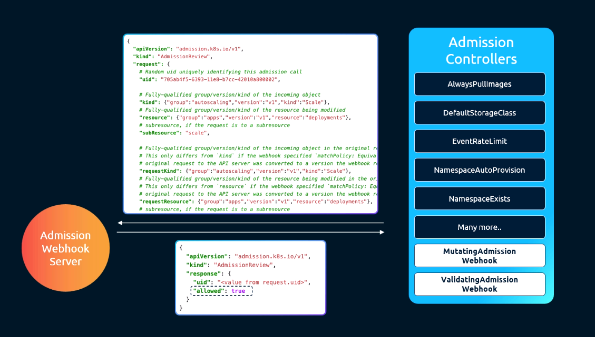

When `kube-apiserver` contacts a webhook, both the request and response wrap within the `admission.k8s.io/v1` `AdmissionReview` structure.

#### 1. Incoming Request Payload (Sent by API Server)
```json
{
  "apiVersion": "admission.k8s.io/v1",
  "kind": "AdmissionReview",
  "request": {
    "uid": "705ab4f5-6393-11e8-b7cc-42010a800002",
    "kind": { "group": "", "version": "v1", "kind": "Pod" },
    "resource": { "group": "", "version": "v1", "resource": "pods" },
    "subResource": "",
    "requestKind": { "group": "", "version": "v1", "kind": "Pod" },
    "requestResource": { "group": "", "version": "v1", "resource": "pods" },
    "name": "my-app",
    "namespace": "default",
    "operation": "CREATE",
    "userInfo": {
      "username": "jane",
      "groups": ["system:authenticated"]
    },
    "object": {
      "apiVersion": "v1",
      "kind": "Pod",
      "metadata": { "name": "my-app", "namespace": "default" },
      "spec": {
        "containers": [{ "name": "nginx", "image": "nginx:latest" }]
      }
    },
    "oldObject": null,
    "dryRun": false
  }
}
```

#### 2. Validating Webhook Response Payload
```json
{
  "apiVersion": "admission.k8s.io/v1",
  "kind": "AdmissionReview",
  "response": {
    "uid": "705ab4f5-6393-11e8-b7cc-42010a800002",
    "allowed": false,
    "status": {
      "code": 403,
      "message": "../Images with tag ':latest' are strictly prohibited in production."
    }
  }
}
```

#### 3. Mutating Webhook Response Payload (RFC 6902 JSONPatch)
A mutating webhook returns an array of JSONPatch operations, which must be **base64-encoded** in the response:
- Plain JSONPatch:
  ```json
  [
    { "op": "add", "path": "/metadata/labels/environment", "value": "production" }
  ]
  ```
- Resulting `AdmissionReview` response:
  ```json
  {
    "apiVersion": "admission.k8s.io/v1",
    "kind": "AdmissionReview",
    "response": {
      "uid": "705ab4f5-6393-11e8-b7cc-42010a800002",
      "allowed": true,
      "patchType": "JSONPatch",
      "patch": "W3sib3AiOiAiYWRkIiwgInBhdGgiOiAiL21ldGFkYXRhL2xhYmVscy9lbnZpcm9ubWVudCIsICJ2YWx1ZSI6ICJwcm9kdWN0aW9uIn1d"
    }
  }
  ```

---

### 3.3 Webhook Server Implementation (Python Flask Walkthrough)

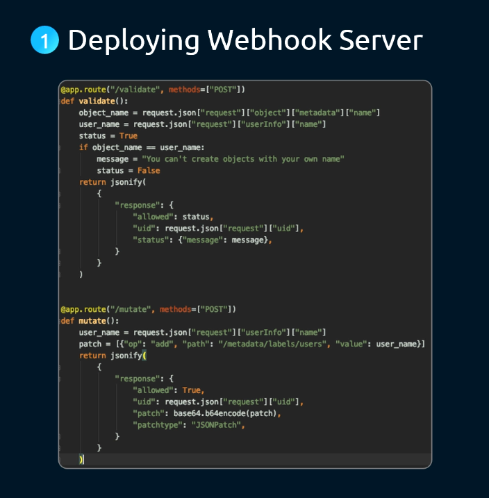

A lightweight webhook server implementing both validation and mutation endpoints using Python Flask:

```python
from flask import Flask, request, jsonify
import base64
import json

app = Flask(__name__)

# -------------------------------------------------------------
# 1. Validation Route: Blocks pods named after the creator
# -------------------------------------------------------------
@app.route("/validate", methods=["POST"])
def validate():
    req = request.json["request"]
    req_uid = req["uid"]
    obj_name = req["object"]["metadata"].get("name", "")
    user_name = req["userInfo"]["username"]

    if obj_name == user_name:
        return jsonify({
            "apiVersion": "admission.k8s.io/v1",
            "kind": "AdmissionReview",
            "response": {
                "uid": req_uid,
                "allowed": False,
                "status": {
                    "message": "Policy violation: Pod name cannot match username."
                }
            }
        })

    return jsonify({
        "apiVersion": "admission.k8s.io/v1",
        "kind": "AdmissionReview",
        "response": {
            "uid": req_uid,
            "allowed": True
        }
    })

# -------------------------------------------------------------
# 2. Mutation Route: Injects an author label onto the pod
# -------------------------------------------------------------
@app.route("/mutate", methods=["POST"])
def mutate():
    req = request.json["request"]
    req_uid = req["uid"]
    user_name = req["userInfo"]["username"]

    # Construct RFC 6902 JSONPatch operation
    patch_operations = [
        {
            "op": "add",
            "path": "/metadata/labels/created-by",
            "value": user_name
        }
    ]
    
    patch_bytes = json.dumps(patch_operations).encode("utf-8")
    base64_patch = base64.b64encode(patch_bytes).decode("utf-8")

    return jsonify({
        "apiVersion": "admission.k8s.io/v1",
        "kind": "AdmissionReview",
        "response": {
            "uid": req_uid,
            "allowed": True,
            "patchType": "JSONPatch",
            "patch": base64_patch
        }
    })

if __name__ == "__main__":
    # Must serve over HTTPS with valid TLS certificates!
    app.run(host="0.0.0.0", port=8443, ssl_context=("/certs/tls.crt", "/certs/tls.key"))
```

---

### 3.4 Deploying and Exposing the Webhook Server

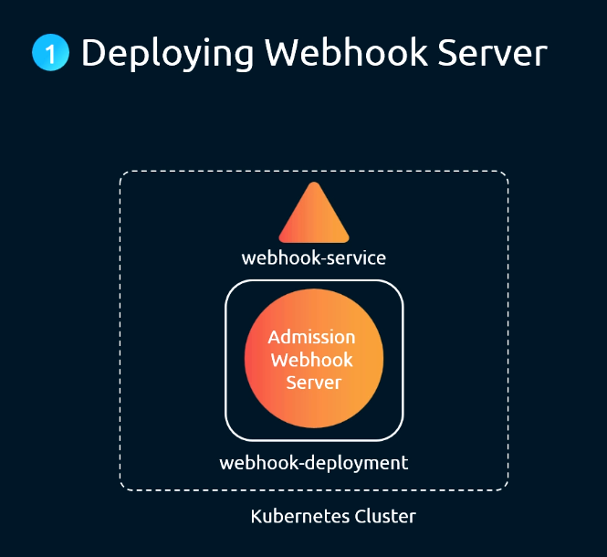

When hosting the webhook server inside the Kubernetes cluster:
1. Containerize the application and deploy it as a `Deployment` inside a dedicated namespace (e.g. `webhook-namespace`).
2. Expose the deployment via a ClusterIP `Service` named `webhook-service` on port `443`.
3. Generate TLS certificates where the **Subject Alternative Name (SAN)** includes:
   `webhook-service.webhook-namespace.svc` and `webhook-service.webhook-namespace.svc.cluster.local`.

---

### 3.5 Webhook Client Configuration: External URL vs. Internal Service

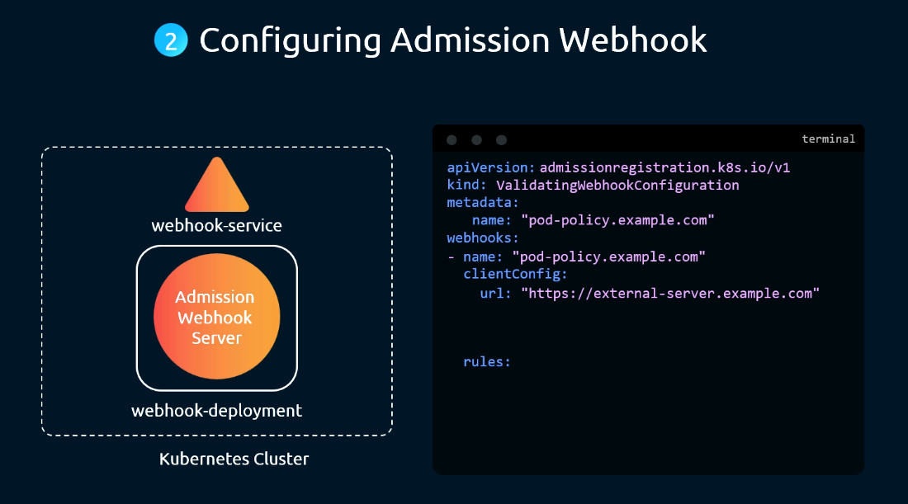
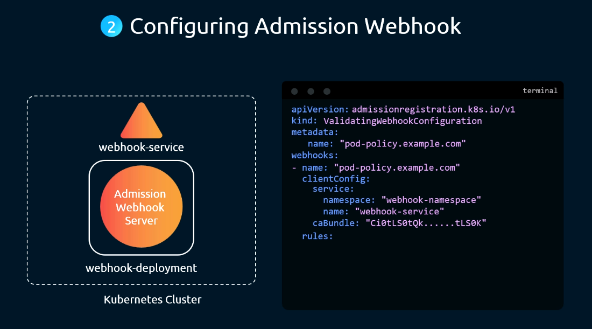

Under `clientConfig`, Kubernetes supports two routing topologies:

#### Option A: External HTTPS Server
```yaml
clientConfig:
  url: "https://external-server.example.com/validate"
  caBundle: "LS0tLS1CRUdJTiBDRVJUSUZJQ0FURS0tLS0tCg=="
```

#### Option B: In-Cluster Service
```yaml
clientConfig:
  service:
    namespace: "webhook-namespace"
    name: "webhook-service"
    path: "/validate"
    port: 443
  caBundle: "LS0tLS1CRUdJTiBDRVJUSUZJQ0FURS0tLS0tCg=="
```

> [!WARNING]
> **The `caBundle` Requirement**:
> `caBundle` is a **base64-encoded PEM certificate string**. It must contain the public CA certificate that signed the webhook server's TLS certificate. If omitted, expired, or invalid, `kube-apiserver` refuses the TLS handshake with `x509: certificate signed by unknown authority`.

---

### 3.6 Scoping Webhook Invocation via Rules

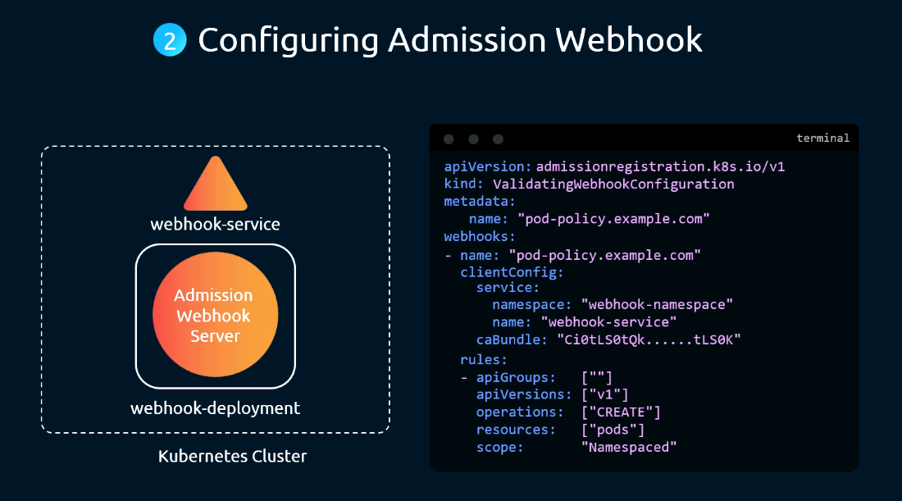

You do not want webhooks executing on every single API request. The `rules` block restricts invocation to target resource operations:

```yaml
rules:
  - operations: ["CREATE", "UPDATE"]
    apiGroups: [""]
    apiVersions: ["v1"]
    resources: ["pods"]
    scope: "Namespaced"                 # Options: Namespaced, Cluster, or *
```

---

## 4. Declarative Manifests & Scaffolding Patterns

### Complete Production Workflow: Registering a Validating Webhook

#### Step 1: Generate CA and Webhook Certificates
```bash
# 1. Generate CA private key and certificate
openssl genrsa -out ca.key 2048
openssl req -x509 -new -nodes -key ca.key -subj "/CN=Admission Webhook CA" -days 365 -out ca.crt

# 2. Generate server private key and CSR with SAN extension
openssl genrsa -out server.key 2048
openssl req -new -key server.key -subj "/CN=webhook-service.webhook-namespace.svc" \
  -config <(cat /etc/ssl/openssl.cnf <(printf "\n[SAN]\nsubjectAltName=DNS:webhook-service.webhook-namespace.svc,DNS:webhook-service.webhook-namespace.svc.cluster.local")) \
  -reqexts SAN -out server.csr

# 3. Sign the server certificate with the CA
openssl x509 -req -in server.csr -CA ca.crt -CAkey ca.key -CAcreateserial -out server.crt -days 365 \
  -extensions SAN -extfile <(printf "\n[SAN]\nsubjectAltName=DNS:webhook-service.webhook-namespace.svc,DNS:webhook-service.webhook-namespace.svc.cluster.local")
```

#### Step 2: Store TLS Certificates in a Secret & Deploy Webhook
```bash
kubectl create namespace webhook-namespace
kubectl create secret tls webhook-certs \
  --cert=server.crt \
  --key=server.key \
  -n webhook-namespace
```

#### Step 3: Extract base64 CA Bundle
```bash
CA_BUNDLE=$(cat ca.crt | base64 -w 0)
echo $CA_BUNDLE
```

#### Step 4: Create the `ValidatingWebhookConfiguration` Manifest
```yaml
# validating-webhook.yaml
apiVersion: admissionregistration.k8s.io/v1
kind: ValidatingWebhookConfiguration
metadata:
  name: "pod-policy.example.com"
webhooks:
  - name: "pod-policy.example.com"
    clientConfig:
      service:
        namespace: "webhook-namespace"
        name: "webhook-service"
        path: "/validate"
        port: 443
      caBundle: "<INSERT_BASE64_CA_BUNDLE_HERE>"
    rules:
      - operations: ["CREATE"]
        apiGroups: [""]
        apiVersions: ["v1"]
        resources: ["pods"]
        scope: "Namespaced"
    admissionReviewVersions: ["v1"]      # Mandatory in v1
    sideEffects: None                    # Mandatory in v1
    timeoutSeconds: 5
    failurePolicy: Fail                  # Options: Fail or Ignore
    namespaceSelector:
      matchExpressions:
        - key: kubernetes.io/metadata.name
          operator: NotIn
          values: ["kube-system", "webhook-namespace"] # Prevent deadlocks!
```

---

## 5. Command Translation & Operational Mapping Tables

### Comparison: `failurePolicy: Fail` vs. `failurePolicy: Ignore`

| Configuration Parameter | `failurePolicy: Fail` (Default) | `failurePolicy: Ignore` |
| :--- | :--- | :--- |
| **Webhook Server Down / Crashed** | API server **rejects** all matching requests with `500 Internal Server Error`. | API server **allows** matching requests through unvalidated. |
| **Timeout Expired ($>10\text{s}$)** | API server **rejects** the request. | API server **allows** the request. |
| **TLS Certificate Error** | API server **rejects** the request. | API server **allows** the request. |
| **Security Posture** | **Fail-Secure** (Guarantees policy compliance; risks cluster outage). | **Fail-Open** (Guarantees cluster availability; risks policy evasion). |
| **Recommended Environment** | High-security production workloads. | Non-critical dev/test clusters or telemetry loggers. |

---

## 6. High-Yield CLI & Verification Commands

```bash
# 1. List all active validating and mutating webhook configurations
kubectl get validatingwebhookconfigurations
kubectl get mutatingwebhookconfigurations

# 2. View details and target service endpoints of a webhook
kubectl describe validatingwebhookconfiguration pod-policy.example.com

# 3. Check logs of the webhook server pod to observe incoming AdmissionReview requests
kubectl logs -n webhook-namespace -l app=webhook-server -f

# 4. Extract and check the caBundle configured on an active webhook
kubectl get validatingwebhookconfiguration pod-policy.example.com \
  -o jsonpath='{.webhooks[0].clientConfig.caBundle}' | base64 -d | openssl x509 -text -noout

# 5. Temporarily disable or delete a broken webhook blocking cluster workloads
kubectl delete validatingwebhookconfiguration pod-policy.example.com
```

---

## 7. Troubleshooting & Diagnostic Runbook

### Decision Tree: Troubleshooting Broken Admission Webhooks

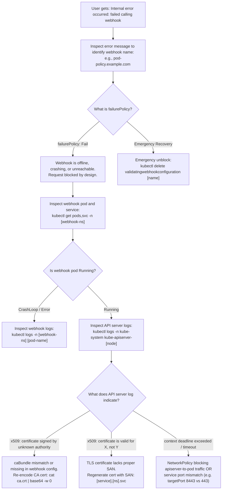

### Step-by-Step Triage Sequence

#### Scenario: Cluster Cannot Create Any Pods Due to Webhook Error
1. **Symptom**: Running `kubectl run test --image=nginx` returns:
   `Error from server (InternalError): Internal error occurred: failed calling webhook "pod-policy.example.com": failed to call webhook: Post "https://webhook-service.webhook-namespace.svc:443/validate": context deadline exceeded`
2. **Investigation**:
   - Check the webhook server pods:
     ```bash
     kubectl get pods -n webhook-namespace
     ```
   - Check if the service endpoints exist:
     ```bash
     kubectl get endpoints webhook-service -n webhook-namespace
     ```
   - If endpoints are empty, verify pod labels match `service.spec.selector`.
3. **Emergency Fix**:
   - If critical workloads are blocked and the webhook service cannot be immediately revived, delete the configuration:
     ```bash
     kubectl delete validatingwebhookconfiguration pod-policy.example.com
     ```

---

## 8. CKA Exam Tips, Gotchas & Traps

> [!CAUTION]
> **The Self-Lockout Circular Dependency Deadlock**:
> If you deploy a validating webhook that validates `pods` across all namespaces without a `namespaceSelector`, and the webhook server pod restarts or gets evicted, **the webhook server pod will fail to reschedule** because the API server attempts to contact the dead webhook to validate its own pod! Always exclude `kube-system` and the webhook's own namespace using `namespaceSelector`.

> [!WARNING]
> **Mandatory Fields in `v1`**:
> If an exam question asks you to write a `ValidatingWebhookConfiguration` using `apiVersion: admissionregistration.k8s.io/v1`:
> - You **must** specify `admissionReviewVersions: ["v1"]` (or `["v1", "v1beta1"]`).
> - You **must** specify `sideEffects: None` (or `NoneOnDryRun`).
> Omitting either field causes immediate API rejection on `kubectl apply`.

> [!IMPORTANT]
> **Base64 Formatting for `caBundle`**:
> When passing the CA certificate into `caBundle`, ensure there are **no line breaks** or wrapping. Use `base64 -w 0`:
> ```bash
> cat ca.crt | base64 -w 0
> ```

> [!TIP]
> **Emergency Bypass via `failurePolicy: Ignore`**:
> If an exam task asks you to diagnose why workloads are failing to deploy, and you discover an unreachable webhook configuration, check if the question allows changing `failurePolicy: Fail` to `failurePolicy: Ignore` to restore cluster operability without deleting the resource.

---

## 9. Self-Test / Active Recall

1. **Why does Kubernetes execute Mutating Admission Controllers before Validating Admission Controllers?**
2. **Which two built-in admission plugins handle dynamic admission webhooks in `kube-apiserver`?**
3. **What JSON top-level object is exchanged between `kube-apiserver` and an admission webhook server?**
4. **What format must a mutating webhook use to express modifications to an object, and how is it encoded in the HTTP response?**
5. **What is the purpose of `clientConfig.caBundle` in a WebhookConfiguration?**
6. **What happens to pod creation requests if a webhook server crashes and its configuration has `failurePolicy: Fail`?**
7. **Which two fields are mandatory under `webhooks[]` in `admissionregistration.k8s.io/v1` that were optional in older beta versions?**

<details>
<summary>Reveal Answers</summary>

1. Because mutations alter the object (injecting sidecars, default labels, or storage classes); the final mutated object must then be evaluated by validating controllers before persisting to etcd.
2. `MutatingAdmissionWebhook` and `ValidatingAdmissionWebhook`.
3. `AdmissionReview` (specifically containing a `request` object on incoming calls, and a `response` object on return).
4. RFC 6902 JSONPatch operations, which must be base64-encoded and returned with `"patchType": "JSONPatch"`.
5. It provides the base64-encoded public CA certificate that signed the webhook server's TLS certificate, enabling the API server to verify the webhook server during the TLS handshake.
6. The API server rejects all pod creation requests with an HTTP 500 / InternalError.
7. `admissionReviewVersions` and `sideEffects`.
</details>

---

### Official Documentation Bookmarks

Allowed for reference during the live exam at [kubernetes.io/docs](https://kubernetes.io/docs/home/):

| Topic | Direct Search Term | Recommended Anchor |
| :--- | :--- | :--- |
| **Dynamic Admission Control** | `Dynamic Admission Control` | Reference > Accessing the API > Dynamic Admission Control |
| **Webhook Configuration** | `ValidatingWebhookConfiguration (v1)` | Reference > Config API > ValidatingWebhookConfiguration (v1) |
| **AdmissionReview Spec** | `AdmissionReview v1` | Reference > Config API > AdmissionReview v1 |
| **A Practical Webhook Guide** | `A Webhook Example` | Reference > Accessing the API > Dynamic Admission Control > A Webhook Example |
