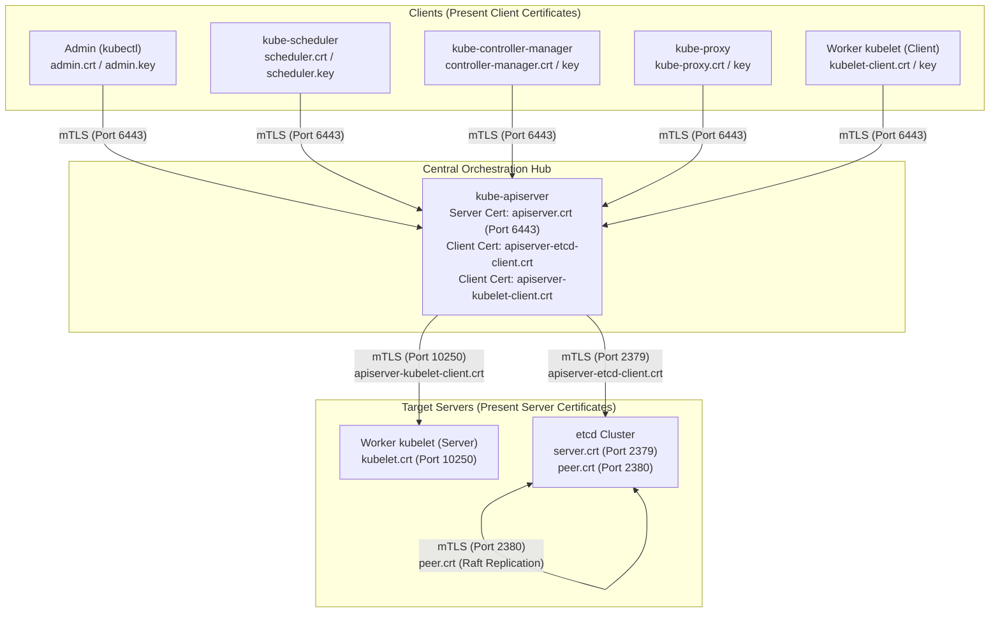
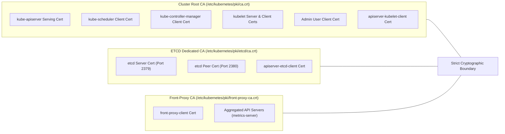
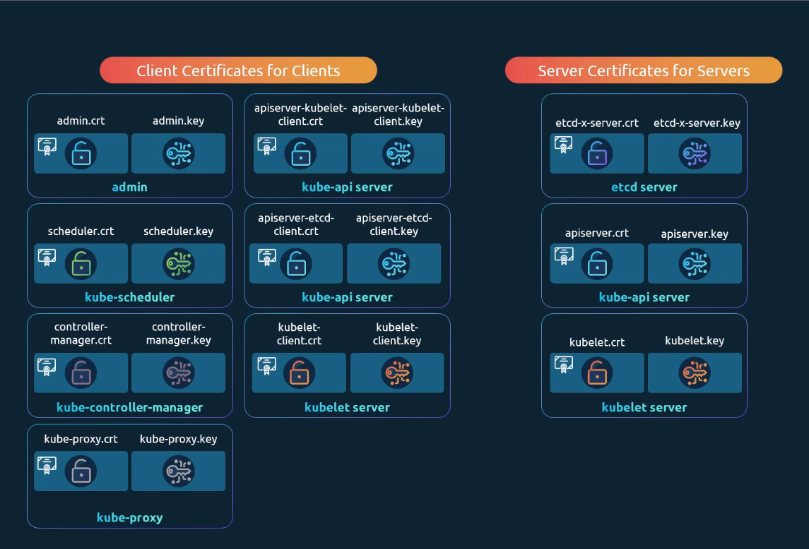
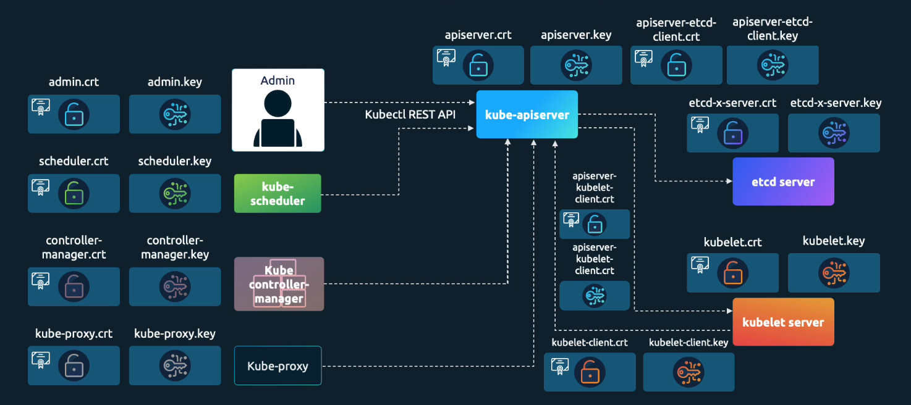
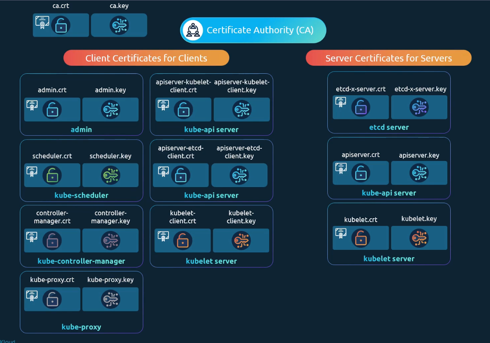
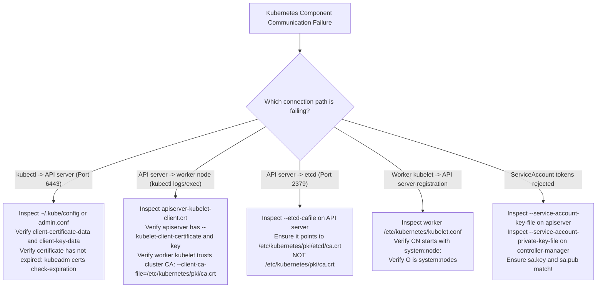

# TLS Architecture & Component Roles in Kubernetes - CKA Exam Notes

> **Exam Domain**: Cluster Architecture, Installation & Configuration (25%) / Cluster Security  
> **Weight / Importance**: Critical (Core theoretical and troubleshooting domain on the CKA exam: understanding the client vs. server roles of every Kubernetes daemon, the multi-CA isolation model, mTLS communication topologies, and certificate paths in `/etc/kubernetes/pki`)  
> **Target Version**: Verified against v1.31 / v1.32 (Current CKA Curriculum)  
> **Allowed Docs Search Keywords**: `PKI certificates and requirements`, `Managing TLS in a Cluster`, `etcd security`, `kubeadm certs`  
> **Source**: Generated from `security/03-TLS-in-kubernetes-raw.md`

---

## 1. Quick-Reference Summary

- **Three Primary Certificate Categories**:
  - **Root CA Certificates**: Cryptographic anchors (`ca.crt`, `etcd/ca.crt`, `front-proxy-ca.crt`). Self-signed; used to sign and validate all server and client certificates across the cluster.
  - **Server Certificates**: Presented by listening daemons to prove identity and terminate incoming TLS connections (`kube-apiserver`, `etcd` server & peer, `kubelet` API on port 10250).
  - **Client Certificates**: Presented by callers to authenticate their identity and RBAC group memberships during mutual TLS (mTLS) handshakes (`kubectl` admin, `kube-scheduler`, `kube-controller-manager`, `kube-proxy`, `kubelet` client, `apiserver-to-kubelet`, `apiserver-to-etcd`).
- **Dual Role of `kube-apiserver`**:
  - Acts as an **HTTPS Server** on port 6443 for `kubectl`, worker `kubelet` daemons, and control plane controllers.
  - Acts as a **TLS Client** when initiating outbound connections to `etcd` (port 2379) and node `kubelet` daemons (port 10250 for `kubectl logs`, `exec`, and metrics).
- **The Multi-CA Isolation Model**:
  - Production and kubeadm clusters use **at least two independent CAs** (and often three):
    1. **Cluster Root CA (`/etc/kubernetes/pki/ca.crt`)**: Signs certificates for the API server, kubelets, scheduler, controller-manager, and cluster administrators.
    2. **ETCD Dedicated CA (`/etc/kubernetes/pki/etcd/ca.crt`)**: Signs certificates exclusively for `etcd` servers, etcd peers, and the API server's etcd client.
    3. **Front-Proxy CA (`/etc/kubernetes/pki/front-proxy-ca.crt`)**: Used by the API Aggregation Layer (e.g., `metrics-server`).
  - *Security Benefit*: Complete blast-radius isolation. A compromise of the cluster CA or a stolen worker node certificate cannot grant direct access to the etcd database.
- **Service Account Signing Keys (`sa.key` / `sa.pub`)**:
  - These are **not X.509 certificates**. They are a raw RSA keypair used by `kube-controller-manager` to cryptographically sign ServiceAccount JWT tokens and by `kube-apiserver` to verify them.
- **File Naming Conventions**:
  - Certificates (public): `.crt` or `.pem` (permissions `0644`).
  - Private Keys (confidential): `.key` or `-key.pem` (permissions `0600`).

---

## 2. Conceptual Overview & Mental Model

### Dual-Layer Architectural Understanding

- **Simple English Explanation (How It Works)**:
  - In a standard web application, security is one-way: your browser checks the server's certificate, but the server does not demand a digital certificate from your computer.
  - Kubernetes operates on a **zero-trust mutual TLS (mTLS) model**. Every component must prove its identity to every other component.
  - Because components both send and receive network requests, they frequently possess two distinct certificates:
    - When a component opens a listening network socket, it needs a **Server Certificate** so clients can verify they reached the genuine service.
    - When a component initiates an outbound network connection, it needs a **Client Certificate** to prove who is knocking on the door.
  - For example, when you run `kubectl logs <pod>`, your `kubectl` client presents a client certificate to the `kube-apiserver`. The API server verifies your certificate, authorizes the request, and then turns around and initiates an outbound connection to the worker node's `kubelet` on port 10250. To talk to `kubelet`, the API server must now act as a client and present its own `apiserver-kubelet-client` certificate.
  - Furthermore, Kubernetes isolates the core database tier (`etcd`) behind a completely separate Certificate Authority. This ensures that even if an attacker manages to forge or steal a certificate trusted by the main cluster, that certificate will be completely rejected by the `etcd` datastore.

- **Formal Kubernetes Definition**:
  - Kubernetes implements a decentralized, multi-tier Public Key Infrastructure (PKI) architecture where control-plane and node components establish transport-level security via mutual TLS (RFC 5246/8446). Identity and access controls are cryptographically coupled: client certificate Subject Attributes (`CN` for User, `O` for Groups) are evaluated by the API server x509 authenticator and passed directly into the RBAC admission chain. Independent CA trust roots decouple the state-storage plane (etcd) from the cluster orchestration plane.

### Architectural Component Interaction Diagrams

#### 1. End-to-End Component Client & Server Relationship Mesh



#### 2. The Multi-CA Trust Boundaries



---

## 3. Deep-Dive Technical Breakdown

### 1. The Three Tiers of Certificates

Kubernetes PKI categorizes all certificates into three distinct tiers based on cryptographic function and lifecycle:


1. **Root Certificates (`ca.crt`)**:
   - The authoritative cryptographic trust anchors.
   - Self-signed, containing the CA's public key.
   - Distributed to every host and pod that needs to validate cluster communications.
2. **Server Certificates (`*.crt` / `*.key`)**:
   - Held by daemons that bind to network sockets and listen for incoming connections.
   - Require **Subject Alternative Names (SANs)** matching all IP addresses and DNS hostnames used to contact the host.
3. **Client Certificates (`*.crt` / `*.key`)**:
   - Held by users and background processes to authenticate outbound requests.
   - Encode identity into the `Subject`:
     - `Common Name (CN)` $\implies$ Username
     - `Organization (O)` $\implies$ Group



---

### 2. Component Server & Client Relationships

Every interaction in Kubernetes maps to a specific client-server handshake:



#### A. Inbound to `kube-apiserver` (APIServer as Server):
- **Port**: `6443` (TCP)
- **Server Certificate**: `/etc/kubernetes/pki/apiserver.crt`
- **CA Verifying Clients**: `/etc/kubernetes/pki/ca.crt` (passed via `--client-ca-file`)
- **Incoming Clients**:
  - `kubectl` (admin user certificate)
  - `kube-scheduler` (scheduler client certificate)
  - `kube-controller-manager` (controller-manager client certificate)
  - `kube-proxy` (proxy client certificate)
  - `kubelet` (worker node client certificate)

#### B. Outbound from `kube-apiserver` to `kubelet` (APIServer as Client):
- **Port**: `10250` (TCP on worker node)
- **Target Server**: Worker node `kubelet` daemon
- **Client Certificate Used**: `/etc/kubernetes/pki/apiserver-kubelet-client.crt`
- **Client Key Used**: `/etc/kubernetes/pki/apiserver-kubelet-client.key`
- **CA Verifying Kubelet Server**: `/etc/kubernetes/pki/ca.crt` (passed via `--kubelet-certificate-authority`)
- **Why It Matters**: Used whenever an administrator executes `kubectl logs`, `kubectl exec`, `kubectl attach`, or `kubectl port-forward`.

#### C. Outbound from `kube-apiserver` to `etcd` (APIServer as Client):
- **Port**: `2379` (TCP)
- **Target Server**: `etcd` static pod
- **Client Certificate Used**: `/etc/kubernetes/pki/apiserver-etcd-client.crt`
- **Client Key Used**: `/etc/kubernetes/pki/apiserver-etcd-client.key`
- **CA Verifying ETCD**: `/etc/kubernetes/pki/etcd/ca.crt` (passed via `--etcd-cafile`)

---

### 3. The Multi-CA Architecture: Why Have More Than One CA?

Kubernetes clusters deployed via `kubeadm` do not rely on a single global Certificate Authority. Instead, they enforce a **Multi-CA isolation pattern**:



#### 1. Cluster Root CA (`/etc/kubernetes/pki/ca.crt`)
- Manages the primary Kubernetes trust domain.
- Issues certificates for API server serving, kubelets, scheduler, controller-manager, and administrative users.

#### 2. Dedicated ETCD CA (`/etc/kubernetes/pki/etcd/ca.crt`)
- Manages the private database trust domain.
- Issues:
  - `etcd/server.crt` (etcd client-facing server certificate)
  - `etcd/peer.crt` (etcd peer-to-peer consensus certificate)
  - `apiserver-etcd-client.crt` (API server client certificate for etcd)
- **Architectural Rationale**:
  - If a worker node's `kubelet` is compromised, an attacker might gain control of that node's client certificate or attempt to forge requests using the cluster CA.
  - Because `etcd` trusts **only** certificates signed by `etcd/ca.crt`, an attacker holding cluster CA credentials cannot bypass `kube-apiserver` to connect directly to the `etcd` database on port 2379.

#### 3. Front-Proxy CA (`/etc/kubernetes/pki/front-proxy-ca.crt`)
- Used for the **API Aggregation Layer**.
- Allows extension API servers (such as `metrics-server` or custom API services) to run in the cluster without needing direct access to the main cluster CA.
- The API server authenticates to aggregated API servers using `front-proxy-client.crt`.

#### 4. Service Account Keypair (`sa.key` and `sa.pub`)
- Located in `/etc/kubernetes/pki/`.
- **Not X.509 certificates**: They contain no Subject, Issuer, or SAN fields.
- `kube-controller-manager` uses `sa.key` (RSA private key) to sign JWT authentication tokens for in-cluster ServiceAccounts.
- `kube-apiserver` uses `sa.pub` (RSA public key) via `--service-account-key-file` to cryptographically verify token signatures.

---

### 4. Filesystem Organization in Kubeadm

In standard kubeadm installations, all PKI artifacts are stored under `/etc/kubernetes/pki`:

```plaintext
/etc/kubernetes/pki/
├── ca.crt                          # Cluster Root CA public certificate
├── ca.key                          # Cluster Root CA private key
├── apiserver.crt                   # kube-apiserver server certificate
├── apiserver.key                   # kube-apiserver server private key
├── apiserver-kubelet-client.crt    # Client cert: apiserver -> kubelet
├── apiserver-kubelet-client.key    # Client key: apiserver -> kubelet
├── front-proxy-ca.crt              # Front-Proxy CA public certificate
├── front-proxy-ca.key              # Front-Proxy CA private key
├── front-proxy-client.crt          # Client cert: apiserver -> extension APIs
├── front-proxy-client.key          # Client key: apiserver -> extension APIs
├── sa.key                          # ServiceAccount token signing private key (RSA)
├── sa.pub                          # ServiceAccount token verification public key (RSA)
└── etcd/                           # Dedicated ETCD CA directory
    ├── ca.crt                      # ETCD dedicated CA public certificate
    ├── ca.key                      # ETCD dedicated CA private key
    ├── server.crt                  # etcd server certificate (port 2379)
    ├── server.key                  # etcd server private key
    ├── peer.crt                    # etcd peer certificate (port 2380)
    ├── peer.key                    # etcd peer private key
    ├── healthcheck-client.crt      # etcd liveness probe client certificate
    └── healthcheck-client.key      # etcd liveness probe client private key
```

---

## 4. Command Translation & Mapping Tables

### Table 1: Complete Kubernetes TLS Connection Matrix

| Connection Stream | Initiating Client | Listening Server | Target Port | Client Cert Used | Server Cert Presented | Validating CA Anchor |
| :--- | :--- | :--- | :--- | :--- | :--- | :--- |
| **Cluster Admin** | `kubectl` CLI | `kube-apiserver` | `6443` | `admin.crt` in `admin.conf` | `apiserver.crt` | `ca.crt` |
| **Scheduler** | `kube-scheduler` | `kube-apiserver` | `6443` | `scheduler.crt` in `scheduler.conf` | `apiserver.crt` | `ca.crt` |
| **Controller Manager** | `kube-controller-manager` | `kube-apiserver` | `6443` | `controller-manager.crt` in `conf` | `apiserver.crt` | `ca.crt` |
| **Worker Heartbeat** | Worker `kubelet` | `kube-apiserver` | `6443` | `kubelet-client.crt` in `kubelet.conf` | `apiserver.crt` | `ca.crt` |
| **Proxy Rules** | `kube-proxy` | `kube-apiserver` | `6443` | `kube-proxy.crt` in `kubeconfig` | `apiserver.crt` | `ca.crt` |
| **Logs / Exec / Metrics** | `kube-apiserver` | Worker `kubelet` | `10250` | `apiserver-kubelet-client.crt` | `kubelet.crt` | `ca.crt` |
| **Database Queries** | `kube-apiserver` | `etcd` static pod | `2379` | `apiserver-etcd-client.crt` | `etcd/server.crt` | `etcd/ca.crt` |
| **Raft Replication** | `etcd` node A | `etcd` node B | `2380` | `etcd/peer.crt` | `etcd/peer.crt` | `etcd/ca.crt` |
| **Metrics Server API** | `kube-apiserver` | `metrics-server` | `4443` | `front-proxy-client.crt` | `metrics-server.crt` | `front-proxy-ca.crt` |

---

### Table 2: The Multi-CA Trust Domain Reference

| Trust Domain | Certificate Authority | Private Key | Scope of Protection | Components Signed by this CA |
| :--- | :--- | :--- | :--- | :--- |
| **Core Cluster PKI** | `/etc/kubernetes/pki/ca.crt` | `ca.key` | Primary cluster orchestration plane | `apiserver.crt`, `apiserver-kubelet-client.crt`, `kubelet.crt`, `admin.crt`, controllers |
| **ETCD Storage PKI** | `/etc/kubernetes/pki/etcd/ca.crt` | `etcd/ca.key` | Key-value state storage plane | `etcd/server.crt`, `etcd/peer.crt`, `apiserver-etcd-client.crt`, healthcheck client |
| **Front-Proxy PKI** | `/etc/kubernetes/pki/front-proxy-ca.crt` | `front-proxy-ca.key` | API Aggregation Layer | `front-proxy-client.crt`, aggregated custom API servers |
| **ServiceAccount PKI** | *None (Raw RSA Keypair)* | `sa.key` | ServiceAccount JWT token authentication | Tokens mounted in Pods at `/var/run/secrets/kubernetes.io/serviceaccount/token` |

---

## 5. High-Yield CLI & Imperative Commands

### 1. Auditing All Cluster Certificates with `kubeadm`
The fastest method to inspect certificate lifetimes and authorities across the cluster:

```bash
sudo kubeadm certs check-expiration
```

*Sample output*:
```plaintext
CERTIFICATE                EXPIRES                  RESIDUAL TIME   CERTIFICATE AUTHORITY   EXTERNALLY MANAGED
admin.conf                 Oct 06, 2027 12:00 UTC   364d            ca                      no
apiserver                  Oct 06, 2027 12:00 UTC   364d            ca                      no
apiserver-etcd-client      Oct 06, 2027 12:00 UTC   364d            etcd-ca                 no
apiserver-kubelet-client   Oct 06, 2027 12:00 UTC   364d            ca                      no
controller-manager.conf    Oct 06, 2027 12:00 UTC   364d            ca                      no
etcd-healthcheck-client    Oct 06, 2027 12:00 UTC   364d            etcd-ca                 no
etcd-peer                  Oct 06, 2027 12:00 UTC   364d            etcd-ca                 no
etcd-server                Oct 06, 2027 12:00 UTC   364d            etcd-ca                 no
front-proxy-client         Oct 06, 2027 12:00 UTC   364d            front-proxy-ca          no
scheduler.conf             Oct 06, 2027 12:00 UTC   364d            ca                      no
```

---

### 2. Batch Inspection of All PKI Certificates
To inspect Subject and Issuer lines of all certificates in `/etc/kubernetes/pki`:

```bash
for cert in /etc/kubernetes/pki/*.crt /etc/kubernetes/pki/etcd/*.crt; do
  echo "--------------------------------------------------------"
  echo "FILE: $cert"
  openssl x509 -in "$cert" -noout -subject -issuer -dates
done
```

---

### 3. Extracting and Inspecting Kubeconfig Embedded Certificates
Kubeconfig files contain base64-encoded certificates. To decode and inspect them:

```bash
# 1. Extract and inspect client certificate in admin.conf
kubectl config view --raw --kubeconfig=/etc/kubernetes/admin.conf \
  -o jsonpath='{.users[0].user.client-certificate-data}' | base64 -d | openssl x509 -text -noout | grep -E 'Subject:|Issuer:'

# 2. Extract and inspect cluster CA certificate in admin.conf
kubectl config view --raw --kubeconfig=/etc/kubernetes/admin.conf \
  -o jsonpath='{.clusters[0].cluster.certificate-authority-data}' | base64 -d | openssl x509 -text -noout | grep 'Subject:'
```

---

### 4. Direct TLS Handshake Diagnostics with `openssl s_client`

```bash
# 1. Test kube-apiserver server certificate and SANs
openssl s_client -connect 127.0.0.1:6443 -CAfile /etc/kubernetes/pki/ca.crt </dev/null 2>/dev/null | openssl x509 -noout -text | grep -A 2 'Alternative Name'

# 2. Test mTLS handshake to etcd using apiserver client certificate
openssl s_client -connect 127.0.0.1:2379 \
  -CAfile /etc/kubernetes/pki/etcd/ca.crt \
  -cert /etc/kubernetes/pki/apiserver-etcd-client.crt \
  -key /etc/kubernetes/pki/apiserver-etcd-client.key </dev/null
```

---

## 6. Troubleshooting & Diagnostic Runbook

### Diagnostic Decision Tree



---

### Step-by-Step Triage Runbook

| Failure Symptom | Root Cause | Diagnosis Command | Remediation Action |
| :--- | :--- | :--- | :--- |
| `kubectl logs` fails with `x509: certificate signed by unknown authority` | Kubelet server cert is self-signed or API server lacks `--kubelet-certificate-authority` | `curl -k https://<node-ip>:10250` | Add `--kubelet-certificate-authority=/etc/kubernetes/pki/ca.crt` to `kube-apiserver.yaml` or set `--kubelet-preferred-address-types`. |
| API server fails with `remote error: tls: bad certificate` when talking to etcd | Mismatched CA: API server used `ca.crt` instead of `etcd/ca.crt` | Inspect `--etcd-cafile` in `/etc/kubernetes/manifests/kube-apiserver.yaml` | Point `--etcd-cafile` to `/etc/kubernetes/pki/etcd/ca.crt`. |
| `kubectl exec` returns `401 Unauthorized` | `apiserver-kubelet-client.crt` lacks `O=system:masters` | `openssl x509 -in /etc/kubernetes/pki/apiserver-kubelet-client.crt -noout -subject` | Re-issue client certificate with `Subject: O=system:masters`. |
| Pod ServiceAccount tokens invalid or fail admission | Mismatched `sa.key` on controller-manager and `sa.pub` on API server | Verify keypair modulus match with OpenSSL | Ensure `/etc/kubernetes/pki/sa.key` and `sa.pub` are identical across all control plane nodes. |
| All components fail simultaneously with TLS handshakes | System clock skew across cluster nodes | Check host clocks: `timedatectl status` | Synchronize NTP clocks across all master and worker nodes. |

---

## 7. CKA Exam Tips, Gotchas & Traps

> [!CAUTION]
> **Trap 1: The Wrong CA for ETCD (`ca.crt` vs. `etcd/ca.crt`)**  
> In troubleshooting scenarios where `kube-apiserver` crashes repeatedly, check its static pod flags. If `--etcd-cafile` points to `/etc/kubernetes/pki/ca.crt`, the API server will be unable to validate etcd's certificate, causing `kube-apiserver` to crashloop. It must always point to `/etc/kubernetes/pki/etcd/ca.crt`.

> [!IMPORTANT]
> **Trap 2: `apiserver-kubelet-client.crt` Group Membership**  
> When the API server communicates with a worker node's `kubelet` API (for `logs` or `exec`), the `kubelet` checks whether the incoming client certificate has administrative rights over the node. Therefore, `apiserver-kubelet-client.crt` must have:
> ```plaintext
> Subject: CN = kube-apiserver-kubelet-client, O = system:masters
> ```
> If `O=system:masters` is missing, `kubectl logs` will fail with `401 Unauthorized` or `403 Forbidden`.

> [!WARNING]
> **Trap 3: Service Account Keys are NOT Certificates**  
> Many exam candidates run `openssl x509 -in /etc/kubernetes/pki/sa.key` and encounter `unable to load certificate`. `sa.key` and `sa.pub` are raw RSA keypairs used strictly for cryptographic signing of JSON Web Tokens (JWT). Do not attempt to renew or manage them as X.509 certificates.

> [!TIP]
> **Exam Tip 4: Single Command Renewal with `kubeadm`**  
> If an exam question presents a cluster where certificates have expired (causing `kubectl` to return `connection refused` or `x509: certificate has expired`), renew all certificates in one command:
> ```bash
> sudo kubeadm certs renew all
> ```
> After renewal, restart the static pods by temporarily moving them out of and back into `/etc/kubernetes/manifests/` or by restarting `kubelet`.

---

## 8. Self-Test / Active Recall

<details>
<summary><strong>1. Why does a standard kubeadm cluster maintain a separate Certificate Authority for etcd instead of using the main cluster CA?</strong></summary>

To enforce security isolation and defense-in-depth. If the cluster CA or a worker node client certificate is compromised, the attacker cannot connect directly to the `etcd` datastore on port 2379 because `etcd` requires client certificates signed strictly by `etcd/ca.crt`.
</details>

<details>
<summary><strong>2. In what two communication paths does <code>kube-apiserver</code> act as a TLS client rather than a server?</strong></summary>

1. Outbound to **`etcd`** (port 2379) using `apiserver-etcd-client.crt`.
2. Outbound to worker node **`kubelet`** daemons (port 10250) using `apiserver-kubelet-client.crt` (for `kubectl logs`, `exec`, and port forwarding).
</details>

<details>
<summary><strong>3. What are <code>sa.key</code> and <code>sa.pub</code> used for, and why are they not listed in <code>kubeadm certs check-expiration</code>?</strong></summary>

They are a raw RSA public/private keypair used by `kube-controller-manager` to sign ServiceAccount JWT tokens and by `kube-apiserver` to verify them. Because they are raw RSA keys and not X.509 certificates, they do not possess certificate metadata, expiration dates, or CA signatures.
</details>

<details>
<summary><strong>4. Which flag on <code>kube-apiserver</code> specifies the CA used to validate incoming client certificates from <code>kubectl</code> and controllers?</strong></summary>

`--client-ca-file=/etc/kubernetes/pki/ca.crt`.
</details>

<details>
<summary><strong>5. What is the role of the Front-Proxy CA (<code>front-proxy-ca.crt</code>)?</strong></summary>

It secures the API Aggregation Layer, enabling extension API servers (such as `metrics-server`) to authenticate incoming requests forwarded by the main `kube-apiserver`.
</details>

<details>
<summary><strong>6. Why must <code>apiserver-kubelet-client.crt</code> belong to the <code>system:masters</code> group?</strong></summary>

Because worker node `kubelet` daemons enforce authorization on their port 10250 endpoints. Membership in `system:masters` grants the API server administrative authority to stream container logs, execute commands, and attach to pods.
</details>

<details>
<summary><strong>7. On what port does <code>etcd</code> listen for peer-to-peer Raft consensus traffic, and what certificate is used?</strong></summary>

Port `2380` (TCP), using the `peer.crt` certificate and `peer.key` private key signed by `etcd/ca.crt`.
</details>

<details>
<summary><strong>8. How does a worker node's <code>kubelet</code> obtain its client certificate when dynamically bootstrapping into a cluster?</strong></summary>

It uses a bootstrap token to submit a `CertificateSigningRequest` (CSR) to the API server via TLS bootstrapping. Once approved (automatically or by an administrator), the controller-manager signs the request and the `kubelet` saves the certificate in `/var/lib/kubelet/pki/`.
</details>

<details>
<summary><strong>9. Where are client certificates typically stored when accessed by human administrators or CLI tools?</strong></summary>

In `kubeconfig` files (e.g. `~/.kube/config` or `/etc/kubernetes/admin.conf`), base64-encoded under `client-certificate-data` and `client-key-data`.
</details>

<details>
<summary><strong>10. What command displays the remaining lifetime of every X.509 certificate managed by kubeadm?</strong></summary>

`sudo kubeadm certs check-expiration`.
</details>

---

## 9. Official Documentation Bookmarks

| Documentation Page | Official URL | Search Keywords | High-Yield Section for Exam |
| :--- | :--- | :--- | :--- |
| **PKI certificates and requirements** | `https://kubernetes.io/docs/setup/best-practices/certificates/` | `PKI certificates and requirements` | Comprehensive list of all cluster certificates, CAs, and paths |
| **Certificate Management with kubeadm** | `https://kubernetes.io/docs/tasks/administer-cluster/kubeadm/kubeadm-certs/` | `kubeadm certs`, `check-expiration` | CLI commands for expiration checking and renewal |
| **Operating etcd clusters for Kubernetes** | `https://kubernetes.io/docs/tasks/administer-cluster/configure-upgrade-etcd/` | `etcd security`, `securing etcd clusters` | TLS certificates and flags required for secure etcd clusters |
| **Control Plane-Node Communication** | `https://kubernetes.io/docs/concepts/architecture/control-plane-node-communication/` | `control plane node communication`, `apiserver to kubelet` | Detailed port and TLS mappings for apiserver-to-kubelet connections |
