# Kubernetes TLS Certificate Generation & PKI Architecture - CKA Exam Notes

> **Exam Domain**: Cluster Architecture, Installation & Configuration (25%) / Cluster Security  
> **Weight / Importance**: Critical (Hands-on CKA exam core: generating and signing cluster certificates using OpenSSL, configuring Subject Common Names and Organization groups for RBAC, defining Subject Alternative Names for `kube-apiserver`, embedding credentials into `kubeconfig`, and diagnosing certificate mismatches)  
> **Target Version**: Verified against v1.31 / v1.32 (Current CKA Curriculum)  
> **Allowed Docs Search Keywords**: `PKI certificates and requirements`, `Managing TLS in a Cluster`, `CertificateSigningRequest`, `kubeadm certs`, `kubeconfig`  
> **Source**: Generated from `security/02-TLS-in-kubernetes-certificate-generation-raw.md`

---

## 1. Quick-Reference Summary

- **Certificate Authority (CA) Anchor**:
  - The Kubernetes Root CA (`ca.crt` and `ca.key`) is self-signed and serves as the single trust anchor for all internal cluster communications.
  - Every component (server or client) must possess a copy of `ca.crt` to validate peer certificates during TLS handshakes.
- **Component Classification in Kubernetes PKI**:
  - **Server Certificates**:
    - **`kube-apiserver`**: Listens on port 6443. Requires extensive **Subject Alternative Names (SANs)** covering DNS names (`kubernetes`, `kubernetes.default`, etc.) and IP addresses (ClusterIP `10.96.0.1`, node IPs, `127.0.0.1`).
    - **`etcd` server & peer**: Listens on port 2379 (client traffic) and port 2380 (peer Raft consensus across etcd cluster members).
    - **`kubelet` server**: Listens on port 10250 on every node to serve metrics, logs, and exec streams to `kube-apiserver`.
  - **Client Certificates**:
    - **Admin user**: `CN=kubernetes-admin`, `O=system:masters` (superadmin privilege).
    - **`kube-scheduler`**: `CN=system:kube-scheduler`.
    - **`kube-controller-manager`**: `CN=system:kube-controller-manager`.
    - **`kube-proxy`**: `CN=system:node-proxier`.
    - **Worker `kubelet` client**: `CN=system:node:<node-name>`, `O=system:nodes` (authenticated by the Node Authorizer).
    - **`apiserver-kubelet-client`**: Client certificate used by `kube-apiserver` to connect securely to node `kubelet` daemons on port 10250.
    - **`apiserver-etcd-client`**: Client certificate used by `kube-apiserver` to query etcd on port 2379.
- **Cryptographic Identity Mapping**:
  - **`Common Name (CN)`** $\implies$ **Kubernetes Username** (e.g., `system:kube-scheduler`, `system:node:node01`).
  - **`Organization (O)`** $\implies$ **Kubernetes Group** (e.g., `system:masters`, `system:nodes`).
  - *Correction Note*: Standard Kubernetes RBAC maps the certificate's **Organization (`O`)** field to groups, not `OU` (Organizational Unit).
- **Consumption Methods**:
  - **Static Pod Command Flags**: Pointing directly to files on disk (e.g., `--tls-cert-file`, `--tls-private-key-file`, `--client-ca-file`).
  - **Kubeconfig Files**: Bundling client credentials via `client-certificate-data` and `client-key-data` alongside `certificate-authority-data`.

---

## 2. Conceptual Overview & Mental Model

### Dual-Layer Architectural Understanding

- **Simple English Explanation (How It Works)**:
  - In a Kubernetes cluster, there are no usernames or passwords stored in a database. Instead, every human administrator and software component uses a digital identity badge: an **X.509 client certificate**.
  - When the cluster is created, a **Certificate Authority (CA)** is initialized. Think of the CA as the internal government of the cluster: it issues a private key (`ca.key`) to stamp certificates and distributes its public seal (`ca.crt`) to every node and daemon.
  - When you run `kubectl`, your client certificate tells the API server who you are. The API server looks at the `Common Name` (CN) to read your username and the `Organization` (O) field to determine what groups you belong to. If your certificate says `O=system:masters`, Kubernetes immediately grants you unrestricted cluster-admin permissions.
  - The `kube-apiserver` is unique because it wears multiple hats:
    - As a **Server**, it listens on port 6443 and presents a server certificate to anyone connecting. Because clients might connect to it via `localhost`, via the host's private IP, or via the in-cluster DNS service name (`kubernetes.default.svc`), its certificate must contain all these names inside the **Subject Alternative Name (SAN)** list.
    - As a **Client**, when the API server needs to pull logs from a worker node or read data from etcd, it presents client certificates specifically signed to access those backend services.
  - Worker node `kubelet` daemons must follow strict naming rules: each node must have a certificate named `system:node:<node-name>` belonging to the `system:nodes` group. This ensures worker node `node01` can only modify its own pods and cannot impersonate `node02`.

- **Formal Kubernetes Definition**:
  - The Kubernetes Public Key Infrastructure (PKI) enforces mutual TLS (mTLS) across all control-plane and node components. Authentication is mediated by the `kube-apiserver` x509 authenticator, which extracts the certificate Subject's Common Name as the authenticated principal (`User`) and Subject Organization attributes as group memberships (`Groups`). Authorization is evaluated against RBAC bindings and special authorizers (e.g., Node Authorizer). Server endpoints validate SAN extensions strictly under RFC 5280 / RFC 6125.

### Comprehensive Cluster PKI Architecture Diagram

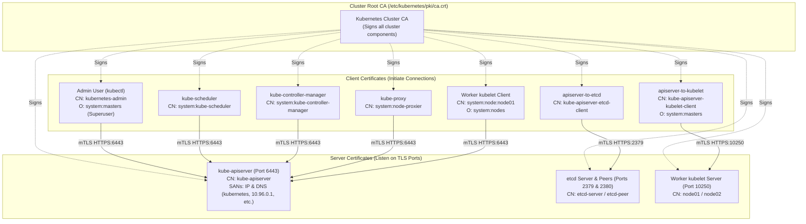

---

## 3. Deep-Dive Technical Breakdown

### 1. Generating the Cluster Certificate Authority (CA)

The Certificate Authority consists of a private key (`ca.key`) and a public certificate (`ca.crt`). Because there is no higher authority in the cluster, the CA is self-signed:

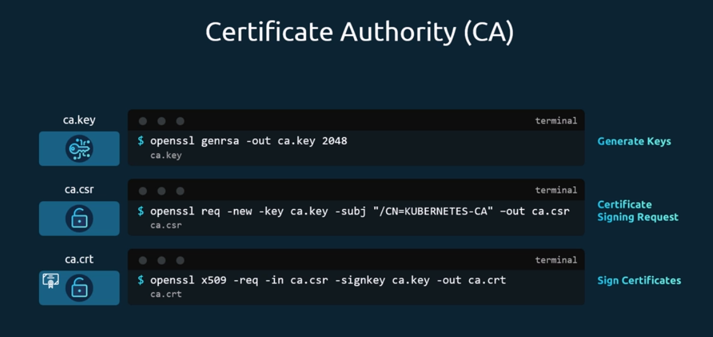

1. **Private Key Generation**:
   ```bash
   openssl genrsa -out ca.key 2048
   ```
2. **Certificate Signing Request (CSR)**:
   ```bash
   openssl req -new -key ca.key -subj "/CN=KUBERNETES-CA" -out ca.csr
   ```
3. **Self-Signing the Root Certificate**:
   The root certificate is signed using its own private key (`-signkey ca.key`):
   ```bash
   openssl x509 -req -in ca.csr -signkey ca.key -out ca.crt -days 3650
   ```

---

### 2. Client Certificates: Users & Control-Plane Components

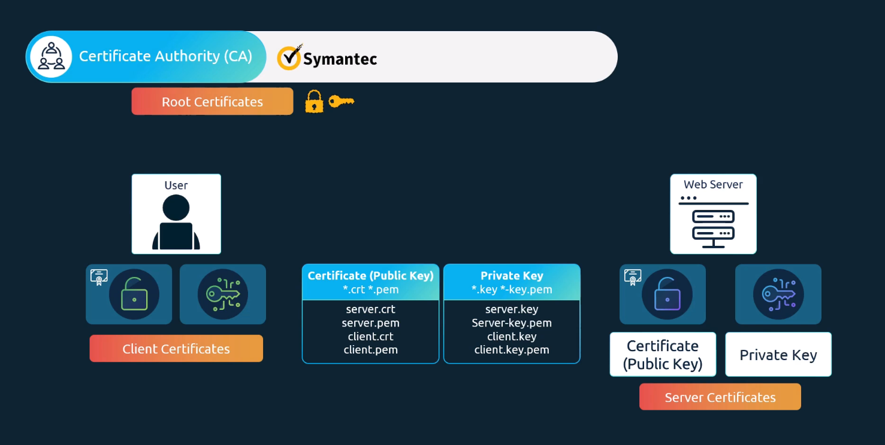

#### A. Administrator Client Certificate (`admin.crt`)
To grant an administrative user access, generate a keypair and embed the user in the `system:masters` group:

```bash
# 1. Generate private key
openssl genrsa -out admin.key 2048

# 2. Generate CSR with CN=kubernetes-admin and Organization=system:masters
openssl req -new -key admin.key -subj "/CN=kubernetes-admin/O=system:masters" -out admin.csr

# 3. Sign CSR with Cluster CA
openssl x509 -req -in admin.csr -CA ca.crt -CAkey ca.key -CAcreateserial -out admin.crt -days 365
```

> [!IMPORTANT]
> **Why `O=system:masters` Matters**:  
> In Kubernetes, the default cluster role binding `cluster-admin` binds the superuser ClusterRole directly to the group `system:masters`. Any certificate possessing `O=system:masters` automatically bypasses fine-grained RBAC and holds unrestricted root privileges over the cluster.

---

#### B. Control Plane Daemons (`scheduler`, `controller-manager`, `kube-proxy`)

Each internal Kubernetes daemon requires its own dedicated client certificate with standard prefixes:

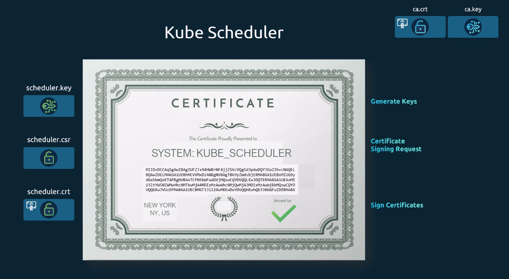

- **kube-scheduler**:
  - `CN = system:kube-scheduler`
  - Signed by `ca.crt` $\to$ used in `/etc/kubernetes/scheduler.conf`.

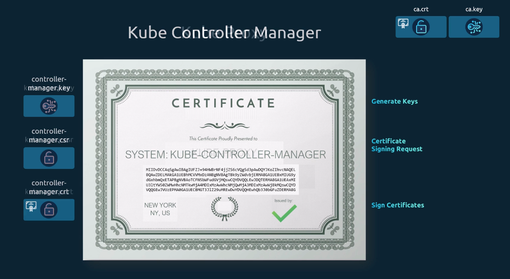

- **kube-controller-manager**:
  - `CN = system:kube-controller-manager`
  - Signed by `ca.crt` $\to$ used in `/etc/kubernetes/controller-manager.conf`.

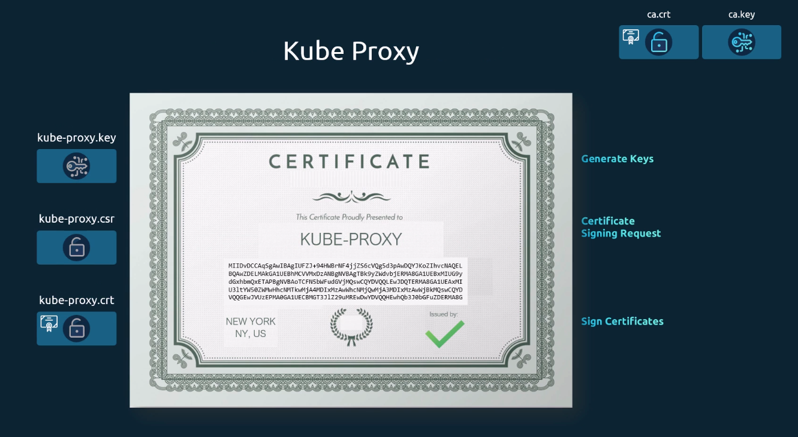

- **kube-proxy**:
  - `CN = system:node-proxier`
  - Used in `/etc/kubernetes/addons/kube-proxy` ConfigMap.

---

### 3. Consuming Client Certificates (Kubeconfig Architecture)

Client certificates are rarely passed as raw command-line flags. Instead, they are packaged into standard `kubeconfig` YAML files:

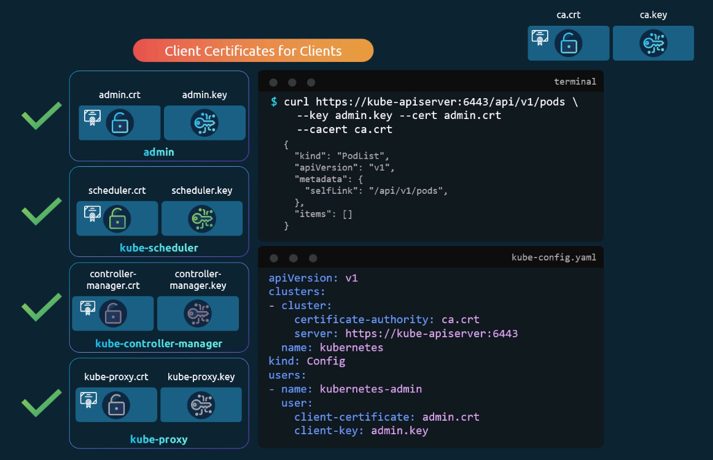

A `kubeconfig` embeds the certificates directly as base64-encoded strings:

```yaml
apiVersion: v1
kind: Config
clusters:
- cluster:
    certificate-authority-data: LS0tLS1CRUdJTi... # base64 of ca.crt
    server: https://192.168.1.10:6443
  name: kubernetes
contexts:
- context:
    cluster: kubernetes
    user: kubernetes-admin
  name: kubernetes-admin@kubernetes
current-context: kubernetes-admin@kubernetes
users:
- name: kubernetes-admin
  user:
    client-certificate-data: LS0tLS1CRUdJTi... # base64 of admin.crt
    client-key-data: LS0tLS1CRUdJTi...         # base64 of admin.key
```

---

### 4. Server Certificates: `etcd` Server & Peer Authentication

etcd requires two distinct sets of TLS certificates:

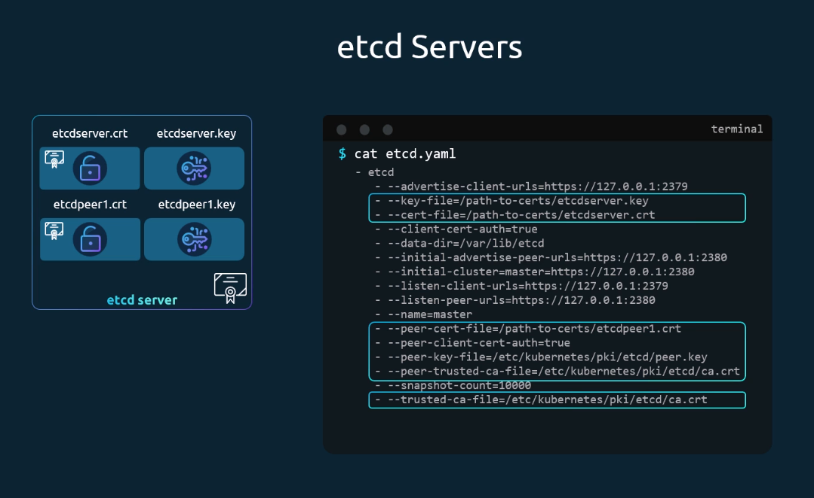

1. **Client-Facing Server Certificate (`server.crt`)**:
   - Presented to `kube-apiserver` when it queries etcd on port 2379.
   - Configured via `--cert-file` and `--key-file`.
   - Verified by `--trusted-ca-file`.
2. **Peer Communication Certificate (`peer.crt`)**:
   - Presented between etcd nodes during Raft consensus replication on port 2380.
   - Configured via `--peer-cert-file` and `--peer-key-file`.
   - Verified by `--peer-trusted-ca-file`.

---

### 5. `kube-apiserver` Server Certificate & SAN Configuration

The `kube-apiserver` serves requests to administrators, worker nodes, and internal cluster pods. Because it is addressed through diverse hostnames and IP addresses, its certificate **must** include Subject Alternative Names (SANs):

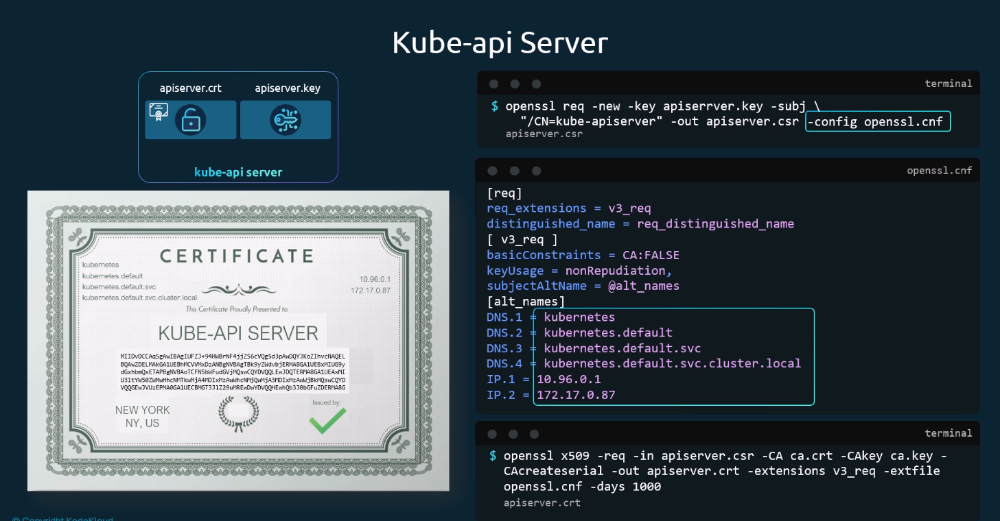

```plaintext
kube-apiserver Alternative Names:
├── DNS: kubernetes
├── DNS: kubernetes.default
├── DNS: kubernetes.default.svc
├── DNS: kubernetes.default.svc.cluster.local
├── DNS: controlplane (Master hostname)
├── IP Address: 10.96.0.1 (First IP from service-cluster-ip-range)
├── IP Address: 192.168.1.10 (Master node host IP)
└── IP Address: 127.0.0.1 (Localhost)
```

To configure SANs in OpenSSL, a dedicated configuration file (`openssl.cnf`) is required:

```ini
[req]
req_extensions = v3_req
distinguished_name = req_distinguished_name
prompt = no

[req_distinguished_name]
CN = kube-apiserver

[v3_req]
basicConstraints = CA:FALSE
keyUsage = nonRepudiation, digitalSignature, keyEncipherment
extendedKeyUsage = serverAuth
subjectAltName = @alt_names

[alt_names]
DNS.1 = kubernetes
DNS.2 = kubernetes.default
DNS.3 = kubernetes.default.svc
DNS.4 = kubernetes.default.svc.cluster.local
DNS.5 = controlplane
IP.1 = 10.96.0.1
IP.2 = 192.168.1.10
IP.3 = 127.0.0.1
```

#### Dual-Role Configuration on `kube-apiserver`:
The API server functions simultaneously as an HTTPS server and a TLS client:

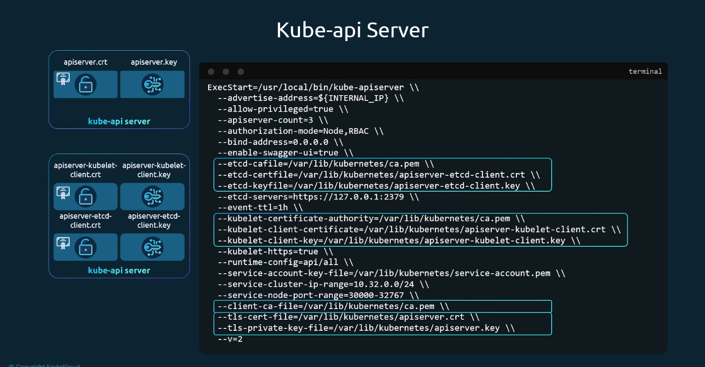

```plaintext
kube-apiserver Flag Mapping:
├── Serving Flags (Server Role):
│   ├── --tls-cert-file=/etc/kubernetes/pki/apiserver.crt
│   ├── --tls-private-key-file=/etc/kubernetes/pki/apiserver.key
│   └── --client-ca-file=/etc/kubernetes/pki/ca.crt
├── ETCD Client Flags (Client Role):
│   ├── --etcd-cafile=/etc/kubernetes/pki/etcd/ca.crt
│   ├── --etcd-certfile=/etc/kubernetes/pki/apiserver-etcd-client.crt
│   └── --etcd-keyfile=/etc/kubernetes/pki/apiserver-etcd-client.key
└── Kubelet Client Flags (Client Role):
    ├── --kubelet-certificate-authority=/etc/kubernetes/pki/ca.crt
    ├── --kubelet-client-certificate=/etc/kubernetes/pki/apiserver-kubelet-client.crt
    └── --kubelet-client-key=/etc/kubernetes/pki/apiserver-kubelet-client.key
```

---

### 6. Kubelet Node Certificates: Server vs. Client

Each worker node runs a `kubelet` process that requires **two distinct certificates**:

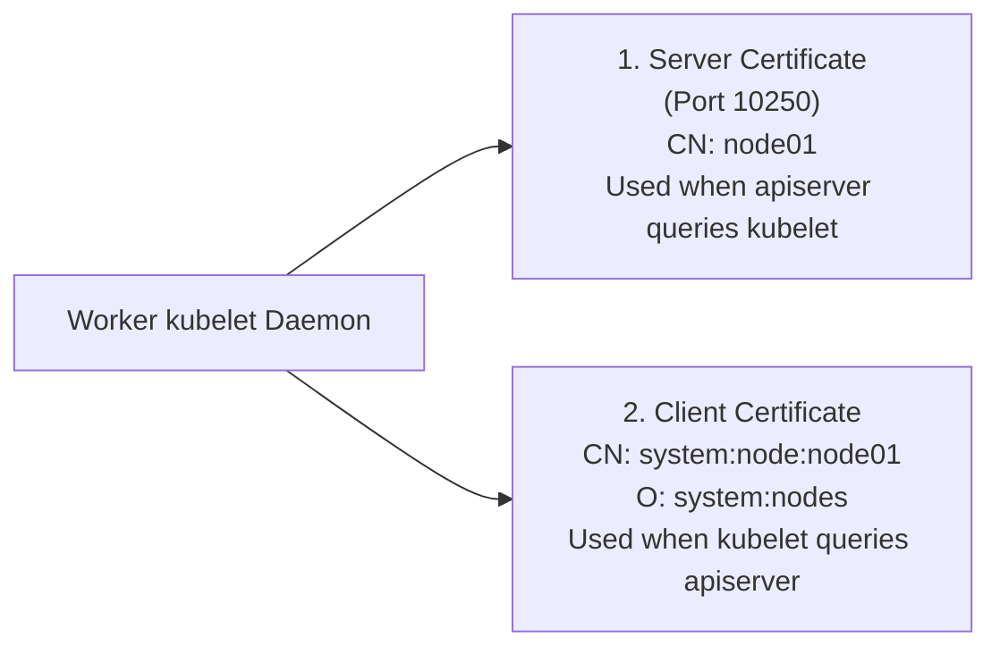

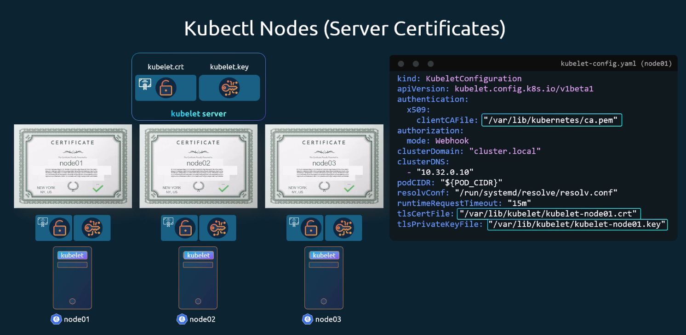

#### A. Kubelet as a Server:
- Listens on port 10250 on the worker node.
- Provides endpoints for `kube-apiserver` to stream logs (`kubectl logs`), execute commands (`kubectl exec`), and gather container metrics.
- Named after the node: `CN = node01`, `CN = node02`.

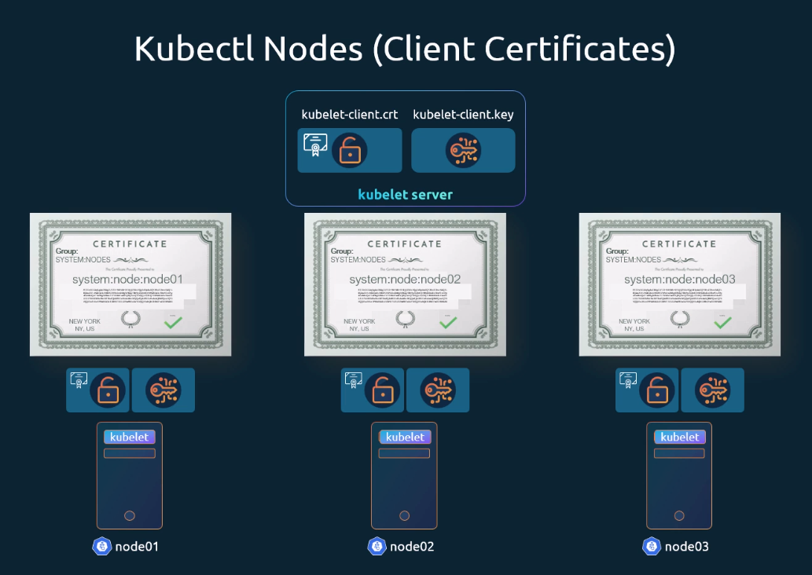

#### B. Kubelet as a Client:
- Connects to `kube-apiserver:6443` to register the node, report status heartbeats, and fetch scheduled pod specifications.
- **Strict Format Enforced by Node Authorizer**:
  - `Common Name (CN)`: `system:node:<node-name>` (e.g. `system:node:node01`).
  - `Organization (O)`: `system:nodes`.
- If the CN is not prefixed with `system:node:`, or if the group is not `system:nodes`, the Node Authorizer rejects the worker node with a `403 Forbidden` error.

---

## 4. Command Translation & Mapping Tables

### Table 1: Kubernetes PKI Component Certificate Reference Matrix

| Component | Cert File Name | Key File Name | Type | Common Name (CN) | Organization (O) | Key Flags / Parameters |
| :--- | :--- | :--- | :--- | :--- | :--- | :--- |
| **Cluster Root CA** | `ca.crt` | `ca.key` | CA Root | `kubernetes-ca` | *N/A* | Self-signed; trust anchor for cluster |
| **kube-apiserver** | `apiserver.crt` | `apiserver.key` | Server | `kube-apiserver` | *N/A* | `--tls-cert-file`, `--tls-private-key-file`, SANs required |
| **apiserver-kubelet-client** | `apiserver-kubelet-client.crt` | `apiserver-kubelet-client.key` | Client | `kube-apiserver-kubelet-client` | `system:masters` | `--kubelet-client-certificate`, `--kubelet-client-key` |
| **apiserver-etcd-client** | `apiserver-etcd-client.crt` | `apiserver-etcd-client.key` | Client | `kube-apiserver-etcd-client` | `system:masters` | `--etcd-certfile`, `--etcd-keyfile` |
| **Admin User** | `admin.crt` | `admin.key` | Client | `kubernetes-admin` | `system:masters` | Packaged into `/etc/kubernetes/admin.conf` |
| **kube-scheduler** | `scheduler.crt` | `scheduler.key` | Client | `system:kube-scheduler` | *N/A* | Packaged into `/etc/kubernetes/scheduler.conf` |
| **kube-controller-manager** | `controller-manager.crt` | `controller-manager.key` | Client | `system:kube-controller-manager` | *N/A* | Packaged into `/etc/kubernetes/controller-manager.conf` |
| **kube-proxy** | `kube-proxy.crt` | `kube-proxy.key` | Client | `system:node-proxier` | *N/A* | Packaged into `kube-proxy` ConfigMap / kubeconfig |
| **Worker kubelet (Client)** | `kubelet-client.crt` | `kubelet-client.key` | Client | `system:node:<node-name>` | `system:nodes` | Authenticated by Node Authorizer in `kubelet.conf` |
| **Worker kubelet (Server)** | `kubelet.crt` | `kubelet.key` | Server | `<node-name>` | *N/A* | Configured in `/var/lib/kubelet/config.yaml` |
| **etcd Server** | `server.crt` | `server.key` | Server | `etcd-server` | *N/A* | `--cert-file`, `--key-file` (Port 2379) |
| **etcd Peer** | `peer.crt` | `peer.key` | Peer | `etcd-peer` | *N/A* | `--peer-cert-file`, `--peer-key-file` (Port 2380) |

---

### Table 2: Component Serving Ports & Protocols

| Component | Default Port | Protocol | Certificate Verified | Incoming Peers |
| :--- | :--- | :--- | :--- | :--- |
| **kube-apiserver** | `6443` | HTTPS / gRPC | `apiserver.crt` | `kubectl`, `kubelet`, controllers, webhooks |
| **etcd (Client)** | `2379` | HTTPS / gRPC | `etcd/server.crt` | `kube-apiserver` |
| **etcd (Peer)** | `2380` | HTTPS / gRPC | `etcd/peer.crt` | Other etcd cluster members |
| **kubelet (API)** | `10250` | HTTPS | `kubelet.crt` | `kube-apiserver` |
| **kubelet (Read-Only)** | `10255` | HTTP *(Deprecated)* | *None* | Unauthenticated scrapers |

---

## 5. High-Yield CLI & Imperative Commands

### Complete OpenSSL Certificate Generation Walkthrough

---

### Step 1: Initialize the Cluster CA
```bash
# 1. Generate 2048-bit RSA key for CA
openssl genrsa -out ca.key 2048
chmod 600 ca.key

# 2. Generate self-signed CA certificate (10-year validity)
openssl req -x509 -new -nodes -key ca.key -sha256 -days 3650 \
  -subj "/CN=kubernetes-ca/O=Kubernetes" \
  -out ca.crt
```

---

### Step 2: Generate Administrative Client Credentials
```bash
# 1. Generate admin private key
openssl genrsa -out admin.key 2048
chmod 600 admin.key

# 2. Create CSR with CN=kubernetes-admin and O=system:masters
openssl req -new -key admin.key \
  -subj "/CN=kubernetes-admin/O=system:masters" \
  -out admin.csr

# 3. Sign CSR with Cluster CA
openssl x509 -req -in admin.csr -CA ca.crt -CAkey ca.key -CAcreateserial \
  -out admin.crt -days 365 -sha256
```

---

### Step 3: Generate Kubelet Client Credentials for `node01`
```bash
# 1. Generate private key
openssl genrsa -out kubelet-node01.key 2048

# 2. Create CSR specifying system:node prefix and system:nodes group
openssl req -new -key kubelet-node01.key \
  -subj "/CN=system:node:node01/O=system:nodes" \
  -out kubelet-node01.csr

# 3. Sign with CA
openssl x509 -req -in kubelet-node01.csr -CA ca.crt -CAkey ca.key -CAcreateserial \
  -out kubelet-node01.crt -days 365 -sha256
```

---

### Step 4: Generate `kube-apiserver` Serving Certificate with SANs
```bash
# 1. Generate apiserver key
openssl genrsa -out apiserver.key 2048
chmod 600 apiserver.key

# 2. Define OpenSSL SAN configuration
cat <<EOF > apiserver.cnf
[req]
req_extensions = v3_req
distinguished_name = req_distinguished_name
prompt = no

[req_distinguished_name]
CN = kube-apiserver

[v3_req]
basicConstraints = CA:FALSE
keyUsage = nonRepudiation, digitalSignature, keyEncipherment
extendedKeyUsage = serverAuth
subjectAltName = @alt_names

[alt_names]
DNS.1 = kubernetes
DNS.2 = kubernetes.default
DNS.3 = kubernetes.default.svc
DNS.4 = kubernetes.default.svc.cluster.local
DNS.5 = controlplane
IP.1 = 10.96.0.1
IP.2 = 192.168.1.10
IP.3 = 127.0.0.1
EOF

# 3. Generate CSR with configuration file
openssl req -new -key apiserver.key -out apiserver.csr -config apiserver.cnf

# 4. Sign CSR using CA with SAN extensions applied
openssl x509 -req -in apiserver.csr -CA ca.crt -CAkey ca.key -CAcreateserial \
  -out apiserver.crt -days 365 -sha256 -extfile apiserver.cnf -extensions v3_req
```

---

### Step 5: Packaging Certificates into a Kubeconfig File
```bash
# Set cluster entry with CA
kubectl config set-cluster kubernetes \
  --certificate-authority=ca.crt \
  --embed-certs=true \
  --server=https://192.168.1.10:6443 \
  --kubeconfig=admin.kubeconfig

# Set user credentials with client cert & key
kubectl config set-credentials kubernetes-admin \
  --client-certificate=admin.crt \
  --client-key=admin.key \
  --embed-certs=true \
  --kubeconfig=admin.kubeconfig

# Set context entry
kubectl config set-context kubernetes-admin@kubernetes \
  --cluster=kubernetes \
  --user=kubernetes-admin \
  --kubeconfig=admin.kubeconfig

# Activate context
kubectl config use-context kubernetes-admin@kubernetes \
  --kubeconfig=admin.kubeconfig
```

---

## 6. Troubleshooting & Diagnostic Runbook

### Diagnostic Decision Tree

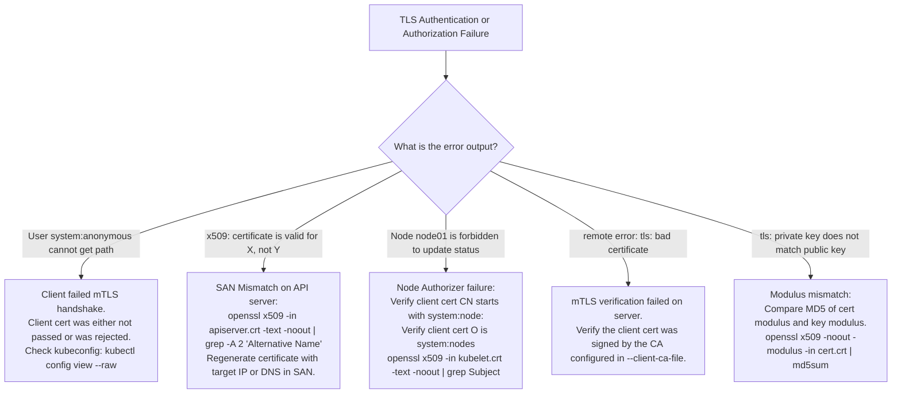

---

### Step-by-Step Triage Runbook

| Failure Symptom | Probable Root Cause | Verification Command | Remediation Action |
| :--- | :--- | :--- | :--- |
| `User "system:anonymous" cannot list resource "nodes"` | `kubectl` did not send client certificate; API server defaulted to anonymous auth | `kubectl config view --raw` | Ensure `client-certificate-data` and `client-key-data` are present in kubeconfig. |
| `x509: certificate is valid for 10.96.0.1, not 192.168.1.50` | Connecting to API server via node IP that is missing from SAN | `openssl x509 -in /etc/kubernetes/pki/apiserver.crt -text -noout \| grep -A 1 "Subject Alternative Name"` | Regenerate `apiserver.crt` including `IP:192.168.1.50` in the OpenSSL configuration. |
| Worker node fails to join: `Node 'node01' is unauthorized` | Client cert `CN` does not match `system:node:<nodename>` | `openssl x509 -in /var/lib/kubelet/pki/kubelet.crt -text -noout \| grep Subject` | Re-issue kubelet client certificate with `CN=system:node:node01` and `O=system:nodes`. |
| API server fails to start: `tls: private key does not match public key` | Mismatched `.key` and `.crt` paths in `/etc/kubernetes/manifests/kube-apiserver.yaml` | Compare modulus MD5 hashes between `apiserver.crt` and `apiserver.key` | Update static pod manifest to point to the matching key file. |
| `etcdctl` fails with `tls: bad certificate` | Sent cluster CA instead of dedicated ETCD CA | Check `/etc/kubernetes/manifests/etcd.yaml` `--trusted-ca-file` | Point `--cacert` flag explicitly to `/etc/kubernetes/pki/etcd/ca.crt`. |

---

## 7. CKA Exam Tips, Gotchas & Traps

> [!CAUTION]
> **Trap 1: `/O=system:masters` vs `/OU=system:masters`**  
> In many raw lecture transcripts, candidates type `/OU=system:masters`. **This is an exam trap**.  
> The Kubernetes API server maps the **`O` (Organization)** attribute to RBAC Groups, and the **`CN` (Common Name)** attribute to Usernames. If you place `system:masters` into `OU`, Kubernetes ignores it, and the user receives `403 Forbidden` for all commands. Always use:
> ```bash
> -subj "/CN=admin-user/O=system:masters"
> ```

> [!IMPORTANT]
> **Trap 2: The Node Authorizer Prefix Rule**  
> For worker nodes, the `Common Name` must follow the exact syntax:
> ```bash
> CN = system:node:<exact-node-name>
> O  = system:nodes
> ```
> If the node name is `node01`, `CN=node01` or `CN=system:nodes:node01` will fail. The prefix **`system:node:`** is required by the internal Node Authorizer to bind the node's permissions to its specific host resources.

> [!WARNING]
> **Trap 3: Forgetting `--embed-certs=true` in `kubectl config`**  
> If you create a standalone kubeconfig for an exam user and reference local file paths without `--embed-certs=true`, moving or submitting the kubeconfig file to another directory or node breaks the configuration. Always pass `--embed-certs=true` so the raw PEM bytes are base64-inlined into the file.

> [!TIP]
> **Exam Tip 4: Instant Expiration Audit with `kubeadm`**  
> When tasked with identifying expired certificates in a cluster, do not manually run `openssl` across dozens of files in `/etc/kubernetes/pki`. Run:
> ```bash
> sudo kubeadm certs check-expiration
> ```
> This command outputs a clean table detailing every certificate's residual lifetime and authority.

> [!NOTE]
> **Trap 5: Inspecting Multi-Cert Names**  
> In exam questions asking you to identify which certificate belongs to which component, use a single shell pipeline:
> ```bash
> for cert in /etc/kubernetes/pki/*.crt; do
>   echo "=== $cert ==="
>   openssl x509 -in "$cert" -noout -subject -issuer
> done
> ```

---

## 8. Self-Test / Active Recall

<details>
<summary><strong>1. In a Kubernetes client certificate, which X.509 Subject attribute maps to the Username, and which attribute maps to Groups?</strong></summary>

- **`Common Name (CN)`** maps to the **Username**.
- **`Organization (O)`** maps to the **Groups**.
</details>

<details>
<summary><strong>2. Why must the certificate for <code>kube-apiserver</code> contain Subject Alternative Names (SANs)?</strong></summary>

Because clients access the API server through multiple hostnames and IP addresses (e.g. `kubernetes`, `kubernetes.default`, `kubernetes.default.svc`, master node hostname, ClusterIP `10.96.0.1`, node host IP, and `127.0.0.1`). Modern TLS strictly validates client requests against the certificate's SAN extension and rejects connections if the requested address is absent.
</details>

<details>
<summary><strong>3. What group membership gives a client certificate immediate superuser administrative privileges across the cluster?</strong></summary>

The group **`system:masters`** (configured via `O=system:masters` in the certificate Subject). It is bound by default to the `cluster-admin` ClusterRole via the `cluster-admin` ClusterRoleBinding.
</details>

<details>
<summary><strong>4. What exact Subject formatting is required for a worker node's client certificate to pass the Node Authorizer?</strong></summary>

- `CN = system:node:<node-name>` (e.g., `CN=system:node:worker01`)
- `O = system:nodes`
</details>

<details>
<summary><strong>5. What two distinct roles does the <code>kube-apiserver</code> play in the cluster PKI architecture?</strong></summary>

1. **Server Role**: Listens on port 6443, presenting `apiserver.crt` to incoming clients (`kubectl`, `kubelet`, controllers).
2. **Client Role**: Initiates outbound TLS connections to `etcd` (port 2379) using `apiserver-etcd-client.crt` and to worker `kubelet` daemons (port 10250) using `apiserver-kubelet-client.crt`.
</details>

<details>
<summary><strong>6. What is the difference between an etcd server certificate and an etcd peer certificate?</strong></summary>

- **Server Certificate**: Configured on port 2379 to authenticate and encrypt communications with the `kube-apiserver`.
- **Peer Certificate**: Configured on port 2380 to authenticate and encrypt Raft consensus communications between member etcd instances in a high-availability cluster.
</details>

<details>
<summary><strong>7. Why is the Root CA certificate self-signed?</strong></summary>

Because the Root CA is the cryptographic root of trust (trust anchor) for the cluster. There is no higher authority to validate it, so its certificate is signed using its own private key (`ca.key`).
</details>

<details>
<summary><strong>8. How can you verify whether an existing private key matches a given certificate file?</strong></summary>

Extract and compare their MD5 modulus hashes:
```bash
openssl x509 -noout -modulus -in cert.crt | md5sum
openssl rsa -noout -modulus -in cert.key | md5sum
```
If the output strings match, the key belongs to the certificate.
</details>

<details>
<summary><strong>9. What does the flag <code>--embed-certs=true</code> do when running <code>kubectl config set-credentials</code>?</strong></summary>

It base64-encodes the referenced certificate and private key files and writes their raw contents directly into the kubeconfig YAML file (under `client-certificate-data` and `client-key-data`), eliminating external file path dependencies.
</details>

<details>
<summary><strong>10. If <code>kubectl get nodes</code> fails with <code>User "system:anonymous" cannot list resource "nodes"</code>, what is the most likely cause?</strong></summary>

The client failed to provide a valid client certificate during the TLS handshake (or the certificate was unreadable due to file permissions or misconfiguration). When no client certificate is provided, the API server treats the connection as unauthenticated anonymous access.
</details>

---

## 9. Official Documentation Bookmarks

| Documentation Page | Official URL | Search Keywords | High-Yield Section for Exam |
| :--- | :--- | :--- | :--- |
| **PKI certificates and requirements** | `https://kubernetes.io/docs/setup/best-practices/certificates/` | `PKI certificates and requirements` | Complete table of all certificate names, CNs, and SAN paths |
| **Certificate Management with kubeadm** | `https://kubernetes.io/docs/tasks/administer-cluster/kubeadm/kubeadm-certs/` | `kubeadm certs`, `check-expiration` | Commands for verifying and renewing cluster certificates |
| **Authenticating with X509 Client Certificates** | `https://kubernetes.io/docs/reference/access-authn-authz/authentication/#x509-client-certificates` | `X509 Client Certificates`, `system:masters` | CN and Organization (O) mapping to Users and Groups |
| **Using Node Authorization** | `https://kubernetes.io/docs/reference/access-authn-authz/node/` | `Node Authorization`, `system:node` | Formatting rules for `system:node:<node-name>` certificates |
