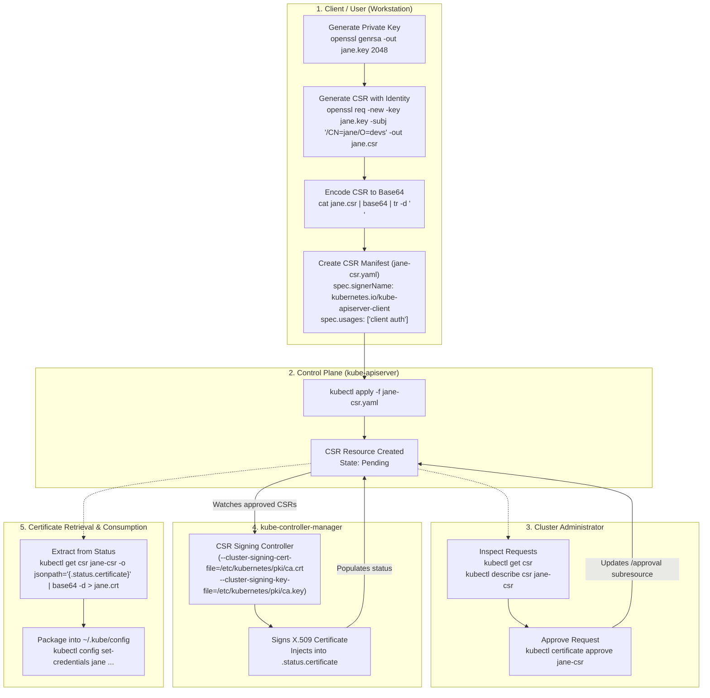
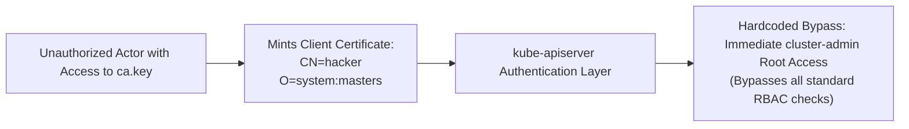
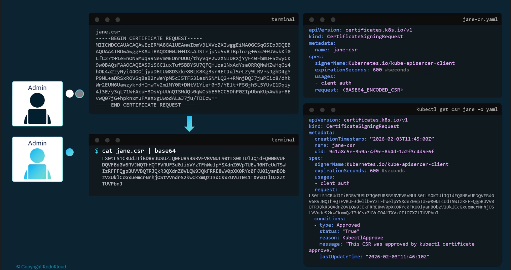
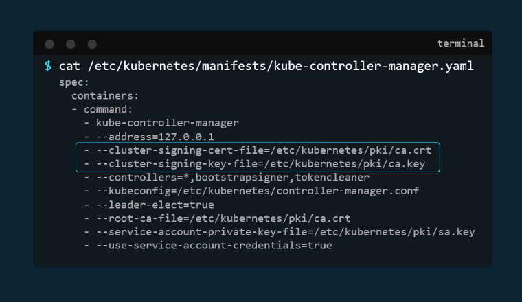
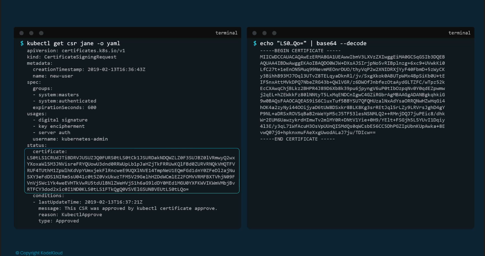
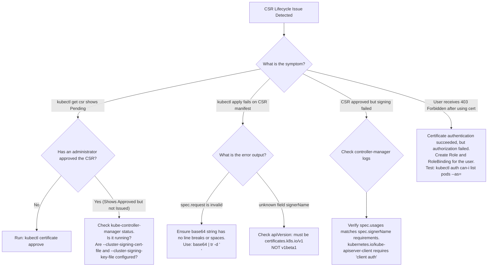

# Kubernetes Certificates API & CSR Lifecycle - CKA Exam Notes

> **Exam Domain**: Cluster Architecture, Installation & Configuration (25%) / Cluster Security  
> **Weight / Importance**: Critical (Top-tier hands-on CKA exam topic tested frequently: generating user keys and CSRs, authoring declarative `CertificateSigningRequest` manifests, managing requests via `kubectl certificate approve/deny`, extracting signed certificates, and configuring user authentication)  
> **Target Version**: Verified against v1.31 / v1.32 (Current CKA Curriculum)  
> **Allowed Docs Search Keywords**: `CertificateSigningRequest`, `Manage TLS Certificates in a Cluster`, `certificates.k8s.io/v1`, `kubectl certificate approve`, `signerName`  
> **Source**: Generated from `security/04-Certificate-API-raw.md`

---

## 1. Quick-Reference Summary

- **Purpose of the Certificates API (`certificates.k8s.io/v1`)**:
  - Replaces manual, out-of-band SSH access to the Root CA server with an automated, declarative Kubernetes API object: **`CertificateSigningRequest` (CSR)**.
  - Allows users to submit signing requests to the API server, where cluster administrators review and approve them using `kubectl`.
- **Root CA Security & The `system:masters` Escalation Vector**:
  - The Cluster Root CA private key (`ca.key`) is the highest-privilege asset in the cluster. Whoever possesses `ca.key` can mint a certificate with `O=system:masters`.
  - Because `system:masters` bypasses standard RBAC checks directly inside the API server code, holding the CA private key effectively yields unrestricted superuser control over the entire cluster.
  - Centralizing signing in `kube-controller-manager` eliminates the need to distribute `ca.key` to multiple human administrators.
- **The Core 4-Step CSR Workflow**:
  1. **Generate Credentials (Client-side)**: User creates a private key and a CSR with OpenSSL containing their username in the Common Name (`CN`) and groups in the Organization (`O`).
  2. **Submit CSR Manifest (Declarative)**: Submit a `certificates.k8s.io/v1` `CertificateSigningRequest` resource with the base64-encoded CSR placed in `spec.request`.
  3. **Approve / Deny Request (Admin-side)**: Administrators inspect (`kubectl get csr`) and execute `kubectl certificate approve <name>` or `kubectl certificate deny <name>`.
  4. **Extract & Decode Certificate**: Extract the issued certificate from `.status.certificate` using JSONPath and base64 decode it for client consumption.
- **Key Fields in `certificates.k8s.io/v1` CSR**:
  - `spec.signerName`: Identifies the authority and validation rules (e.g. `kubernetes.io/kube-apiserver-client`). **Mandatory in v1**.
  - `spec.request`: The PEM-encoded CSR, base64-encoded as a single-line string.
  - `spec.usages`: Permitted key usages (e.g., `client auth`, `digital signature`, `key encipherment`).
  - `spec.expirationSeconds`: Optional certificate lifetime (e.g., `86400` for 24 hours).
- **The Controller Behind the API**:
  - `kube-controller-manager` runs the `csrsigning` and `csrapproving` controllers.
  - Requires flags: `--cluster-signing-cert-file=/etc/kubernetes/pki/ca.crt` and `--cluster-signing-key-file=/etc/kubernetes/pki/ca.key`.

---

## 2. Conceptual Overview & Mental Model

### Dual-Layer Architectural Understanding

- **Simple English Explanation (How It Works)**:
  - When a new engineer joins an infrastructure team, they need credentials to access the Kubernetes cluster.
  - In a primitive setup, the engineer would send a CSR file to a senior administrator, who would SSH into the control-plane node, locate the cluster's private CA key (`ca.key`), run manual OpenSSL commands to sign it, and email the resulting `.crt` file back.
  - This manual process has severe security and operational risks: human admins must log into the master node, private CA keys are exposed on the host filesystem, and certificate rotation is tedious and error-prone.
  - The **Kubernetes Certificates API** replaces this entirely. The engineer creates their private key locally, converts their CSR into base64, and wraps it inside a standard Kubernetes YAML object called a `CertificateSigningRequest`.
  - The administrator never touches the master node or OpenSSL. They review the request directly in `kubectl` and run `kubectl certificate approve`.
  - Inside the control plane, a background loop in `kube-controller-manager` detects the approval, uses its internal access to `ca.key` to sign the certificate, and writes the signed certificate directly back into the CSR's status field.
  - The engineer pulls the signed certificate out using `kubectl`, inserts it into their local `kubeconfig`, and begins working.

- **Formal Kubernetes Definition**:
  - The Kubernetes Certificates API provides a declarative control loop for requesting, auditing, approving, and issuing X.509 certificates within the `certificates.k8s.io` API group. The lifecycle decouples request submission from signing: clients submit `CertificateSigningRequest` resources, authorized actors update the `/approval` subresource with `Approved` or `Denied` conditions, and the `csrsigning` controller in `kube-controller-manager` fulfills approved requests by minting X.509 v3 certificates via the cluster signing CA and populating `.status.certificate`.

### Complete Architectural CSR Lifecycle Diagram



---

## 3. Deep-Dive Technical Breakdown

### 1. The Security Hazard of Manual CA Signing & Superuser Risks

In self-managed Kubernetes clusters, the CA server is typically the master node hosting `/etc/kubernetes/pki/ca.crt` and `/etc/kubernetes/pki/ca.key`.



#### Why `O=system:masters` is a Universal Superuser:
- Kubernetes includes a pre-defined superuser group: **`system:masters`**.
- In the `kube-apiserver` source code, requests authenticated with membership in `system:masters` bypass standard RBAC evaluation chains and are automatically authorized for all verbs across all API groups.
- If multiple administrators have SSH access to the Root CA host to sign CSRs manually, any compromised administrator credential exposes `ca.key`, allowing an attacker to generate permanent, untraceable superuser certificates.
- **The Certificates API Solution**: Isolates `ca.key` strictly within the `kube-controller-manager` process. Administrators are granted granular RBAC permissions to approve specific CSR objects via the Kubernetes API without ever accessing the underlying filesystem or CA private key.

---

### 2. Anatomy of the `CertificateSigningRequest` Resource (`v1`)



The declarative `CertificateSigningRequest` manifest in API version `certificates.k8s.io/v1`:

```yaml
apiVersion: certificates.k8s.io/v1
kind: CertificateSigningRequest
metadata:
  name: jane-csr
spec:
  # 1. Base64-encoded PEM CSR (MUST be a single continuous string)
  request: LS0tLS1CRUdJTiBDRVJUSUZJQ0FURSBSRVFVRVNULS0tLS0KTUlJQ1ZqQ0...
  
  # 2. Required built-in or custom signer
  signerName: kubernetes.io/kube-apiserver-client
  
  # 3. Optional duration in seconds (clamped by controller-manager max duration)
  expirationSeconds: 86400  # 24 hours
  
  # 4. Mandatory key usages matching the signerName
  usages:
  - client auth
```

#### Detailed Field Specifications:
- **`spec.request`**: The base64-encoded output of the `.csr` file. It must not contain line breaks or carriage returns.
- **`spec.signerName`**: Determines who signs the request and what validation checks are applied. Introduced in `v1` (mandatory).
- **`spec.usages`**: Specifies the cryptographic operations permitted for the issued certificate. For client authentication, `client auth` is required.
- **`spec.expirationSeconds`**: Allows the applicant to request a specific certificate lifetime. If omitted, it defaults to the `--cluster-signing-duration` flag configured on `kube-controller-manager` (default 1 year).

---

### 3. Built-in Kubernetes Signers

Kubernetes v1 provides standard built-in signers with strict validation rules:

| Signer Name | Permitted Usages | Validation Constraints | Target Consumers |
| :--- | :--- | :--- | :--- |
| **`kubernetes.io/kube-apiserver-client`** | `client auth` | Signs certificates used to authenticate to the API server | Human users, admins, external services |
| **`kubernetes.io/kube-apiserver-client-kubelet`** | `client auth` | Restricts Subject `CN` to `system:node:<node-name>` and `O` to `system:nodes` | Node bootstrap & kubelet client rotation |
| **`kubernetes.io/kubelet-serving`** | `server auth` | Restricts Subject `O` to `system:nodes`; requires valid node IP/DNS SANs | Kubelet server port 10250 serving |
| **`kubernetes.io/legacy-unknown`** | Any | No validation guarantees; backward compatibility | Legacy external signers |

> [!CAUTION]
> If `spec.usages` contains an entry not permitted by the specified `signerName` (e.g. specifying `server auth` under `kubernetes.io/kube-apiserver-client`), `kube-controller-manager` will refuse to sign the certificate even if an administrator approves the CSR.

---

### 4. `kube-controller-manager` Internal Architecture

The Certificates API relies on two distinct controllers running concurrently inside `kube-controller-manager`:



1. **`csrapproving` Controller**:
   - Watches new `CertificateSigningRequest` objects.
   - Automatically approves node bootstrap CSRs matching specific TLS bootstrapping policies.
   - For user requests, approval must be submitted manually by a human admin or an external approval webhook.
2. **`csrsigning` Controller**:
   - Watches CSR objects that possess an `Approved` condition in their status.
   - Validates that the request matches the parameters required by `spec.signerName`.
   - Uses the Root CA files passed via controller-manager flags:
     ```plaintext
     --cluster-signing-cert-file=/etc/kubernetes/pki/ca.crt
     --cluster-signing-key-file=/etc/kubernetes/pki/ca.key
     --cluster-signing-duration=8760h0m0s
     ```
   - Issues the X.509 certificate and writes the base64-encoded certificate into `.status.certificate`.

---

### 5. Extracting and Decoding the Signed Certificate



Once approved and signed, the resource displays:

```yaml
status:
  certificate: LS0tLS1CRUdJTiBDRVJUSUZJQ0FUR...
  conditions:
  - type: Approved
    status: "True"
    reason: KubectlApprove
    message: This CSR was approved by kubectl certificate approve.
```

The certificate is extracted directly from the API and decoded into a standard `.crt` file:

```bash
kubectl get csr jane-csr -o jsonpath='{.status.certificate}' | base64 --decode > jane.crt
```

---

## 4. Command Translation & Mapping Tables

### Table 1: CSR Lifecycle States & Conditions

| Lifecycle Phase | Status Displayed (`kubectl get csr`) | Underlying State Condition | Action Required |
| :--- | :--- | :--- | :--- |
| **Submitted** | `Pending` | `conditions` is empty | Administrator must inspect and approve or deny |
| **Approved, Unsigned** | `Approved` | `conditions[0].type: Approved`, `certificate` is empty | Controller-manager signing controller must process request |
| **Issued** | `Approved,Issued` | `conditions[0].type: Approved`, `certificate` is populated | Client extracts certificate for use |
| **Denied** | `Denied` | `conditions[0].type: Denied` | Request terminated; cannot be re-approved |

---

### Table 2: Manual OpenSSL CA Signing vs. Certificates API Automation

| Operational Aspect | Manual Host-Based Signing | Kubernetes Certificates API |
| :--- | :--- | :--- |
| **Access Requirements** | SSH root access to Control Plane node | `kubectl` access with RBAC permissions |
| **CA Key Security** | High risk; CA key readable by multiple users | Maximum security; CA key accessed only by `controller-manager` |
| **Auditability** | Poor; relies on local bash command history | Complete; all CSR submissions and approvals logged in API audit logs |
| **Revocation & Expiry Control** | Static; hard to enforce cluster-wide defaults | Declarative; controlled via `expirationSeconds` and controller flags |
| **Automation Compatibility** | Requires complex Ansible / SSH scripts | Native Kubernetes declarative API; integrates with GitOps & webhooks |

---

## 5. High-Yield CLI & Imperative Commands

### End-to-End Walkthrough: Provisioning Access for Developer "Jane"

---

### Step 1: User Generates Key & CSR (on User Workstation)
```bash
# 1. Generate 2048-bit RSA private key
openssl genrsa -out jane.key 2048
chmod 600 jane.key

# 2. Generate CSR with CN=jane and O=developer-team
openssl req -new -key jane.key -subj "/CN=jane/O=developer-team" -out jane.csr
```

---

### Step 2: Administrator Authors and Submits CSR Manifest
The administrator captures the base64-encoded CSR and submits it as a Kubernetes API resource:

```bash
# 1. Base64 encode the CSR as a single continuous line (strip newlines)
CSR_BASE64=$(cat jane.csr | base64 | tr -d '\n')

# 2. Apply the CertificateSigningRequest manifest
cat <<EOF | kubectl apply -f -
apiVersion: certificates.k8s.io/v1
kind: CertificateSigningRequest
metadata:
  name: jane-csr
spec:
  request: ${CSR_BASE64}
  signerName: kubernetes.io/kube-apiserver-client
  expirationSeconds: 86400
  usages:
  - client auth
EOF
```

---

### Step 3: Inspect and Review the Request
```bash
# View list of CSRs and their statuses
kubectl get csr

# Inspect detailed subject attributes and requested usages
kubectl describe csr jane-csr
```

*Expected output*:
```plaintext
NAME       AGE   SIGNERNAME                            REQUESTOR          REQUESTEDNAME   USAGES        STATUS
jane-csr   12s   kubernetes.io/kube-apiserver-client   kubernetes-admin   jane            client auth   Pending
```

---

### Step 4: Approve the Certificate Request
```bash
# Approve the CSR
kubectl certificate approve jane-csr

# Verify status transitions to Approved,Issued
kubectl get csr jane-csr
```

*Expected output*:
```plaintext
NAME       AGE   SIGNERNAME                            REQUESTOR          REQUESTEDNAME   USAGES        STATUS
jane-csr   45s   kubernetes.io/kube-apiserver-client   kubernetes-admin   jane            client auth   Approved,Issued
```

*(Note: To deny a suspicious request, use `kubectl certificate deny <csr-name>`)*.

---

### Step 5: Extract and Decode the Issued Certificate
```bash
# Extract the signed certificate and decode from base64
kubectl get csr jane-csr -o jsonpath='{.status.certificate}' | base64 -d > jane.crt

# Verify certificate Subject, Issuer, and Dates
openssl x509 -in jane.crt -text -noout | grep -E 'Subject:|Issuer:|Not After'
```

*Expected output*:
```plaintext
Issuer: CN = kubernetes-ca
Subject: CN = jane, O = developer-team
Not After : Oct  9 21:00:00 2026 GMT
```

---

### Step 6: Configure Role-Based Access Control (RBAC)
Having a valid certificate authenticates the user as `jane`, but yields zero permissions without an RBAC RoleBinding:

```bash
# 1. Create a Role allowing pod read operations in the default namespace
kubectl create role pod-reader --verb=get,list,watch --resource=pods -n default

# 2. Bind the role directly to user 'jane'
kubectl create rolebinding jane-pod-reader --role=pod-reader --user=jane -n default

# 3. Test permissions using authorization simulation
kubectl auth can-i list pods -n default --as=jane
```

*Expected output*:
```plaintext
yes
```

---

### Step 7: Build Jane's Kubeconfig File
```bash
# 1. Set cluster entry using cluster CA
kubectl config set-cluster kubernetes \
  --certificate-authority=/etc/kubernetes/pki/ca.crt \
  --embed-certs=true \
  --server=https://192.168.1.10:6443 \
  --kubeconfig=jane.kubeconfig

# 2. Set user credentials with Jane's new certificate and private key
kubectl config set-credentials jane \
  --client-certificate=jane.crt \
  --client-key=jane.key \
  --embed-certs=true \
  --kubeconfig=jane.kubeconfig

# 3. Set context
kubectl config set-context jane@kubernetes \
  --cluster=kubernetes \
  --user=jane \
  --kubeconfig=jane.kubeconfig

# 4. Activate context
kubectl config use-context jane@kubernetes --kubeconfig=jane.kubeconfig
```

---

## 6. Troubleshooting & Diagnostic Runbook

### Diagnostic Decision Tree



---

### Step-by-Step Triage Runbook

| Failure Symptom | Probable Root Cause | Verification Command | Remediation Action |
| :--- | :--- | :--- | :--- |
| CSR stays `Approved` indefinitely without reaching `Issued` | `kube-controller-manager` missing CA signing flags or service is stopped | `crictl ps \| grep controller-manager` | Ensure `--cluster-signing-cert-file` and `--cluster-signing-key-file` point to valid CA paths in `kube-controller-manager.yaml`. |
| `spec.request: Invalid value: "...": spec.request: unable to parse base64` | Base64 string contains line breaks, carriage returns, or padding errors | `echo "$CSR_BASE64" \| base64 -d` | Encode with `cat user.csr \| base64 \| tr -d '\n'`. |
| `kubectl certificate approve` fails with `denied` | Another administrator or webhook denied the request | `kubectl describe csr <name>` | Denied CSRs cannot be resurrected. Delete and re-submit a new CSR resource. |
| User authenticates as `system:anonymous` despite cert in kubeconfig | `client-certificate-data` corrupted or missing private key | `kubectl config view --raw` | Verify certificate base64 payload in kubeconfig using `echo <data> \| base64 -d \| openssl x509 -text`. |
| Certificate issued with 1-year expiry despite `expirationSeconds: 600` | Controller-manager does not support or clamped `expirationSeconds` | Check `kube-controller-manager` version | In v1.22+, `expirationSeconds` is honored up to the controller-manager maximum duration. |

---

## 7. CKA Exam Tips, Gotchas & Traps

> [!CAUTION]
> **Trap 1: The Multi-line Base64 Trap**  
> On Linux, running `base64 user.csr` wraps lines at 76 columns by default. When pasted into a YAML manifest, whitespace indentation breaks the base64 parser. Always strip newlines before injection:
> ```bash
> cat user.csr | base64 | tr -d '\n'
> # OR:
> base64 -w 0 user.csr
> ```

> [!IMPORTANT]
> **Trap 2: `apiVersion: certificates.k8s.io/v1` vs. `v1beta1`**  
> In older Kubernetes versions, `v1beta1` allowed omitting `signerName`. In current CKA exams (`v1.31`+), **`signerName` is mandatory**. For user authentication, always specify:
> ```yaml
> signerName: kubernetes.io/kube-apiserver-client
> ```

> [!WARNING]
> **Trap 3: Usages Mismatch Rejection**  
> In `v1`, you cannot invent arbitrary usages. For user client certificates, `usages` must contain:
> ```yaml
> usages:
> - client auth
> ```
> Specifying `server auth` under `kubernetes.io/kube-apiserver-client` causes `kube-controller-manager` to reject signing silently.

> [!TIP]
> **Exam Tip 4: Single-Command JSONPath Certificate Extraction**  
> Never copy-paste base64 strings from `kubectl describe` or `kubectl get -o yaml`. Shell line-wrapping can corrupt characters. Always use JSONPath:
> ```bash
> kubectl get csr <csr-name> -o jsonpath='{.status.certificate}' | base64 -d > user.crt
> ```

> [!NOTE]
> **Trap 5: Authentication $\neq$ Authorization**  
> Approving a CSR only provides **Authentication** (validates who the user is). The new user has zero access to any cluster resource by default. You **must** create an RBAC `Role` and `RoleBinding` (or `ClusterRoleBinding`) targeting the user's `name` or `group` before they can execute commands.

---

## 8. Self-Test / Active Recall

<details>
<summary><strong>1. Why is direct access to the Root CA private key (<code>ca.key</code>) considered a critical security vulnerability in Kubernetes?</strong></summary>

Because anyone holding `ca.key` can mint a certificate with the Organization attribute `O=system:masters`. The `system:masters` group bypasses all standard RBAC evaluation chains in the API server, granting instant, unrestricted superuser privileges across the cluster.
</details>

<details>
<summary><strong>2. What Kubernetes component is responsible for signing approved <code>CertificateSigningRequest</code> resources?</strong></summary>

**`kube-controller-manager`** (specifically the internal `csrsigning` controller loop), which uses the CA files passed via `--cluster-signing-cert-file` and `--cluster-signing-key-file`.
</details>

<details>
<summary><strong>3. Which built-in <code>signerName</code> must be used when requesting a client certificate for a human user or administrator?</strong></summary>

**`kubernetes.io/kube-apiserver-client`**.
</details>

<details>
<summary><strong>4. What command is used to approve a pending <code>CertificateSigningRequest</code> named <code>dev-user-csr</code>?</strong></summary>

```bash
kubectl certificate approve dev-user-csr
```
</details>

<details>
<summary><strong>5. How do you extract and decode the issued certificate from an approved CSR using JSONPath?</strong></summary>

```bash
kubectl get csr <csr-name> -o jsonpath='{.status.certificate}' | base64 -d > <output-file>.crt
```
</details>

<details>
<summary><strong>6. What happens if a user submits a CSR with <code>signerName: kubernetes.io/kube-apiserver-client</code> but sets <code>usages: [server auth]</code>?</strong></summary>

The request may be accepted into the API server as `Pending`, but `kube-controller-manager` will refuse to sign the certificate because `server auth` is not an allowed usage for the `kube-apiserver-client` signer.
</details>

<details>
<summary><strong>7. Once a user receives an approved and signed client certificate, why can they still receive <code>403 Forbidden</code> when running <code>kubectl get pods</code>?</strong></summary>

Because a certificate only provides **Authentication** (verifies identity). The user must be granted **Authorization** through RBAC (`Role` and `RoleBinding` or `ClusterRoleBinding`) matching their username (`CN`) or group (`O`).
</details>

<details>
<summary><strong>8. What CLI flag on <code>kube-controller-manager</code> controls the default lifetime of certificates issued via the Certificates API?</strong></summary>

`--cluster-signing-duration` (default is 1 year / 8760h).
</details>

<details>
<summary><strong>9. Can a denied CSR (status <code>Denied</code>) be subsequently approved using <code>kubectl certificate approve</code>?</strong></summary>

**No.** Once a CSR has been denied, its state condition is terminal. To obtain a certificate, a new `CertificateSigningRequest` object must be created.
</details>

<details>
<summary><strong>10. How do you verify the username and group embedded in an issued certificate without using <code>kubectl</code>?</strong></summary>

Inspect the Subject line with OpenSSL:
```bash
openssl x509 -in <cert-file>.crt -text -noout | grep Subject:
```
The Common Name (`CN`) represents the username, and the Organization (`O`) represents the group.
</details>

---

## 9. Official Documentation Bookmarks

| Documentation Page | Official URL | Search Keywords | High-Yield Section for Exam |
| :--- | :--- | :--- | :--- |
| **Manage TLS Certificates in a Cluster** | `https://kubernetes.io/docs/tasks/tls/managing-tls-in-a-cluster/` | `CertificateSigningRequest`, `managing tls` | Complete YAML manifest and approval CLI workflow |
| **CertificateSigningRequest API Reference** | `https://kubernetes.io/docs/reference/kubernetes-api/authentication-resources/certificate-signing-request-v1/` | `CertificateSigningRequest v1`, `signerName` | Complete field definitions and validation constraints |
| **Kubernetes Signers Reference** | `https://kubernetes.io/docs/reference/access-authn-authz/certificate-signing-requests/#kubernetes-signers` | `kubernetes.io/kube-apiserver-client`, `signers` | Table of all built-in signers and permitted usages |
| **Authenticating with X509 Client Certificates** | `https://kubernetes.io/docs/reference/access-authn-authz/authentication/#x509-client-certificates` | `X509 Client Certificates`, `system:masters` | Explains username and group mapping from certificate Subject |

