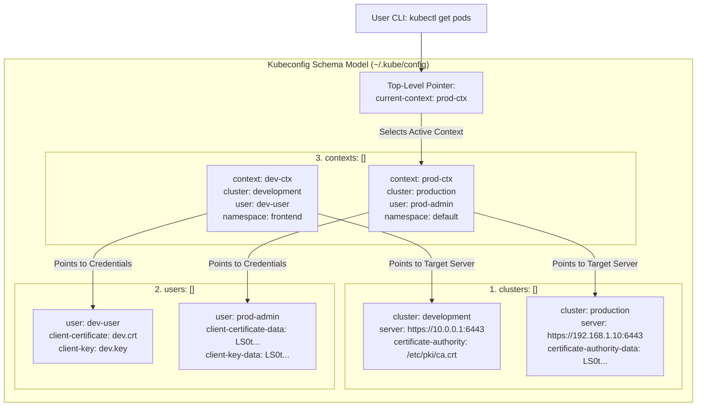
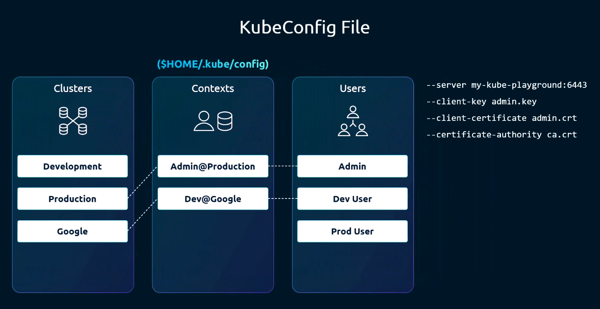
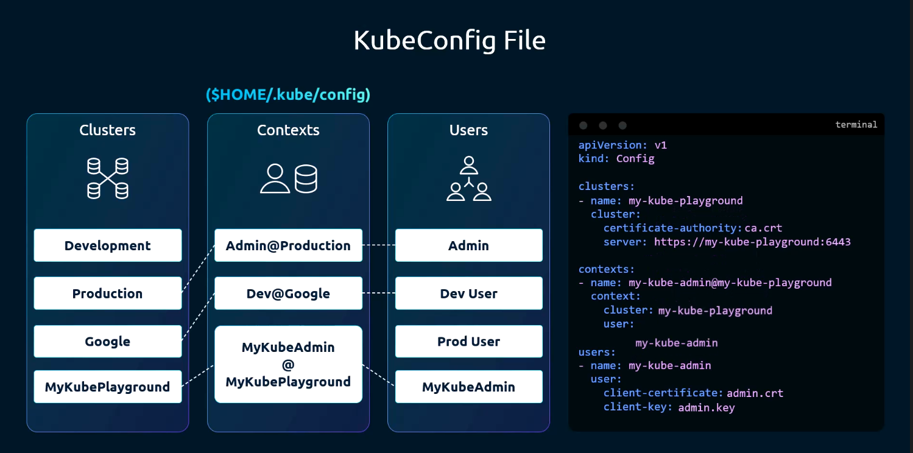
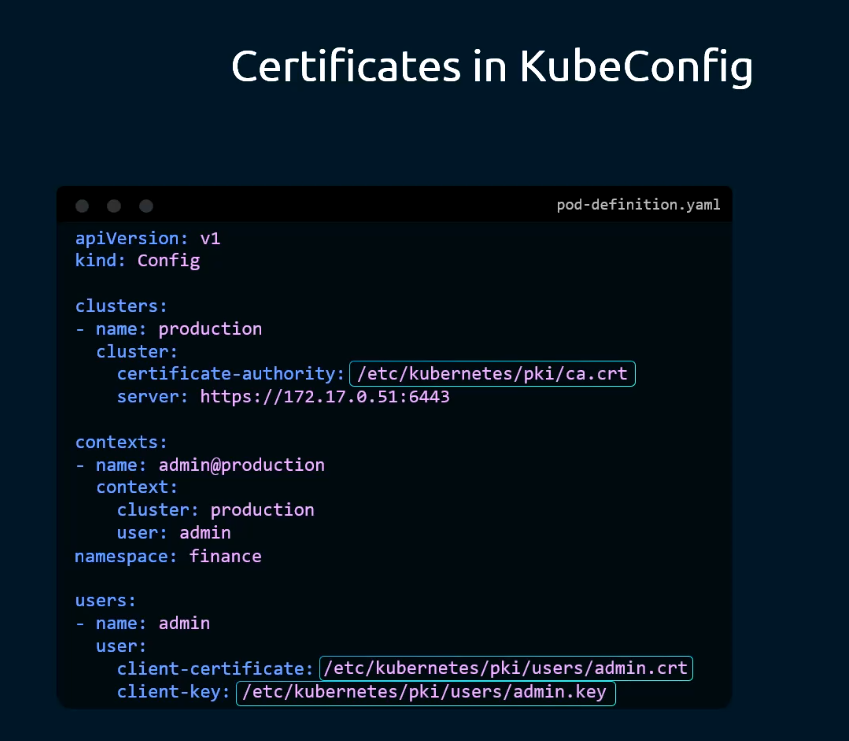
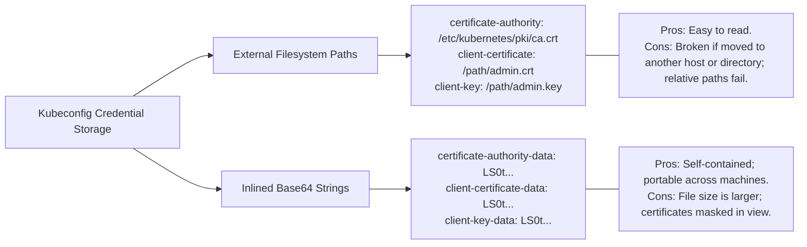
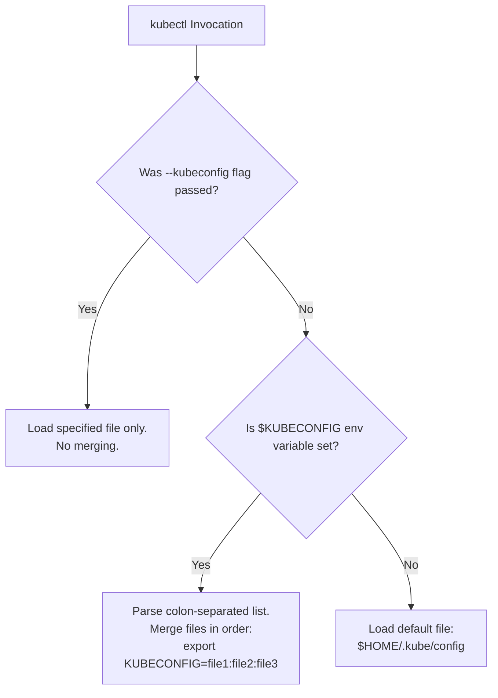
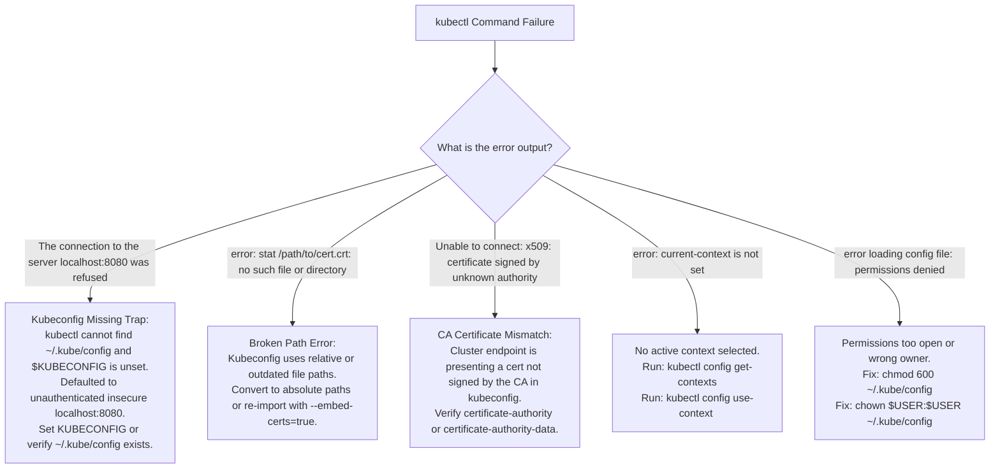

# Kubeconfig Architecture & Context Management - CKA Exam Notes

> **Exam Domain**: Cluster Architecture, Installation & Configuration (25%) / Cluster Security  
> **Weight / Importance**: Critical (Core hands-on CKA exam topic tested in nearly every exam session: switching contexts, setting active namespaces, embedding certificates, merging multi-cluster configurations, and diagnosing connection failures caused by corrupted kubeconfig paths)  
> **Target Version**: Verified against v1.31 / v1.32 (Current CKA Curriculum)  
> **Allowed Docs Search Keywords**: `kubeconfig`, `Organizing Cluster Access Using kubeconfig Files`, `kubectl config`, `current-context`  
> **Source**: Generated from `security/05-KubeConfig-raw.md`

---

## 1. Quick-Reference Summary

- **Tripartite Schema Architecture**:
  A `kubeconfig` file decouples cluster endpoints, authentication identities, and routing scopes into three distinct top-level arrays:
  1. **`clusters`**: Defines target endpoints (`server: https://<ip>:<port>`) and trust anchors (`certificate-authority` or `certificate-authority-data`).
  2. **`users`**: Defines authentication credentials (`client-certificate`, `client-key`, bearer `token`, or `exec` auth plugins).
  3. **`contexts`**: Connects a `cluster` and a `user` with an optional default `namespace`.
- **Active State Pointer (`current-context`)**:
  - The top-level string `current-context` specifies which context `kubectl` uses by default for all commands.
  - Can be switched instantly via `kubectl config use-context <context-name>`.
- **Loading & Precedence Hierarchy**:
  `kubectl` discovers configuration following a strict priority order:
  1. **CLI Flag**: `--kubeconfig <path>` (Highest priority).
  2. **Environment Variable**: `$KUBECONFIG` (Supports a colon-separated list of files merged at runtime: `export KUBECONFIG=file1:file2`).
  3. **Default Path**: `$HOME/.kube/config` (Lowest priority; standard file location).
- **Embedded Base64 Data vs. File Paths**:
  - `certificate-authority`, `client-certificate`, and `client-key` accept local filesystem paths.
  - Suffixing with `-data` (`certificate-authority-data`, `client-certificate-data`, `client-key-data`) indicates base64-encoded PEM content embedded directly into the YAML file.
  - Passing `--embed-certs=true` during `kubectl config` commands prevents external file path dependency failures.
- **Default Namespace Injection**:
  - Setting `namespace: <name>` inside a context directs `kubectl` to automatically query that namespace, eliminating the need to pass `-n <namespace>` on every command.
  - Command: `kubectl config set-context --current --namespace=<name>`.
- **The Redaction Trap**:
  - Running `kubectl config view` redacts certificate data and tokens as `DATA+OMIT`.
  - To view the unredacted base64 contents, you **must pass the `--raw` flag**: `kubectl config view --raw`.

---

## 2. Conceptual Overview & Mental Model

### Dual-Layer Architectural Understanding

- **Simple English Explanation (How It Works)**:
  - When you run `kubectl get pods`, `kubectl` needs to know three things:
    1. *Where is the cluster?* (The server URL and the CA certificate to verify it).
    2. *Who am I?* (The client certificate and private key to prove identity).
    3. *Which room am I looking in?* (The default namespace).
  - Without a configuration file, you would be forced to pass tedious command-line flags on every command:
    `kubectl get pods --server=https://192.168.1.10:6443 --certificate-authority=/path/ca.crt --client-certificate=/path/client.crt --client-key=/path/client.key --namespace=prod`.
  - The `kubeconfig` file organizes this cleanly. Instead of hardcoding credentials to a single endpoint, it stores a list of **Clusters**, a list of **Users**, and a list of **Contexts**.
  - A **Context** is simply a named relationship connecting one User to one Cluster (e.g. "Use `admin-user` when talking to `production-cluster` in the `finance` namespace").
  - The `current-context` field tells `kubectl` which context is active right now. When you switch contexts using `kubectl config use-context`, `kubectl` seamlessly redirects your commands to that target cluster and identity without touching the other configurations.

- **Formal Kubernetes Definition**:
  - A kubeconfig is a YAML document adhering to the `clientcmd/v1` API schema. It provides declarative configuration consumed by the `client-go` library to construct `rest.Config` objects. It encapsulates TLS transport security settings, client authenticators (X.509, OIDC, Webhook, Exec), and routing defaults. The loader evaluates configuration files across hierarchical merge rules, resolving relative file paths against the locating configuration file's parent directory and parsing embedded PKI data blocks.

### Architectural Mapping & Relationship Diagram



---

## 3. Deep-Dive Technical Breakdown

### 1. The Three Sections of a Kubeconfig



A kubeconfig file maps direct CLI flags into reusable configuration blocks:

| CLI Manual Flags | Kubeconfig Section | Description |
| :--- | :--- | :--- |
| `--server`, `--certificate-authority`, `--insecure-skip-tls-verify` | **`clusters`** | Network endpoints and server validation parameters |
| `--client-certificate`, `--client-key`, `--token` | **`users`** | Identity credentials proving authentication |
| `--cluster`, `--user`, `--namespace` | **`contexts`** | Binding that associates a user with a cluster and a default namespace |
| *None (Default switch)* | **`current-context`** | The active context used when no context flag is passed |

---

### 2. Complete Anatomy of a Multi-Cluster Kubeconfig Manifest



The declarative structure of a multi-cluster, multi-user configuration file:

```yaml
apiVersion: v1
kind: Config
preferences: {}

# 1. CLUSTERS: List of target Kubernetes clusters
clusters:
- cluster:
    certificate-authority: /etc/kubernetes/pki/ca.crt
    server: https://192.168.1.10:6443
  name: production

- cluster:
    certificate-authority-data: LS0tLS1CRUdJTi...
    server: https://10.0.0.50:6443
  name: development

# 2. USERS: List of client credentials
users:
- name: admin-user
  user:
    client-certificate: /etc/kubernetes/pki/users/admin.crt
    client-key: /etc/kubernetes/pki/users/admin.key

- name: dev-user
  user:
    client-certificate-data: LS0tLS1CRUdJTi...
    client-key-data: LS0tLS1CRUdJTi...

# 3. CONTEXTS: Bindings linking clusters, users, and default namespaces
contexts:
- context:
    cluster: production
    user: admin-user
    namespace: kube-system
  name: prod-admin-ctx

- context:
    cluster: development
    user: dev-user
    namespace: dev-apps
  name: dev-user-ctx

# 4. ACTIVE CONTEXT POINTER
current-context: prod-admin-ctx
```

> [!NOTE]
> Unlike standard Kubernetes API resources (Pods, Deployments), `kubeconfig` files are **never applied with `kubectl apply -f`**. They are client-side configuration files read directly by `kubectl` from the local filesystem.

---

### 3. File Paths vs. Inlined Base64 Data (`--embed-certs`)



Kubeconfig supports two methods for referencing cryptographic keys and certificates:



#### Converting File Paths to Inlined Data:
To convert a certificate file to base64 for embedding:
```bash
cat admin.crt | base64 | tr -d '\n'
```
When using the imperative CLI, passing `--embed-certs=true` automatically reads the file from disk, base64-encodes it, and writes the `*-data` field directly into the kubeconfig:
```bash
kubectl config set-credentials admin-user \
  --client-certificate=/path/to/admin.crt \
  --client-key=/path/to/admin.key \
  --embed-certs=true
```

---

### 4. Configuration Discovery, Merging & `$KUBECONFIG`

`kubectl` uses a loading pipeline to resolve its configuration:



#### Multi-File Merging Mechanics:
When multiple files are specified in `$KUBECONFIG` (e.g., `export KUBECONFIG=~/.kube/config:~/k8s/dev-config`):
- `kubectl` merges all `clusters`, `users`, and `contexts` into an in-memory unified configuration.
- **Precedence Rule**: If duplicate names exist across files (e.g., two clusters named `production`), the definition in the **first file** takes precedence.
- To permanently flatten merged files into a single standalone file:
  ```bash
  KUBECONFIG=file1:file2 kubectl config view --flatten > ~/.kube/config
  ```

---

### 5. Context-Level Namespace Scoping

By default, all contexts route requests to the `default` namespace. If you manage resources in a specific namespace (such as `development` or `ingress-nginx`), adding `namespace:` to the context eliminates repetitive `-n <namespace>` flags:

```yaml
contexts:
- context:
    cluster: production
    user: admin-user
    namespace: development    # Default namespace for this context
  name: prod-context
```

When `prod-context` is active:
```bash
kubectl get pods
```
is identical to executing:
```bash
kubectl get pods -n development
```

---

## 4. Command Translation & Mapping Tables

### Table 1: Imperative CLI Commands vs. Kubeconfig State Mutations

| Administrative Intent | Exact `kubectl config` Command | Underlying YAML Modification |
| :--- | :--- | :--- |
| **Switch Active Context** | `kubectl config use-context <ctx-name>` | Updates top-level `current-context: <ctx-name>` |
| **Inspect Active Context** | `kubectl config current-context` | Prints the value of `current-context` |
| **Set Active Context Namespace** | `kubectl config set-context --current --namespace=<ns>` | Sets `contexts[name=current].context.namespace: <ns>` |
| **Create / Update Context** | `kubectl config set-context <name> --cluster=<c> --user=<u> --namespace=<ns>` | Adds/modifies entry in `contexts: []` |
| **Create / Update Cluster** | `kubectl config set-cluster <name> --server=<url> --certificate-authority=<ca> --embed-certs=true` | Adds/modifies entry in `clusters: []` with inlined CA |
| **Create / Update User Credentials** | `kubectl config set-credentials <name> --client-certificate=<crt> --client-key=<key> --embed-certs=true` | Adds/modifies entry in `users: []` with inlined keys |
| **Delete Context** | `kubectl config delete-context <name>` | Removes entry from `contexts: []` |
| **Delete Cluster** | `kubectl config delete-cluster <name>` | Removes entry from `clusters: []` |
| **Delete User** | `kubectl config unset users.<name>` | Removes entry from `users: []` |

---

### Table 2: File References vs. Embedded Data Fields

| Object Category | Filesystem Path Field | Embedded Base64 Data Field | Base64 Encoding Command |
| :--- | :--- | :--- | :--- |
| **Cluster Authority** | `certificate-authority` | `certificate-authority-data` | `cat ca.crt \| base64 \| tr -d '\n'` |
| **Client Certificate** | `client-certificate` | `client-certificate-data` | `cat user.crt \| base64 \| tr -d '\n'` |
| **Client Private Key** | `client-key` | `client-key-data` | `cat user.key \| base64 \| tr -d '\n'` |

---

## 5. High-Yield CLI & Imperative Commands

### 1. Viewing & Inspecting Configuration
```bash
# View configuration with sensitive certificates redacted (shows DATA+OMIT)
kubectl config view

# View unredacted configuration showing raw base64 data and tokens
kubectl config view --raw

# View configuration for the currently active context only (minified)
kubectl config view --minify

# Inspect custom kubeconfig file
kubectl config view --kubeconfig=/root/my-kube-config
```

---

### 2. Managing Contexts & Default Namespaces
```bash
# Display the currently active context name
kubectl config current-context

# Switch to a different context
kubectl config use-context prod-admin-ctx

# Change the default namespace of the currently active context
kubectl config set-context --current --namespace=finance

# Create a brand-new context linking an existing cluster and user
kubectl config set-context dev-test-ctx \
  --cluster=development \
  --user=dev-user \
  --namespace=test
```

---

### 3. Programmatically Constructing a Kubeconfig from Scratch
A common exam task is assembling a standalone kubeconfig file for a user:

```bash
KUBECONFIG_FILE="/root/developer.kubeconfig"

# 1. Define the cluster endpoint with embedded CA
kubectl config set-cluster k8s-cluster \
  --server=https://192.168.1.10:6443 \
  --certificate-authority=/etc/kubernetes/pki/ca.crt \
  --embed-certs=true \
  --kubeconfig=$KUBECONFIG_FILE

# 2. Define user credentials with embedded client cert and private key
kubectl config set-credentials dev-user \
  --client-certificate=/root/dev-user.crt \
  --client-key=/root/dev-user.key \
  --embed-certs=true \
  --kubeconfig=$KUBECONFIG_FILE

# 3. Create context binding cluster, user, and default namespace
kubectl config set-context dev-context \
  --cluster=k8s-cluster \
  --user=dev-user \
  --namespace=development \
  --kubeconfig=$KUBECONFIG_FILE

# 4. Set current-context
kubectl config use-context dev-context --kubeconfig=$KUBECONFIG_FILE

# 5. Restrict file permissions
chmod 600 $KUBECONFIG_FILE
```

---

### 4. Merging Multiple Kubeconfig Files
```bash
# Merge standard config with an external test config into a temporary file
KUBECONFIG=~/.kube/config:/tmp/external-config.yaml kubectl config view --flatten > /tmp/merged-config.yaml

# Replace active config with the merged result
mv /tmp/merged-config.yaml ~/.kube/config
chmod 600 ~/.kube/config
```

---

## 6. Troubleshooting & Diagnostic Runbook

### Diagnostic Decision Tree



---

### Step-by-Step Triage Runbook

| Failure Symptom | Root Cause | Diagnosis Command | Remediation Procedure |
| :--- | :--- | :--- | :--- |
| `The connection to the server localhost:8080 was refused` | Kubeconfig file missing or `$KUBECONFIG` points to nonexistent file | `ls -la ~/.kube/config; echo $KUBECONFIG` | Export valid config: `export KUBECONFIG=/etc/kubernetes/admin.conf` or copy to `~/.kube/config`. |
| `stat client.crt: no such file or directory` | Kubeconfig contains relative file path that fails when changing directory | `kubectl config view` | Edit kubeconfig to use absolute paths or re-embed using `--embed-certs=true`. |
| `error: context "prod" does not exist` | Typo in context name or context omitted | `kubectl config get-contexts` | Identify valid context name and run `kubectl config use-context <exact-name>`. |
| `kubectl` commands query wrong namespace | Context default namespace set to an unexpected value | `kubectl config view --minify` | Update namespace: `kubectl config set-context --current --namespace=<correct-ns>`. |
| `x509: certificate has expired or is not yet valid` | Client certificate in kubeconfig has expired | `kubectl config view --raw -o jsonpath='{.users[0].user.client-certificate-data}' \| base64 -d \| openssl x509 -noout -enddate` | Re-issue user certificate or run `kubeadm certs renew all`. |

---

## 7. CKA Exam Tips, Gotchas & Traps

> [!CAUTION]
> **Trap 1: The "localhost:8080" Connection Refused Error**  
> If you run `kubectl` and see:
> ```plaintext
> The connection to the server localhost:8080 was refused - did you specify the right host or port?
> ```
> This indicates that `kubectl` **found no valid kubeconfig**! When no configuration is located, `kubectl` falls back to its compiled-in legacy default: `http://localhost:8080`. Immediately verify if `$KUBECONFIG` is set or if `~/.kube/config` exists.

> [!IMPORTANT]
> **Trap 2: Modifying the Current Context's Namespace**  
> In exam tasks asking you to "permanently configure context `research` to use namespace `finance`", do not manually edit YAML. Use the imperative shorthand:
> ```bash
> # If already in the context:
> kubectl config set-context --current --namespace=finance
> 
> # If targeting a specific context:
> kubectl config set-context research --namespace=finance
> ```

> [!WARNING]
> **Trap 3: The `DATA+OMIT` Redaction Trap**  
> Candidates frequently inspect `kubectl config view` to copy certificate data, only to paste the literal string `DATA+OMIT`. This corrupts the target file. Always supply the `--raw` flag when copying or extracting certificates:
> ```bash
> kubectl config view --raw
> ```

> [!TIP]
> **Exam Tip 4: Preserving the Environment Across Tasks**  
> Exam questions frequently state: *"Execute the following task using the kubeconfig located at `/root/my-other-config`"*.  
> Do not overwrite `/root/.kube/config`. Instead, either pass the flag `--kubeconfig=/root/my-other-config` on each command or export the environment variable for that subshell:
> ```bash
> export KUBECONFIG=/root/my-other-config
> ```

> [!NOTE]
> **Trap 5: Relative Paths in Custom Kubeconfigs**  
> If an exam question asks you to generate a custom kubeconfig, never write `client-certificate: dev.crt`. If the grading script runs from `/home/user`, it will fail to resolve the certificate. Always use absolute paths (e.g. `/root/dev.crt`) or pass `--embed-certs=true`.

---

## 8. Self-Test / Active Recall

<details>
<summary><strong>1. What are the three primary array sections defined in a standard kubeconfig file?</strong></summary>

1. **`clusters`**: Defines cluster API endpoints and CA certificates.
2. **`users`**: Defines authentication credentials (certificates, keys, tokens).
3. **`contexts`**: Binds a specific cluster and user together with an optional default namespace.
</details>

<details>
<summary><strong>2. In what priority order does <code>kubectl</code> look for configuration settings?</strong></summary>

1. The `--kubeconfig` command-line flag (highest).
2. The `$KUBECONFIG` environment variable (colon-separated list).
3. The default file at `$HOME/.kube/config` (lowest).
</details>

<details>
<summary><strong>3. What imperative command switches the active context to <code>prod-cluster-admin</code>?</strong></summary>

```bash
kubectl config use-context prod-cluster-admin
```
</details>

<details>
<summary><strong>4. How do you permanently change the default namespace for the currently active context to <code>marketing</code>?</strong></summary>

```bash
kubectl config set-context --current --namespace=marketing
```
</details>

<details>
<summary><strong>5. Why does <code>kubectl config view</code> display <code>DATA+OMIT</code> for certificates, and how do you view the actual values?</strong></summary>

`kubectl config view` redacts certificate data and private keys for security. To display the raw unredacted base64 data, append the `--raw` flag:
```bash
kubectl config view --raw
```
</details>

<details>
<summary><strong>6. What is the difference between <code>certificate-authority</code> and <code>certificate-authority-data</code> in a cluster entry?</strong></summary>

- `certificate-authority`: Contains a filesystem path to the PEM-encoded CA certificate file.
- `certificate-authority-data`: Contains the base64-encoded string of the CA certificate embedded directly in the YAML file.
</details>

<details>
<summary><strong>7. What happens if multiple kubeconfig files are exported in <code>$KUBECONFIG</code> and contain conflicting context names?</strong></summary>

The files are merged in order from left to right. The first file in the colon-separated list that defines the context takes precedence.
</details>

<details>
<summary><strong>8. What error indicates that <code>kubectl</code> found no valid kubeconfig file?</strong></summary>

```plaintext
The connection to the server localhost:8080 was refused - did you specify the right host or port?
```
This occurs because `kubectl` defaults to `http://localhost:8080` when no configuration file is discovered.
</details>

<details>
<summary><strong>9. What flag should always be passed when creating clusters or credentials with <code>kubectl config set-*</code> to ensure portability?</strong></summary>

`--embed-certs=true`. It embeds the base64-encoded file contents into the kubeconfig rather than referencing local file paths.
</details>

<details>
<summary><strong>10. How do you view only the configuration relevant to the currently active context?</strong></summary>

```bash
kubectl config view --minify
```
</details>

---

## 9. Official Documentation Bookmarks

| Documentation Page | Official URL | Search Keywords | High-Yield Section for Exam |
| :--- | :--- | :--- | :--- |
| **Organizing Cluster Access Using kubeconfig Files** | `https://kubernetes.io/docs/concepts/configuration/organize-cluster-access-kubeconfig/` | `kubeconfig`, `organize cluster access` | Kubeconfig file structure, loading rules, and merging |
| **Configure Access to Multiple Clusters** | `https://kubernetes.io/docs/tasks/access-application-cluster/configure-access-multiple-clusters/` | `configure access multiple clusters` | Step-by-step tutorial on defining clusters, users, and contexts |
| **kubectl config Reference** | `https://kubernetes.io/docs/reference/generated/kubectl/kubectl-commands#config` | `kubectl config`, `use-context`, `set-context` | Complete CLI syntax for all `kubectl config` subcommands |

