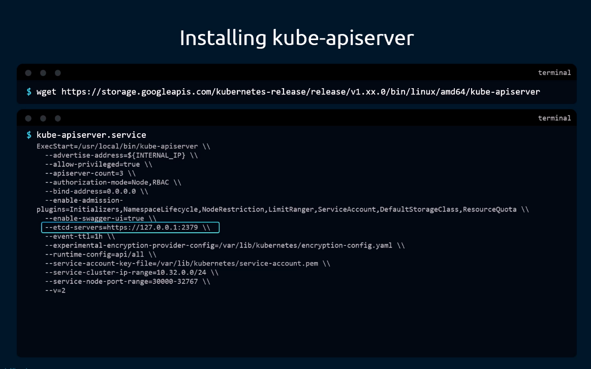
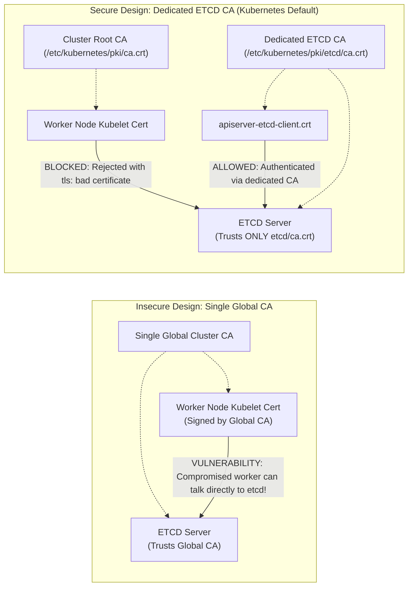
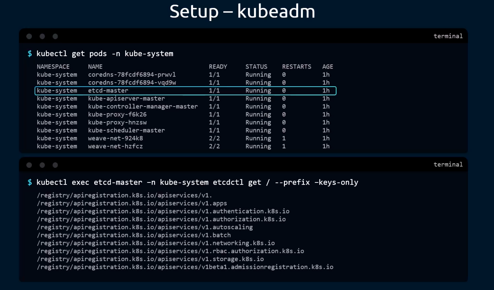
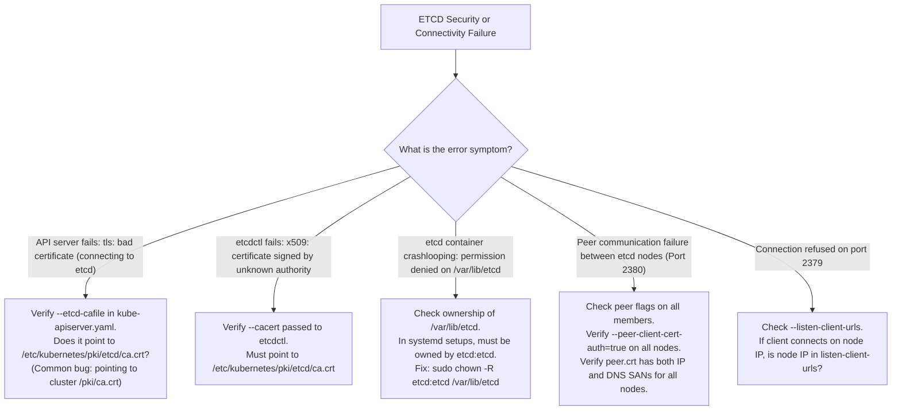

# Securing the Persistent Key/Value Store (ETCD) - CKA Exam Notes

> **Exam Domain**: Cluster Architecture, Installation & Configuration (25%) / Cluster Security  
> **Weight / Importance**: Critical (ETCD is the sole authoritative datastore of Kubernetes; securing its client and peer transport via mTLS, enforcing dedicated CA boundaries, isolating network interfaces, and setting strict filesystem permissions is a primary CKA security requirement)  
> **Target Version**: Verified against v1.31 / v1.32 (Current CKA Curriculum)  
> **Allowed Docs Search Keywords**: `Operating etcd clusters for Kubernetes`, `etcd security`, `securing etcd clusters`, `kubeadm certs`  
> **Source**: Generated from `security/06-persistant-key-value-store-raw.md`

---

## 1. Quick-Reference Summary

- **The Crown Jewels of Kubernetes**:
  - ETCD holds the complete, authoritative state of the Kubernetes cluster (manifests, specifications, secrets, status, dynamic leases, and RBAC bindings).
  - Anyone with direct, unauthenticated read/write access to ETCD has full control over the cluster and can read all raw Secrets without going through API server authorization checks.
- **The Four Pillars of ETCD Security**:
  1. **Dual-Channel Mutual TLS (mTLS)**: Enforces cryptographic identity verification for both client connections (port 2379) and peer replication connections (port 2380).
  2. **Dedicated Certificate Authority Isolation**: ETCD must be governed by its own independent CA (`/etc/kubernetes/pki/etcd/ca.crt`), completely segregated from the Kubernetes cluster Root CA (`/etc/kubernetes/pki/ca.crt`).
  3. **Network Boundary Isolation**: ETCD must listen only on `localhost` (`127.0.0.1`) or an isolated, firewall-protected control-plane subnet. Worker nodes and public internet traffic must never reach ports 2379 or 2380.
  4. **Filesystem Access Hardening**: The data directory (`--data-dir=/var/lib/etcd`) must have strict permissions (`0700` / `drwx------`), and private keys (`*.key`) must be restricted to `0600` (`-rw-------`).
- **Core Server Flags for Client TLS (Port 2379)**:
  - `--cert-file=/etc/kubernetes/pki/etcd/server.crt`
  - `--key-file=/etc/kubernetes/pki/etcd/server.key`
  - `--trusted-ca-file=/etc/kubernetes/pki/etcd/ca.crt`
  - `--client-cert-auth=true` (Rejects any client lacking a certificate signed by `trusted-ca-file`).
- **Core Server Flags for Peer TLS (Port 2380)**:
  - `--peer-cert-file=/etc/kubernetes/pki/etcd/peer.crt`
  - `--peer-key-file=/etc/kubernetes/pki/etcd/peer.key`
  - `--peer-trusted-ca-file=/etc/kubernetes/pki/etcd/ca.crt`
  - `--peer-client-cert-auth=true` (Prevents rogue etcd instances from joining the Raft cluster).
- **Matching Kube-Apiserver Client Flags**:
  - `--etcd-servers=https://127.0.0.1:2379`
  - `--etcd-cafile=/etc/kubernetes/pki/etcd/ca.crt`
  - `--etcd-certfile=/etc/kubernetes/pki/apiserver-etcd-client.crt`
  - `--etcd-keyfile=/etc/kubernetes/pki/apiserver-etcd-client.key`

---

## 2. Conceptual Overview & Mental Model

### Dual-Layer Architectural Understanding

- **Simple English Explanation (How It Works)**:
  - Imagine your Kubernetes cluster as a bank. The `kube-apiserver` is the front-desk teller: it checks your ID, validates your permissions via RBAC, and logs your transactions.
  - **ETCD is the underground vault**. It holds the actual money and ledgers (all pod definitions, passwords, and tokens).
  - If someone can dig a tunnel directly into the vault (bypass the API server and talk directly to ETCD), all the security guards and RBAC rules at the front desk become useless.
  - To secure ETCD, we place multiple defense barriers around it:
    1. **Locked Doors (mTLS)**: ETCD refuses to talk to anyone unless they show a digital badge signed by ETCD's personal security office (ETCD CA).
    2. **Separate Badging Office (Dedicated CA)**: The badge used by the main cluster (`ca.crt`) does *not* open the vault door. Only badges signed specifically by the ETCD CA (`etcd/ca.crt`) are accepted.
    3. **Two Separate Entrances (Client vs. Peer)**: One entrance (port 2379) is exclusively for the API server teller to fetch data. A completely separate private hallway (port 2380) is used between multiple vault guards (etcd nodes) to synchronize ledger copies via Raft consensus.
    4. **Physical Vault Walls (Filesystem Permissions)**: On the operating system itself, the physical database files (`/var/lib/etcd`) can only be opened and read by the root user or the etcd system daemon.

- **Formal Kubernetes Definition**:
  - ETCD is a strongly consistent, distributed key-value store implementing the Raft consensus algorithm. In Kubernetes, it functions as the single source of truth for the entire control plane. Security is established through multi-layer defense-in-depth: transport-layer mutual TLS on both client (`2379/tcp`) and peer (`2380/tcp`) listeners, cryptographic trust isolation via an independent X.509 Certificate Authority, interface binding restrictions, and POSIX file access controls on the underlying BoltDB storage engine (`member/snap/db`).

### Multi-Layer Perimeter Security Model

```mermaid
flowchart TD
    subgraph Layer1["Layer 1: Network & Interface Perimeter"]
        direction TB
        FW["Host Firewall / iptables<br/>Block external traffic to 2379/2380"]
        Bind["Interface Binding<br/>--listen-client-urls=https://127.0.0.1:2379<br/>(or isolated control-plane subnet)"]
    end

    subgraph Layer2["Layer 2: Dedicated CA Trust Boundary"]
        direction TB
        ETCD_CA["Dedicated ETCD CA (/etc/kubernetes/pki/etcd/ca.crt)<br/>Completely isolated from Cluster Root CA"]
    end

    subgraph Layer3["Layer 3: Mutual TLS (mTLS) Authentication"]
        direction TB
        ClientAuth["Client Channel (Port 2379)<br/>--client-cert-auth=true<br/>Accepts ONLY apiserver-etcd-client.crt"]
        PeerAuth["Peer Channel (Port 2380)<br/>--peer-client-cert-auth=true<br/>Accepts ONLY etcd member peer.crt"]
    end

    subgraph Layer4["Layer 4: Host Filesystem Hardening"]
        direction TB
        DataDir["Database Directory (/var/lib/etcd)<br/>Permissions: 0700 (drwx------)"]
        KeyPerms["Private Keys (/etc/kubernetes/pki/etcd/*.key)<br/>Permissions: 0600 (-rw-------)"]
    end

    Caller["Untrusted Actor / Worker Node"] -->|Blocked by Network Rule| Layer1
    APIServer["kube-apiserver"] -->|Valid mTLS (apiserver-etcd-client)| Layer2
    Layer2 --> Layer3
    Layer3 --> Layer4
    Layer4 --> BoltDB[("BoltDB Key-Value Datastore<br/>member/snap/db")]
```

---

## 3. Deep-Dive Technical Breakdown

### 1. The Threat Model & Attack Surface of ETCD

If ETCD is left unhardened, an attacker on the network can completely compromise the Kubernetes cluster:

1. **Direct Credential Extraction**:
   Kubernetes `Secret` resources are stored in ETCD as base64-encoded strings (unless API Server Encryption at Rest is explicitly enabled). An unauthenticated connection to ETCD allows executing `etcdctl get /registry/secrets --prefix`, dumping all service account tokens, database passwords, and TLS certificates.
2. **State Manipulation & Backdoors**:
   An attacker can directly write keys into `/registry/pods/` or create cluster-admin bindings directly in `/registry/clusterrolebindings/`, bypassing all validating and mutating admission webhooks in the API server.
3. **Malicious Peer Injection (Raft Poisoning)**:
   If port 2380 lacks peer TLS authentication, an attacker can spin up a rogue etcd instance, join the cluster, and manipulate or wipe the distributed consensus log.

---

### 2. Dual-Channel Mutual TLS Architecture


ETCD divides network communication into two distinct channels, each requiring its own TLS configuration:

#### Channel A: Client-Facing Communication (Port 2379)
- **Primary Listener**: Receives queries from `kube-apiserver` and administrative `etcdctl` CLI calls.
- **Flags**:
  - `--listen-client-urls`: Network interfaces ETCD binds to (e.g. `https://127.0.0.1:2379,https://192.168.1.10:2379`).
  - `--advertise-client-urls`: URL published to clients for connection.
  - `--cert-file`: Server certificate presented to incoming clients.
  - `--key-file`: Private key matching the server certificate.
  - `--trusted-ca-file`: CA certificate used to validate client certificates.
  - `--client-cert-auth=true`: Forces TLS handshake to demand and verify a client certificate.

#### Channel B: Peer-to-Peer Cluster Replication (Port 2380)
- **Primary Listener**: Receives Raft consensus heartbeats and log entries from fellow etcd members in HA clusters.
- **Flags**:
  - `--listen-peer-urls`: Network interfaces ETCD binds to for peer traffic (e.g. `https://192.168.1.10:2380`).
  - `--initial-advertise-peer-urls`: URL advertised to other cluster members.
  - `--peer-cert-file`: Server certificate presented to fellow peers.
  - `--peer-key-file`: Private key matching the peer certificate.
  - `--peer-trusted-ca-file`: CA certificate used to validate peer certificates.
  - `--peer-client-cert-auth=true`: Enforces mutual authentication among all Raft members.

---

### 3. The Dedicated ETCD Certificate Authority Isolation

Why does `kubeadm` generate a separate CA in `/etc/kubernetes/pki/etcd/ca.crt` rather than reusing the cluster Root CA (`/etc/kubernetes/pki/ca.crt`)?





- **Blast Radius Containment**:
  If a worker node is compromised, the attacker has access to the node's client certificate signed by `ca.crt`.
  Because ETCD trusts **only** certificates signed by `etcd/ca.crt`, the compromised node certificate is completely useless against ETCD.
  Only the `kube-apiserver` holds a valid client certificate (`apiserver-etcd-client.crt`) signed by `etcd/ca.crt`.

---

### 4. Network & Interface Hardening

In single-control-plane clusters (standard lab/exam environments), ETCD client communications should be restricted strictly to localhost:

```yaml
spec:
  containers:
  - command:
    - etcd
    - --listen-client-urls=https://127.0.0.1:2379
    - --advertise-client-urls=https://127.0.0.1:2379
```

In High Availability (HA) multi-master clusters:
- ETCD binds to the private, internal control-plane IP address.
- Strict firewall rules (`iptables` / `ufw` / cloud security groups) must block ports 2379 and 2380 from all worker node IP subnets and external CIDR blocks.

---

### 5. Filesystem Security & Storage Hardening



ETCD writes all persistent state to local disk inside `--data-dir` (default: `/var/lib/etcd`).

#### POSIX Permission Baseline:
1. **Database Directory (`/var/lib/etcd`)**:
   - Must be owned by `root:root` (for kubeadm static pods) or `etcd:etcd` (for systemd).
   - Permissions must be set to **`0700` (`drwx------`)**. No other user or group may read, write, or enter the directory.
2. **PKI Certificates and Private Keys (`/etc/kubernetes/pki/etcd/`)**:
   - Public certificates (`*.crt`): Permissions **`0644` (`-rw-r--r--`)**.
   - Private keys (`*.key`): Permissions **`0600` (`-rw-------`)**.

---

## 4. Command Translation & Mapping Tables

### Table 1: Comprehensive ETCD Security Flags Reference

| Configuration Flag | Channel / Scope | Default Kubeadm Value | Security Purpose & Impact |
| :--- | :--- | :--- | :--- |
| **`--cert-file`** | Client (2379) | `/etc/kubernetes/pki/etcd/server.crt` | Server certificate presented to `kube-apiserver` |
| **`--key-file`** | Client (2379) | `/etc/kubernetes/pki/etcd/server.key` | Private key for client-facing server certificate |
| **`--trusted-ca-file`** | Client (2379) | `/etc/kubernetes/pki/etcd/ca.crt` | CA used to authenticate incoming clients (`kube-apiserver`) |
| **`--client-cert-auth`** | Client (2379) | `true` | Enforces mandatory mTLS; drops unauthenticated HTTP/TLS calls |
| **`--peer-cert-file`** | Peer (2380) | `/etc/kubernetes/pki/etcd/peer.crt` | Certificate presented to fellow etcd cluster members |
| **`--peer-key-file`** | Peer (2380) | `/etc/kubernetes/pki/etcd/peer.key` | Private key for peer certificate |
| **`--peer-trusted-ca-file`**| Peer (2380) | `/etc/kubernetes/pki/etcd/ca.crt` | CA used to validate peer certificates across cluster members |
| **`--peer-client-cert-auth`**| Peer (2380) | `true` | Enforces mandatory mutual TLS for Raft consensus communication |
| **`--listen-client-urls`** | Client (2379) | `https://127.0.0.1:2379,...` | Socket interfaces listening for incoming client requests |
| **`--listen-peer-urls`** | Peer (2380) | `https://<node-ip>:2380` | Socket interfaces listening for incoming peer replication traffic |

---

### Table 2: ETCD vs. Kube-Apiserver Flag Handshake Pairing

| ETCD Server Configuration (`etcd.yaml`) | Kube-Apiserver Client Configuration (`kube-apiserver.yaml`) | Handshake Validation Role |
| :--- | :--- | :--- |
| `--trusted-ca-file=/etc/kubernetes/pki/etcd/ca.crt` | `--etcd-certfile=/etc/kubernetes/pki/apiserver-etcd-client.crt` | ETCD verifies API server identity using ETCD CA |
| `--cert-file=/etc/kubernetes/pki/etcd/server.crt` | `--etcd-cafile=/etc/kubernetes/pki/etcd/ca.crt` | API server verifies ETCD identity using ETCD CA |
| `--key-file=/etc/kubernetes/pki/etcd/server.key` | `--etcd-keyfile=/etc/kubernetes/pki/apiserver-etcd-client.key` | Cryptographic private key matches for TLS session |
| `--listen-client-urls=https://127.0.0.1:2379` | `--etcd-servers=https://127.0.0.1:2379` | Target IP and port match |

---

### Table 3: Filesystem Permissions & Security Matrix

| Target File / Directory | Recommended Ownership | Octal Permissions | Symbolic Permissions | Potential Risk if Misconfigured |
| :--- | :--- | :--- | :--- | :--- |
| `/var/lib/etcd` | `root:root` (or `etcd:etcd`) | `0700` | `drwx------` | Unauthorized users on host can read raw database |
| `/etc/kubernetes/pki/etcd/ca.key` | `root:root` | `0600` | `-rw-------` | Attacker can forge etcd client & peer certificates |
| `/etc/kubernetes/pki/etcd/server.key` | `root:root` | `0600` | `-rw-------` | Attacker can impersonate etcd server in MITM attack |
| `/etc/kubernetes/pki/etcd/peer.key` | `root:root` | `0600` | `-rw-------` | Attacker can inject malicious peer into Raft cluster |
| `/etc/kubernetes/pki/etcd/*.crt` | `root:root` | `0644` | `-rw-r--r--` | Publicly readable; zero secret compromise |

---

## 5. High-Yield CLI & Imperative Commands

### 1. Auditing ETCD TLS Configuration on the Control Plane
Inspect the running static pod manifest to verify all security flags are present:

```bash
# Check all TLS flags in etcd.yaml
grep -E '\-\-(cert-file|key-file|trusted-ca-file|client-cert-auth|peer-cert-file|peer-key-file|peer-trusted-ca-file|peer-client-cert-auth)' /etc/kubernetes/manifests/etcd.yaml
```

---

### 2. Demonstrating mTLS Enforcement with `etcdctl`
To prove that ETCD is secured and refuses unauthenticated calls:

```bash
# Attempt 1: Call without TLS flags (FAILS or times out)
ETCDCTL_API=3 etcdctl --endpoints=https://127.0.0.1:2379 endpoint health
# Output: Error: context deadline exceeded OR client: etcd cluster is unavailable

# Attempt 2: Call with full mTLS credentials (SUCCEEDS)
ETCDCTL_API=3 etcdctl \
  --endpoints=https://127.0.0.1:2379 \
  --cacert=/etc/kubernetes/pki/etcd/ca.crt \
  --cert=/etc/kubernetes/pki/etcd/server.crt \
  --key=/etc/kubernetes/pki/etcd/server.key \
  endpoint health
# Output: https://127.0.0.1:2379 is healthy: successfully committed proposal: took = 2.1ms
```

---

### 3. Auditing Filesystem Access Permissions
Verify that the host filesystem permissions follow security best practices:

```bash
# 1. Audit etcd data directory permissions (Must be 0700)
stat -c "%a %n %U:%G" /var/lib/etcd

# 2. Audit etcd private keys (Must be 0600)
stat -c "%a %n %U:%G" /etc/kubernetes/pki/etcd/*.key

# Correct permissions if found non-compliant:
sudo chmod 700 /var/lib/etcd
sudo chmod 600 /etc/kubernetes/pki/etcd/*.key
```

---

### 4. Checking Certificate Validity & Expiration
```bash
# 1. Check expiration using kubeadm
sudo kubeadm certs check-expiration | grep etcd

# 2. Inspect ETCD server certificate details using OpenSSL
openssl x509 -in /etc/kubernetes/pki/etcd/server.crt -text -noout | grep -E 'Subject:|Issuer:|Not After'
```

---

## 6. Troubleshooting & Diagnostic Runbook

### Diagnostic Decision Tree



---

### Step-by-Step Triage Runbook

| Failure Symptom | Probable Root Cause | Verification Command | Corrective Action |
| :--- | :--- | :--- | :--- |
| `API server crashloops; logs show remote error: tls: bad certificate` | API server configured with cluster CA instead of ETCD CA | `grep etcd-cafile /etc/kubernetes/manifests/kube-apiserver.yaml` | Update `--etcd-cafile` to point strictly to `/etc/kubernetes/pki/etcd/ca.crt`. |
| `etcdctl: context deadline exceeded` | TLS flags omitted or wrong port specified | `netstat -tlpn \| grep etcd` | Add `--cacert`, `--cert`, `--key`, and ensure `--endpoints=https://127.0.0.1:2379`. |
| `etcd fails with error: open /var/lib/etcd/member: permission denied` | Filesystem ownership changed during backup or restore | `ls -ld /var/lib/etcd` | Set permissions: `chown -R root:root /var/lib/etcd && chmod 700 /var/lib/etcd`. |
| `etcd members cannot form cluster; raft: cannot reach peer` | Network firewall blocking port 2380 between master nodes | `nc -zvw3 <peer-ip> 2380` | Open port 2380 between all control plane nodes in firewall / security groups. |
| `x509: certificate is valid for 127.0.0.1, not 192.168.1.10` | Connecting to etcd via host IP, but IP is missing from server certificate SANs | `openssl x509 -in /etc/kubernetes/pki/etcd/server.crt -text -noout \| grep -A 1 "Alternative Name"` | Connect via `127.0.0.1` or regenerate `server.crt` with node IP in SAN. |

---

## 7. CKA Exam Tips, Gotchas & Traps

> [!CAUTION]
> **Trap 1: The CA Cross-Contamination Trap**  
> Never mix the cluster CA with the ETCD CA!
> - When troubleshooting `kube-apiserver.yaml`, candidates often see `--etcd-cafile=/etc/kubernetes/pki/ca.crt`.
> - This breaks the API server immediately because `ca.crt` cannot validate etcd's `server.crt`.
> - Always verify that all etcd-related flags point to the `/etc/kubernetes/pki/etcd/` subfolder.

> [!IMPORTANT]
> **Trap 2: `client-cert-auth=true` is Mandatory for Zero-Trust**  
> Setting `--cert-file` and `--key-file` only enables one-way TLS (encrypts data and proves ETCD's identity to clients). Without `--client-cert-auth=true`, **any client can connect without presenting a certificate**. Always ensure `--client-cert-auth=true` is enabled.

> [!WARNING]
> **Trap 3: Forgetting `ETCDCTL_API=3`**  
> In exam terminal environments, the `etcdctl` binary might default to API v2. In v2 mode, TLS flags and snapshot subcommands do not function properly. Always prepend:
> ```bash
> ETCDCTL_API=3 etcdctl ...
> ```

> [!TIP]
> **Exam Tip 4: Fast Certificate Discovery**  
> If an exam question asks you to run an `etcdctl` command, do not guess certificate paths. Open `/etc/kubernetes/manifests/etcd.yaml` and copy the paths directly from:
> - `--trusted-ca-file` $\implies$ pass to `--cacert`
> - `--cert-file` $\implies$ pass to `--cert`
> - `--key-file` $\implies$ pass to `--key`

> [!NOTE]
> **Trap 5: Port 2379 vs. Port 2380**  
> - **Port 2379**: Client traffic (`kube-apiserver`, `etcdctl`).
> - **Port 2380**: Peer traffic between etcd cluster nodes.
> Never point `kube-apiserver` or `etcdctl` to port 2380!

---

## 8. Self-Test / Active Recall

<details>
<summary><strong>1. Why is ETCD considered the most critical security asset in a Kubernetes cluster?</strong></summary>

Because ETCD is the sole authoritative datastore for all cluster state. It contains all manifests, configurations, RBAC policies, and raw Secret data. Anyone who gains direct read/write access to ETCD can extract all cluster secrets and modify cluster state, completely bypassing API server authorization and admission controls.
</details>

<details>
<summary><strong>2. What is the architectural purpose of maintaining a separate Certificate Authority specifically for ETCD?</strong></summary>

To enforce security isolation and defense-in-depth. If the Kubernetes cluster Root CA or a worker node client certificate is compromised, the attacker cannot connect to the ETCD datastore because ETCD trusts strictly certificates signed by `etcd/ca.crt`.
</details>

<details>
<summary><strong>3. What does the flag <code>--client-cert-auth=true</code> do on an ETCD instance?</strong></summary>

It enforces mutual TLS (mTLS) on the client listener (port 2379). ETCD will reject any incoming connection that does not present a valid client certificate signed by the authority specified in `--trusted-ca-file`.
</details>

<details>
<summary><strong>4. What is the difference between ETCD port 2379 and port 2380?</strong></summary>

- **Port 2379**: Listens for **client** requests (from `kube-apiserver` and `etcdctl`).
- **Port 2380**: Listens for **peer-to-peer** Raft consensus and replication traffic between clustered etcd members.
</details>

<details>
<summary><strong>5. Which four flags on <code>kube-apiserver</code> configure its secure client connection to ETCD?</strong></summary>

1. `--etcd-servers=https://<ip>:2379`
2. `--etcd-cafile=/etc/kubernetes/pki/etcd/ca.crt`
3. `--etcd-certfile=/etc/kubernetes/pki/apiserver-etcd-client.crt`
4. `--etcd-keyfile=/etc/kubernetes/pki/apiserver-etcd-client.key`
</details>

<details>
<summary><strong>6. What POSIX file permissions should be applied to <code>/var/lib/etcd</code> and <code>/etc/kubernetes/pki/etcd/*.key</code>?</strong></summary>

- `/var/lib/etcd`: **`0700` (`drwx------`)**, owned by `root:root` (or `etcd:etcd`).
- `*.key` files: **`0600` (`-rw-------`)**, readable only by the owner.
</details>

<details>
<summary><strong>7. Why should ETCD's client listener bind to <code>127.0.0.1</code> in single-master clusters?</strong></summary>

To restrict network reachability exclusively to local processes on the control-plane host, preventing any network-based attacks from worker nodes or external networks.
</details>

<details>
<summary><strong>8. What happens if an administrator runs <code>etcdctl endpoint health</code> against a secured ETCD instance without providing certificates?</strong></summary>

The request fails or times out with an error (e.g. `context deadline exceeded` or `client: etcd cluster is unavailable`) because ETCD refuses the unauthenticated TLS handshake.
</details>

<details>
<summary><strong>9. What flag prevents rogue etcd instances from joining an existing etcd cluster?</strong></summary>

`--peer-client-cert-auth=true` (combined with `--peer-trusted-ca-file`).
</details>

<details>
<summary><strong>10. How can you verify that ETCD certificates are not close to expiration without stopping the cluster?</strong></summary>

Run the kubeadm diagnostic command:
```bash
sudo kubeadm certs check-expiration | grep etcd
```
</details>

---

## 9. Official Documentation Bookmarks

| Documentation Page | Official URL | Search Keywords | High-Yield Section for Exam |
| :--- | :--- | :--- | :--- |
| **Operating etcd clusters for Kubernetes** | `https://kubernetes.io/docs/tasks/administer-cluster/configure-upgrade-etcd/` | `Operating etcd clusters for Kubernetes`, `etcd security` | Comprehensive guide on etcd flags, clustering, and security |
| **Securing an etcd cluster** | `https://kubernetes.io/docs/tasks/administer-cluster/configure-upgrade-etcd/#securing-etcd-clusters` | `securing etcd clusters`, `etcd TLS` | Exact TLS flags for client and peer authentication |
| **PKI certificates and requirements** | `https://kubernetes.io/docs/setup/best-practices/certificates/` | `PKI certificates and requirements`, `etcd certs` | Certificate paths and CA hierarchy in kubeadm |
| **Certificate Management with kubeadm** | `https://kubernetes.io/docs/tasks/administer-cluster/kubeadm/kubeadm-certs/` | `kubeadm certs check-expiration` | Commands for auditing and renewing etcd certificates |

