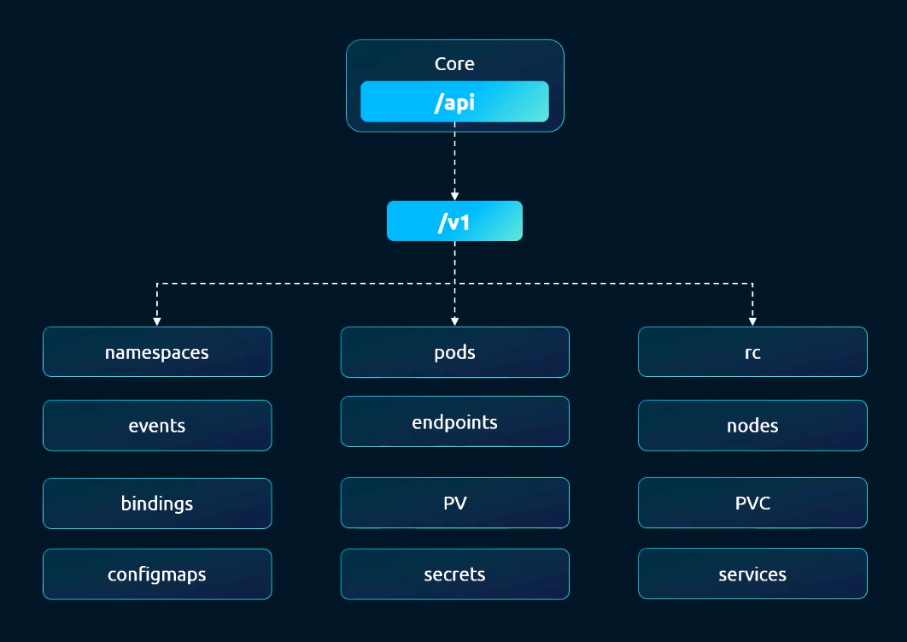
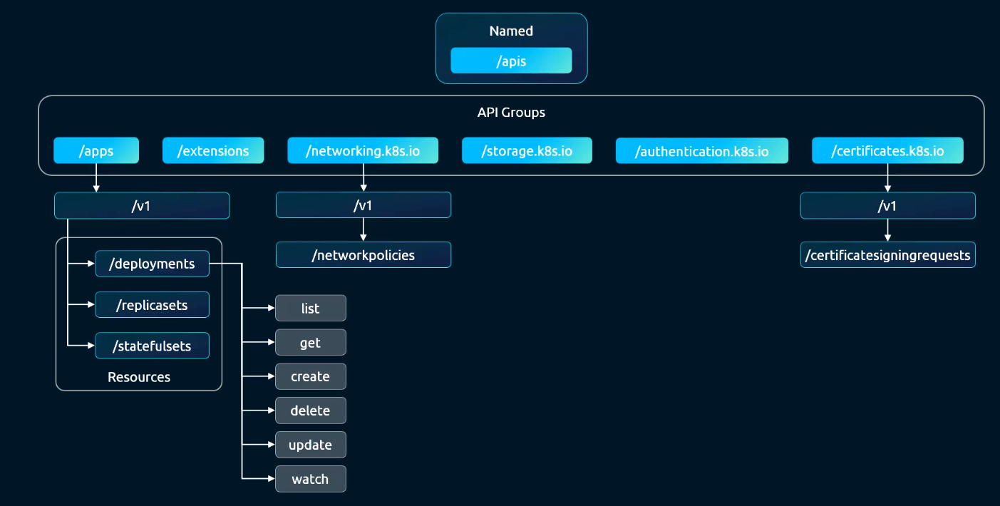
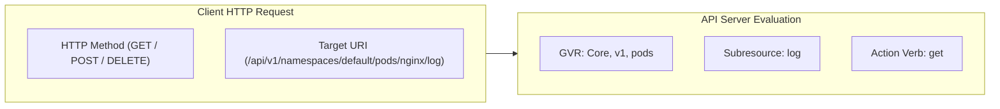
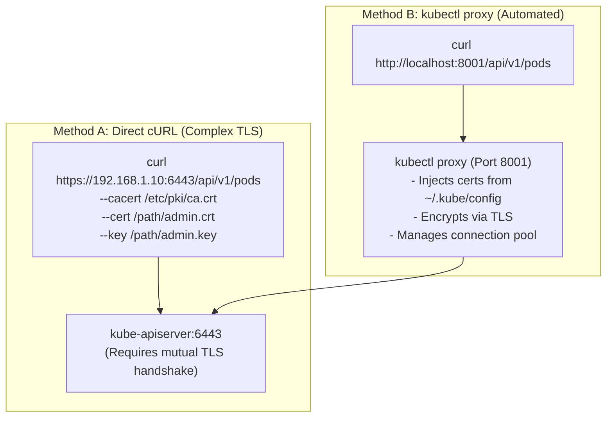
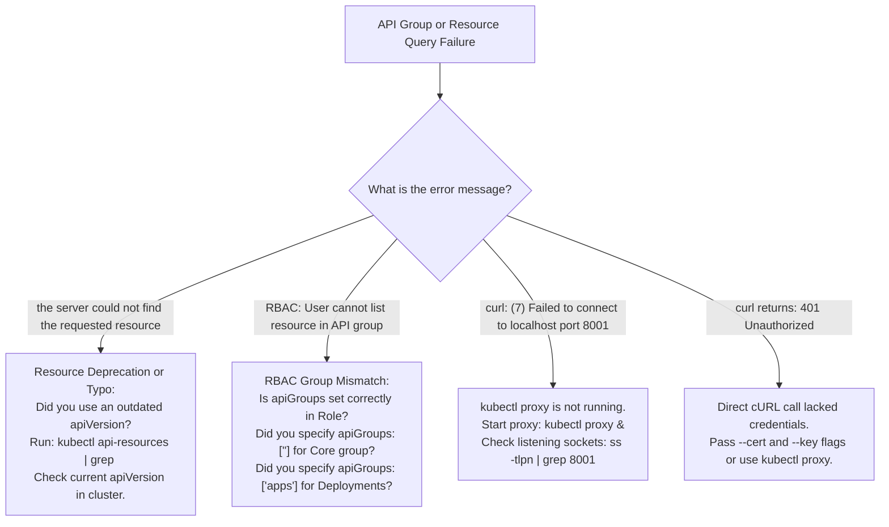

# Kubernetes API Groups & Resource Architecture - CKA Exam Notes

> **Exam Domain**: Cluster Architecture, Installation & Configuration (25%) / Cluster Security  
> **Weight / Importance**: Essential Core Foundation (Directly underpins all Role and ClusterRole definitions in RBAC, manifest `apiVersion` schemas, custom resource extensions, and RESTful API interactions via `kubectl proxy`)  
> **Target Version**: Verified against v1.31 / v1.32 (Current CKA Curriculum)  
> **Allowed Docs Search Keywords**: `API Overview`, `API Groups`, `kubectl proxy`, `kubectl api-resources`, `kubectl api-versions`  
> **Source**: Generated from `security/07-api-groups-raw.md`

---

## 1. Quick-Reference Summary

- **Top-Level API Server URI Hierarchy**:
  - **System & Diagnostic Endpoints**:
    - `/version`: Displays the Kubernetes control plane version.
    - `/healthz`, `/livez`, `/readyz`: Liveness and readiness health checks.
    - `/metrics`: Prometheus-compatible performance metrics.
    - `/logs`: Host-level log streaming (deprecated).
    - `/openapi/v2`, `/openapi/v3`: OpenAPI specification schemas.
  - **Workload & Resource Endpoints**:
    - **`/api/v1` (Core / Legacy Group)**: Houses foundational primitives (`pods`, `services`, `namespaces`, `nodes`, `configmaps`, `secrets`, `pv`, `pvc`). Has **no group name** in its URI path.
    - **`/apis/<group>/<version>` (Named API Groups)**: Houses organized, domain-specific resources (`/apis/apps/v1`, `/apis/batch/v1`, `/apis/networking.k8s.io/v1`).
- **GVR vs. GVK Mapping**:
  - **GVR (Group, Version, Resource)**: Pluralized identifier used in RESTful HTTP URI paths and RBAC rules (e.g., `apps`, `v1`, `deployments`).
  - **GVK (Group, Version, Kind)**: Singular identifier used in YAML manifests (e.g., `apiVersion: apps/v1`, `kind: Deployment`).
- **The Empty String Core Group Rule in RBAC**:
  - In RBAC `Role` and `ClusterRole` manifests:
    - **Core Group resources** (`pods`, `services`, `secrets`, etc.) **MUST** specify `apiGroups: [""]` (an empty string).
    - Specifying `apiGroups: ["core"]` or `apiGroups: ["v1"]` is invalid and will silently fail authorization.
- **Resources, Subresources & Verbs**:
  - **Resource**: The main API entity (e.g. `pods`, `deployments`).
  - **Subresource**: Sub-endpoints attached to a parent resource (e.g. `pods/log`, `pods/exec`, `deployments/scale`, `deployments/status`).
  - **Verbs**: The actions that can be performed: `get`, `list`, `watch`, `create`, `update`, `patch`, `delete`, `deletecollection`.
- **`kubectl proxy` vs. Direct Access**:
  - Direct HTTPS calls to `https://<master-ip>:6443` require passing TLS client certificates (`--cert`, `--key`, `--cacert`) or a Bearer token.
  - `kubectl proxy` spawns a local HTTP server on `127.0.0.1:8001` that automatically injects credentials and TLS parameters from `~/.kube/config`, allowing simple unauthenticated `curl http://localhost:8001/...` queries.

---

## 2. Conceptual Overview & Mental Model

### Dual-Layer Architectural Understanding

- **Simple English Explanation (How It Works)**:
  - The Kubernetes API server is a giant RESTful web server. Everything in Kubernetes—whether you create a Pod, scale a Deployment, or inspect a Node—is an HTTP request sent to `kube-apiserver`.
  - In early versions of Kubernetes, all objects were dumped into a single flat path: `/api/v1`. As Kubernetes grew from a dozen features to hundreds of resources, maintaining everything in one place became unmanageable.
  - Kubernetes solved this by introducing **API Groups**. Think of API Groups as organized department folders:
    - The original foundational resources remained in the **Core Group** under `/api/v1`.
    - All newer, specialized features were placed under **Named API Groups** under `/apis/`. For instance, apps and scaling live in the `apps` group (`/apis/apps/v1`), networking features live in `networking.k8s.io` (`/apis/networking.k8s.io/v1`), and storage features live in `storage.k8s.io`.
  - When you write an RBAC security rule, you must tell Kubernetes *which department* the resource belongs to. If you want to permit reading Pods, you tell RBAC to look in the Core group (`""`). If you want to permit reading Deployments, you tell RBAC to look in the `apps` group.
  - To inspect these raw web endpoints without wrestling with complex TLS client certificates on the command line, you run `kubectl proxy`. This creates a local gateway that handles the security handshakes in the background, letting you query the cluster using standard `curl`.

- **Formal Kubernetes Definition**:
  - The Kubernetes API is organized around RESTful principles where state transitions are expressed as HTTP operations on structured JSON/YAML entities. The API space is partitioned into a legacy un-grouped namespace (`/api/v1`) and domain-segregated namespaces (`/apis/<group>/<version>`). Request routing is mediated by the API server mux multiplexer, which maps GroupVersionResource (GVR) tuples to registered storage backends (etcd registry paths). API discovery endpoints publish machine-readable schemas enabling dynamic client binding and validation.

### API Server URI Tree Architecture

```mermaid
flowchart TD
    Root["kube-apiserver Root Path: /"] --> SystemPaths["System & Health Endpoints"]
    Root --> CorePath["Core API Path: /api"]
    Root --> NamedPath["Named API Groups: /apis"]

    subgraph SystemEndpoints["System Endpoints"]
        SystemPaths --> V["/version (Kubernetes GitVersion)"]
        SystemPaths --> H["/healthz, /livez, /readyz (Health probes)"]
        SystemPaths --> M["/metrics (Prometheus scrapers)"]
        SystemPaths --> O["/openapi/v2, /openapi/v3 (API Schemas)"]
    end

    subgraph CoreGroupTree["Core Group (/api/v1)"]
        CorePath --> V1["/api/v1"]
        V1 --> Pods["/namespaces/{ns}/pods"]
        V1 --> Svcs["/namespaces/{ns}/services"]
        V1 --> Secrets["/namespaces/{ns}/secrets"]
        V1 --> ConfigMaps["/namespaces/{ns}/configmaps"]
        V1 --> Nodes["/nodes (Cluster-scoped)"]
        V1 --> Namespaces["/namespaces (Cluster-scoped)"]
    end

    subgraph NamedGroupTree["Named Groups (/apis/<group>/<version>)"]
        NamedPath --> Apps["/apis/apps/v1"]
        NamedPath --> Net["/apis/networking.k8s.io/v1"]
        NamedPath --> Batch["/apis/batch/v1"]
        NamedPath --> RBAC["/apis/rbac.authorization.k8s.io/v1"]

        Apps --> Deploy["/namespaces/{ns}/deployments"]
        Apps --> DS["/namespaces/{ns}/daemonsets"]
        Apps --> STS["/namespaces/{ns}/statefulsets"]

        Net --> Ing["/namespaces/{ns}/ingresses"]
        Net --> NP["/namespaces/{ns}/networkpolicies"]

        Batch --> Jobs["/namespaces/{ns}/jobs"]
        Batch --> CronJobs["/namespaces/{ns}/cronjobs"]

        RBAC --> Roles["/namespaces/{ns}/roles"]
        RBAC --> CRoles["/clusterroles (Cluster-scoped)"]
    end
```



---

## 3. Deep-Dive Technical Breakdown

### 1. The Core API Group (`/api/v1`)



The **Core API Group** (historically called the legacy API) represents the foundational building blocks of Kubernetes:

- **URI Root**: `/api/v1`
- **Manifest Syntax**: `apiVersion: v1`
- **RBAC Syntax**: `apiGroups: [""]` (Empty string)
- **Scope**: Contains resources that existed prior to the introduction of the multi-group architecture.

#### Key Resources in the Core Group:
- `pods` (and subresources: `pods/log`, `pods/exec`, `pods/portforward`, `pods/status`)
- `services` (and subresources: `services/proxy`)
- `endpoints`
- `namespaces`
- `nodes` (and subresources: `nodes/proxy`, `nodes/metrics`)
- `bindings`
- `persistentvolumes` (PV)
- `persistentvolumeclaims` (PVC)
- `configmaps`
- `secrets`
- `serviceaccounts`
- `resourcequotas`
- `limitranges`
- `events`

---

### 2. Named API Groups (`/apis/<group>/<version>`)



To support rapid feature growth without bloating the core API server codebase, all new Kubernetes resources are organized into **Named API Groups**:

- **URI Structure**: `/apis/<group-name>/<version>/...`
- **Manifest Syntax**: `apiVersion: <group-name>/<version>` (e.g. `apiVersion: apps/v1`, `apiVersion: networking.k8s.io/v1`)
- **RBAC Syntax**: `apiGroups: ["<group-name>"]` (e.g. `apiGroups: ["apps"]`)
- **Naming Convention**: Uses reverse domain-name syntax (FQDN) to guarantee global uniqueness across open-source and custom resources (e.g., `cert-manager.io`, `keda.sh`).

#### Major Named Groups in Kubernetes:
1. **`apps`** (`apps/v1`): Workload orchestrators (`deployments`, `statefulsets`, `daemonsets`, `replicasets`).
2. **`batch`** (`batch/v1`): Finite batch workloads (`jobs`, `cronjobs`).
3. **`networking.k8s.io`** (`networking.k8s.io/v1`): Network routing and policy rules (`ingresses`, `ingressclasses`, `networkpolicies`).
4. **`storage.k8s.io`** (`storage.k8s.io/v1`): Dynamic storage drivers (`storageclasses`, `volumeattachments`, `csidrivers`).
5. **`rbac.authorization.k8s.io`** (`rbac.authorization.k8s.io/v1`): Access control definitions (`roles`, `rolebindings`, `clusterroles`, `clusterrolebindings`).
6. **`certificates.k8s.io`** (`certificates.k8s.io/v1`): PKI certificate provisioning (`certificatesigningrequests`).
7. **`autoscaling`** (`autoscaling/v2`): Workload metrics autoscalers (`horizontalpodautoscalers`).
8. **`policy`** (`policy/v1`): Availability and admission constraints (`poddisruptionbudgets`).

---

### 3. Resources, Subresources & Verbs

Every resource exposes a set of actions that users can perform, known as **Verbs**:



#### Mapping HTTP Methods to Kubernetes Verbs:
- **`GET /api/v1/pods`** $\implies$ Verb: **`list`**
- **`GET /api/v1/namespaces/default/pods/nginx`** $\implies$ Verb: **`get`**
- **`GET /api/v1/pods?watch=true`** $\implies$ Verb: **`watch`**
- **`POST /api/v1/namespaces/default/pods`** $\implies$ Verb: **`create`**
- **`PUT /api/v1/namespaces/default/pods/nginx`** $\implies$ Verb: **`update`**
- **`PATCH /api/v1/namespaces/default/pods/nginx`** $\implies$ Verb: **`patch`**
- **`DELETE /api/v1/namespaces/default/pods/nginx`** $\implies$ Verb: **`delete`**
- **`DELETE /api/v1/namespaces/default/pods`** $\implies$ Verb: **`deletecollection`**

#### Subresources:
Subresources allow granular operations without exposing the entire object spec. In RBAC, subresources are referenced using a slash (`/`):
- `pods/log`: Viewing container logs.
- `pods/exec`: Running commands inside a container.
- `pods/portforward`: Port-forwarding network streams.
- `deployments/scale`: Modifying replica counts without editing deployment specs.
- `deployments/status`: Controller status updates.

---

### 4. API Discovery Mechanics

`kubectl` is a thin client that dynamically discovers cluster capabilities at runtime:

1. When `kubectl` runs, it queries `/api` and `/apis`.
2. The API server returns a list of all supported groups, versions, resources, and verbs.
3. `kubectl` caches this metadata locally in:
   ```plaintext
   ~/.kube/cache/discovery/<server-ip_port>/
   ```
4. This cache allows `kubectl` to autocomplete commands, map short names (e.g. `deploy` $\to$ `deployments`), and validate manifest schemas without repeatedly hitting the API server.

---

### 5. Accessing the Raw API: Direct TLS vs. `kubectl proxy`



- **`kubectl proxy`**:
  - Acts as a local HTTP reverse proxy.
  - Listens on `http://127.0.0.1:8001` (by default).
  - Uses the active context in `~/.kube/config` to authenticate to `kube-apiserver`.
  - Enables browser-based inspection and simple automation scripts to interact with the API without needing OpenSSL client certificate parameters.

---

## 4. Command Translation & Mapping Tables

### Table 1: Core API Group vs. Named API Groups

| Dimension | Core API Group | Named API Groups |
| :--- | :--- | :--- |
| **URI Path** | `/api/v1` | `/apis/<group-name>/<version>` |
| **Manifest `apiVersion`** | `v1` | `<group-name>/<version>` (e.g., `apps/v1`) |
| **RBAC `apiGroups` Field** | `[""]` (Empty string) | `["<group-name>"]` (e.g., `["apps"]`) |
| **Evolution Model** | Stable, legacy foundational primitives | Modular, independently versioned feature domains |
| **Example Resources** | `pods`, `services`, `secrets`, `namespaces` | `deployments`, `ingresses`, `jobs`, `roles` |

---

### Table 2: Major Named API Groups & Common Resources

| API Group Name | Current Version | Included Resources | RBAC Manifest Syntax |
| :--- | :--- | :--- | :--- |
| **Core (Legacy)** | `v1` | `pods`, `services`, `configmaps`, `secrets`, `nodes` | `apiGroups: [""]` |
| **`apps`** | `v1` | `deployments`, `daemonsets`, `statefulsets`, `replicasets`| `apiGroups: ["apps"]` |
| **`batch`** | `v1` | `jobs`, `cronjobs` | `apiGroups: ["batch"]` |
| **`networking.k8s.io`** | `v1` | `ingresses`, `ingressclasses`, `networkpolicies` | `apiGroups: ["networking.k8s.io"]` |
| **`storage.k8s.io`** | `v1` | `storageclasses`, `volumeattachments`, `csidrivers` | `apiGroups: ["storage.k8s.io"]` |
| **`rbac.authorization.k8s.io`**| `v1` | `roles`, `rolebindings`, `clusterroles`, `bindings` | `apiGroups: ["rbac.authorization.k8s.io"]`|
| **`certificates.k8s.io`** | `v1` | `certificatesigningrequests` | `apiGroups: ["certificates.k8s.io"]` |
| **`autoscaling`** | `v2` | `horizontalpodautoscalers` | `apiGroups: ["autoscaling"]` |

---

### Table 3: `kubectl api-resources` CLI Discovery Flags

| Flag / Option | Command Example | Output / Purpose |
| :--- | :--- | :--- |
| **List All Resources** | `kubectl api-resources` | Complete table: Name, Shortnames, APIVersion, Namespaced, Kind |
| **Filter by API Group** | `kubectl api-resources --api-group=apps` | Lists only resources belonging to `apps` |
| **Filter Namespaced Only**| `kubectl api-resources --namespaced=true` | Identifies resources subject to namespace isolation |
| **Filter Cluster-Scoped** | `kubectl api-resources --namespaced=false` | Identifies global cluster resources (`nodes`, `pv`, `namespaces`) |
| **Show Resource Verbs** | `kubectl api-resources -o wide` | Displays the exact supported verbs (`[create get list watch ...]`) |

---

## 5. High-Yield CLI & Imperative Commands

### 1. Discovering API Groups & Versions via `kubectl`
```bash
# 1. List all available API versions registered with the cluster
kubectl api-versions

# 2. Find which API group a specific resource belongs to
kubectl api-resources | grep -E 'deployments|pods|ingresses'

# 3. Find only resources belonging to the networking group
kubectl api-resources --api-group=networking.k8s.io

# 4. View supported verbs and shortnames for all resources
kubectl api-resources -o wide | head -n 25
```

---

### 2. Inspecting API Schemas with `kubectl explain`
```bash
# 1. Check the apiVersion and Group of a Deployment
kubectl explain deployment | grep -E 'KIND:|VERSION:'

# 2. Drill down into specific spec fields
kubectl explain deployment.spec.template.spec.containers
```

---

### 3. Querying the Kubernetes API via `kubectl proxy`
```bash
# 1. Start the proxy in the background on port 8001
kubectl proxy --port=8001 &

# 2. Query cluster version
curl http://localhost:8001/version

# 3. Query all top-level API paths
curl http://localhost:8001/

# 4. Query all resources in the Core API group
curl http://localhost:8001/api/v1

# 5. Query all named API groups
curl http://localhost:8001/apis

# 6. List all pods in the 'default' namespace
curl http://localhost:8001/api/v1/namespaces/default/pods

# 7. List all deployments in the 'default' namespace
curl http://localhost:8001/apis/apps/v1/namespaces/default/deployments
```

---

### 4. Direct cURL Access using Client Certificates
```bash
# Query the API server directly without kubectl proxy
curl https://127.0.0.1:6443/api/v1/nodes \
  --cacert /etc/kubernetes/pki/ca.crt \
  --cert /etc/kubernetes/pki/apiserver-kubelet-client.crt \
  --key /etc/kubernetes/pki/apiserver-kubelet-client.key
```

---

## 6. Troubleshooting & Diagnostic Runbook

### Diagnostic Decision Tree



---

### Step-by-Step Triage Runbook

| Failure Symptom | Probable Root Cause | Verification Command | Remediation Action |
| :--- | :--- | :--- | :--- |
| `error: unable to recognize "manifest.yaml": no matches for kind "Deployment" in version "extensions/v1beta1"` | Manifest uses deprecated/removed API group | `kubectl api-resources \| grep -i deployment` | Update manifest `apiVersion` to current supported version: `apps/v1`. |
| User with `Role` receives `403 Forbidden` accessing `pods` | Role defined `apiGroups: ["core"]` or `["v1"]` instead of `[""]` | `kubectl describe role <role-name>` | Change `apiGroups` in Role manifest to `[""]`. |
| `curl http://localhost:8001/api/v1/pods` returns connection refused | `kubectl proxy` was not started or terminated | `ps aux \| grep "kubectl proxy"` | Run `kubectl proxy --port=8001 &`. |
| Direct curl to `6443` fails with `SSL certificate problem: self signed certificate` | cURL does not trust cluster CA | `curl -k ...` (test only) | Pass cluster CA: `--cacert /etc/kubernetes/pki/ca.crt`. |
| `kubectl api-resources` does not show Custom Resource (CRD) | CRD is not installed or failed admission | `kubectl get crd` | Install the CRD manifest or check custom controller logs. |

---

## 7. CKA Exam Tips, Gotchas & Traps

> [!CAUTION]
> **Trap 1: The Core Group Empty String Trap in RBAC**  
> This is one of the most frequently failed points on the CKA exam:
> - For any resource in the Core group (`pods`, `services`, `configmaps`, `secrets`, `namespaces`, `nodes`, `pv`, `pvc`), the RBAC `apiGroups` field **MUST BE `[""]`**:
>   ```yaml
>   rules:
>   - apiGroups: [""]     # Correct!
>     resources: ["pods"]
>     verbs: ["get", "list"]
>   ```
> - Writing `apiGroups: ["core"]` or `apiGroups: ["v1"]` will parse without error, but the user will be blocked with `403 Forbidden` because Kubernetes evaluates the group string literally.

> [!IMPORTANT]
> **Trap 2: Subresource RBAC Authorization**  
> Granting permissions to `resources: ["pods"]` does **not** grant permission to view pod logs or execute commands inside containers!  
> You must explicitly list subresources:
> ```yaml
> rules:
> - apiGroups: [""]
>   resources: ["pods", "pods/log", "pods/exec"]
>   verbs: ["get", "create"]
> ```

> [!WARNING]
> **Trap 3: Finding the Right Group in Exam Speed**  
> If an exam question asks you to create a Role granting access to an unfamiliar resource (e.g. `ingresses` or `cronjobs`), never guess the API group. Use `kubectl api-resources`:
> ```bash
> kubectl api-resources | grep cronjobs
> # Output: cronjobs   cj   batch/v1   true   CronJob
> ```
> The group name is the prefix before the slash (`batch`).

> [!TIP]
> **Exam Tip 4: Distinguishing `kubectl proxy` from `kubectl port-forward`**  
> - **`kubectl proxy`**: Forwards requests from your local machine directly to the **Kubernetes API Server**.
> - **`kubectl port-forward`**: Forwards requests from your local machine directly to a **specific Pod or Service port**.

---

## 8. Self-Test / Active Recall

<details>
<summary><strong>1. What is the fundamental structural difference between the URI path of the Core API group and a Named API group?</strong></summary>

The Core API group uses the un-grouped legacy path `/api/v1`, whereas Named API groups embed the group name directly into the path: `/apis/<group-name>/<version>` (e.g. `/apis/apps/v1`).
</details>

<details>
<summary><strong>2. How is the Core API group represented inside an RBAC Role's <code>apiGroups</code> list?</strong></summary>

As an **empty string**: `apiGroups: [""]`.
</details>

<details>
<summary><strong>3. What command lists all API resources available in the cluster, along with their associated API groups and supported verbs?</strong></summary>

```bash
kubectl api-resources -o wide
```
</details>

<details>
<summary><strong>4. What is the difference between a GVR and a GVK?</strong></summary>

- **GVR (Group, Version, Resource)**: Identifies a resource plural in RESTful HTTP endpoints and RBAC rules (e.g. `apps`, `v1`, `deployments`).
- **GVK (Group, Version, Kind)**: Identifies an object type singular in declarative YAML manifests (e.g. `apiVersion: apps/v1`, `kind: Deployment`).
</details>

<details>
<summary><strong>5. What purpose does <code>kubectl proxy</code> serve when inspecting the API server?</strong></summary>

It runs a local HTTP reverse proxy that handles client-side authentication and TLS encryption using the credentials in `~/.kube/config`, allowing unauthenticated HTTP requests (e.g. via `curl http://localhost:8001`) to reach the API server.
</details>

<details>
<summary><strong>6. What HTTP method corresponds to the Kubernetes verb <code>create</code>, and what method corresponds to <code>list</code>?</strong></summary>

- `create` $\implies$ **`POST`**
- `list` $\implies$ **`GET`** (without specifying a specific resource name)
</details>

<details>
<summary><strong>7. Under which API group do Deployments, DaemonSets, and StatefulSets reside?</strong></summary>

The **`apps`** API group (`apps/v1`).
</details>

<details>
<summary><strong>8. How are subresources represented in RBAC rules?</strong></summary>

Using a slash attached to the parent resource name: `resources: ["pods/log", "pods/exec", "deployments/scale"]`.
</details>

<details>
<summary><strong>9. Where does <code>kubectl</code> store cached discovery metadata to avoid repeatedly querying the API server?</strong></summary>

In `$HOME/.kube/cache/discovery/<server-ip_port>/`.
</details>

<details>
<summary><strong>10. Under which API group do Ingress resources reside?</strong></summary>

The **`networking.k8s.io`** API group (`networking.k8s.io/v1`).
</details>

---

## 9. Official Documentation Bookmarks

| Documentation Page | Official URL | Search Keywords | High-Yield Section for Exam |
| :--- | :--- | :--- | :--- |
| **The Kubernetes API** | `https://kubernetes.io/docs/concepts/overview/kubernetes-api/` | `The Kubernetes API`, `API groups` | API groups overview, GVR concepts, and OpenAPI specs |
| **API Overview & Groups Reference** | `https://kubernetes.io/docs/reference/generated/kubernetes-api/v1.31/` | `Kubernetes API Reference` | Complete catalog of all API groups, kinds, and operations |
| **kubectl proxy Reference** | `https://kubernetes.io/docs/reference/generated/kubectl/kubectl-commands#proxy` | `kubectl proxy` | CLI options for setting up local API proxies |
| **Using RBAC Authorization** | `https://kubernetes.io/docs/reference/access-authn-authz/rbac/` | `apiGroups`, `Role`, `ClusterRole` | How `apiGroups` and verbs map to Role rules |

