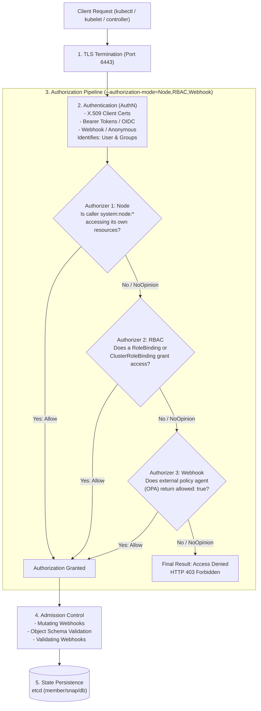
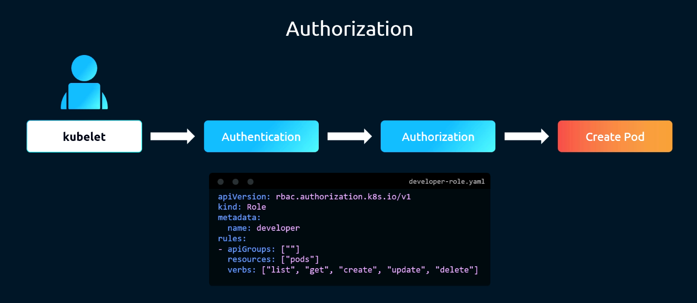
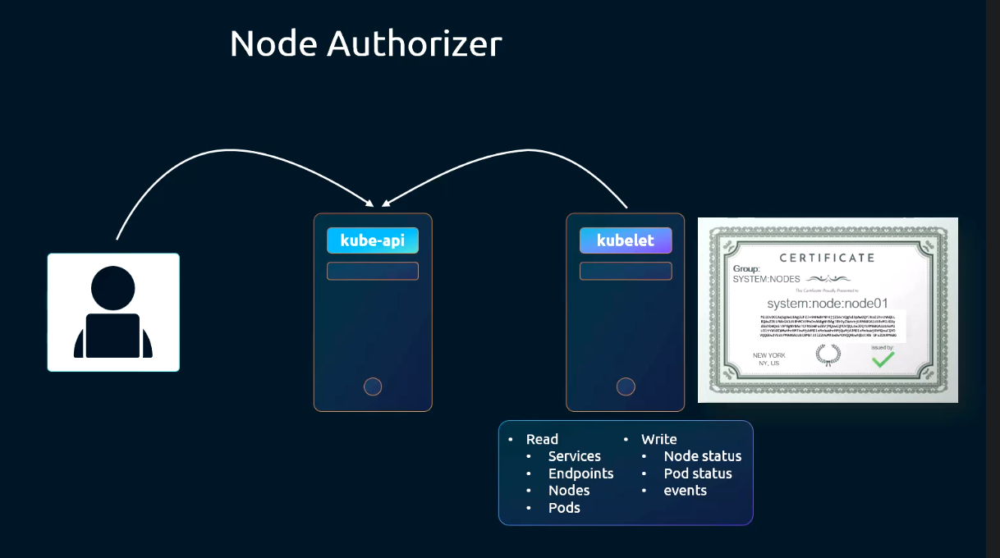
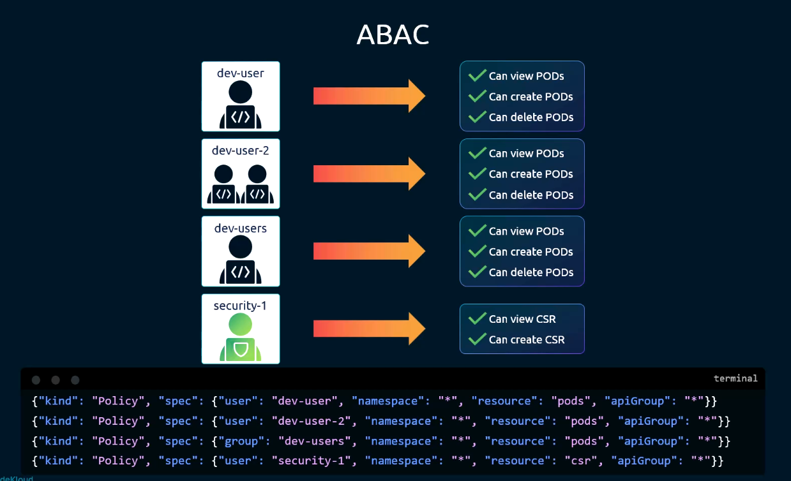
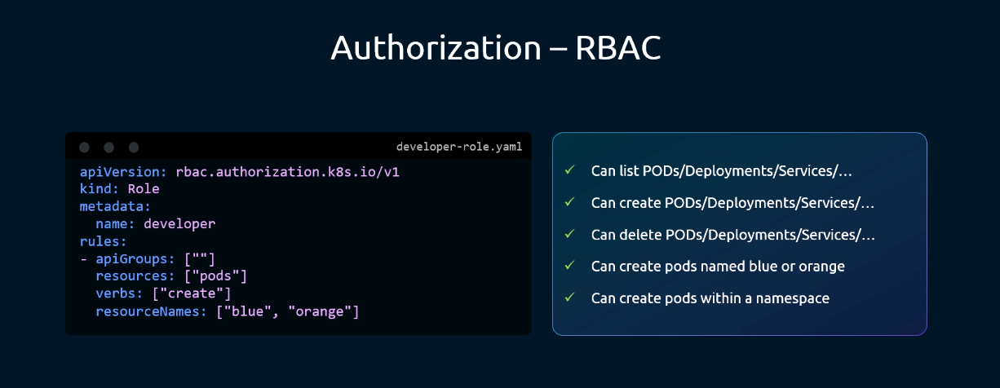
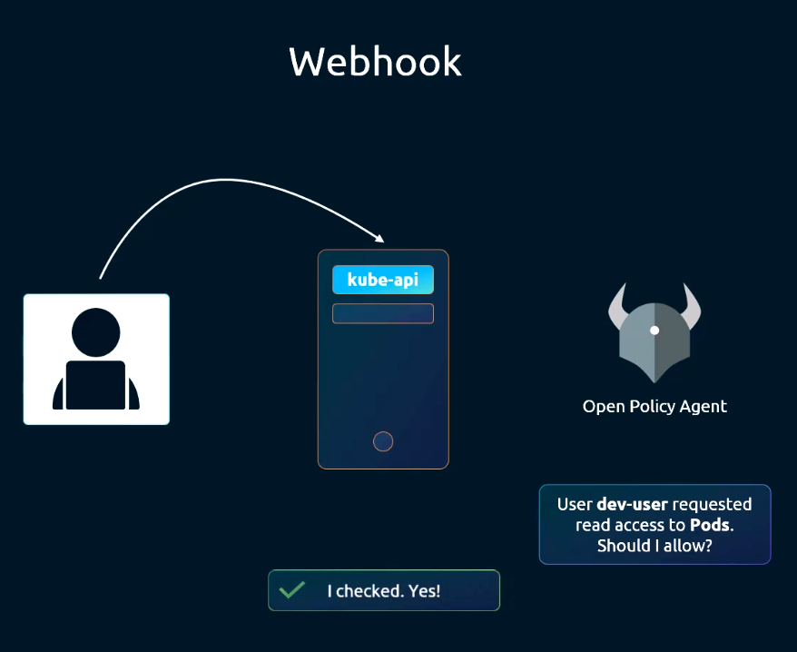
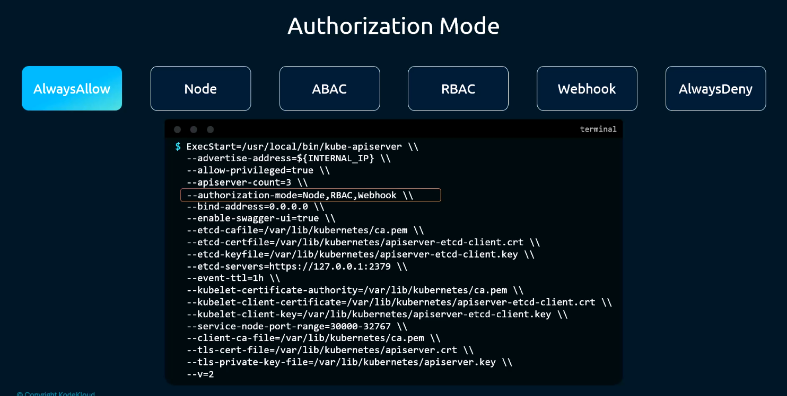
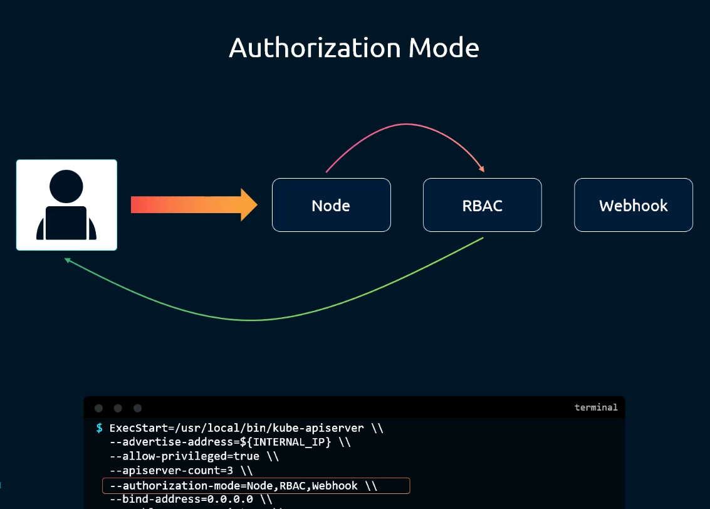
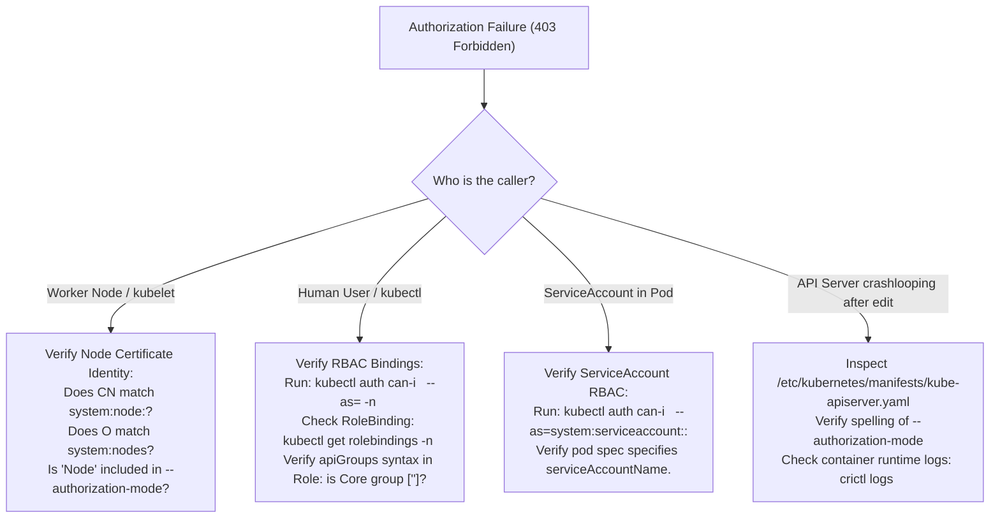

# Kubernetes Authorization Architecture & Modes - CKA Exam Notes

> **Exam Domain**: Cluster Architecture, Installation & Configuration (25%) / Cluster Security  
> **Weight / Importance**: Critical (Core security gatekeeper in the Kubernetes request pipeline: configuring `--authorization-mode` on `kube-apiserver`, authorizer chaining semantics, Node authorizer enforcement, Webhook integration, and permission auditing via `kubectl auth can-i`)  
> **Target Version**: Verified against v1.31 / v1.32 (Current CKA Curriculum)  
> **Allowed Docs Search Keywords**: `Authorization Overview`, `Node Authorization`, `Webhook Mode`, `authorization-mode`, `kubectl auth can-i`  
> **Source**: Generated from `security/08-authorization-raw.md`

---

## 1. Quick-Reference Summary

- **The Request Processing Pipeline**:
  Every incoming API request passes sequentially through three distinct control phases before reaching etcd:
  $$\text{TLS Handshake} \longrightarrow \text{Authentication (AuthN)} \longrightarrow \text{Authorization (AuthZ)} \longrightarrow \text{Admission Control} \longrightarrow \text{etcd}$$
- **The Six Authorization Modes**:
  1. **Node**: Special-purpose authorizer dedicated to `kubelet` daemons. Permits kubelets to access only the resources (Pods, Secrets, ConfigMaps, PVs) associated with their specific node.
  2. **ABAC (Attribute-Based Access Control)**: Static JSON policy file passed to the API server. Inflexible and legacy; requires manual file editing and API server restarts.
  3. **RBAC (Role-Based Access Control)**: Declarative, dynamic, in-cluster authorization via `Role`, `ClusterRole`, `RoleBinding`, and `ClusterRoleBinding`. **Default production standard**.
  4. **Webhook**: Delegates authorization decisions out-of-band to an external HTTP service (e.g., Open Policy Agent, Gatekeeper) via `SubjectAccessReview` API calls.
  5. **AlwaysAllow**: Bypasses authorization completely; permits every authenticated request. (Used strictly for testing/debugging).
  6. **AlwaysDeny**: Denies all incoming requests unconditionally. (Used strictly in integration test suites).
- **Authorizer Chaining & Evaluation Semantics**:
  - Configured via comma-separated list on `kube-apiserver`: `--authorization-mode=Node,RBAC,Webhook`.
  - Modules are evaluated **sequentially in the exact order specified**.
  - Each module returns one of three internal decisions:
    - **`Allow`**: **Short-circuits immediately**. Access is granted; subsequent authorizers are skipped.
    - **`Deny` / `NoOpinion`**: Passes the request down to the next authorizer in the chain.
  - **Default Deny**: If the request traverses all configured authorizers without any module returning `Allow`, the request is denied with `403 Forbidden`.
- **Testing Permissions Imperatively**:
  - `kubectl auth can-i <verb> <resource> [--as=<user>] [--as-group=<group>] [-n <namespace>]`
  - Validates effective permissions without actually performing the action.

---

## 2. Conceptual Overview & Mental Model

### Dual-Layer Architectural Understanding

- **Simple English Explanation (How It Works)**:
  - When you make a request to the Kubernetes API server, the system first verifies **who you are** (Authentication: reading your client certificate, token, or password).
  - Once your identity is confirmed, the system must decide **what you are allowed to do** (Authorization).
  - Kubernetes uses an ordered chain of checkpoints (Authorizers). You configure this chain in the API server using `--authorization-mode=Node,RBAC`:
    - First, the **Node Authorizer** inspects the request. If the request is from a worker node's `kubelet` reporting its status or asking for a pod assigned to it, the Node authorizer says "Approved!" and lets it through. If the request is from a human user like a developer, the Node authorizer says "This isn't a node request—I have No Opinion" and passes it to the next checkpoint.
    - Second, the **RBAC Authorizer** inspects the request. It checks whether the user's role allows reading or modifying that resource. If a matching RoleBinding exists, RBAC says "Approved!" and the request succeeds.
    - If no authorizer approves the request by the end of the line, the door remains shut, and the user receives a `403 Forbidden` error.
  - In legacy setups, administrators used **ABAC**, which required writing JSON policy files directly on the master node's filesystem and rebooting the API server every time permissions changed.
  - **RBAC** solved this by making permissions normal Kubernetes objects that you can create, modify, and delete dynamically without restarting anything.
  - For complex organizational governance, companies can add **Webhook** authorization to send a real-time HTTP query to an external tool like Open Policy Agent (OPA) to approve or deny the action.

- **Formal Kubernetes Definition**:
  - Kubernetes authorization is a pluggable middleware pipeline executed post-authentication. The API server maps authenticated request metadata into an `authorizer.Attributes` interface containing `User`, `Verb`, `Namespace`, `APIGroup`, `Resource`, `Subresource`, and `NonResourceURL`. The attributes are evaluated against an ordered slice of `authorizer.Authorizer` implementations defined by `--authorization-mode`. The chaining engine implements short-circuiting disjunction: the first authorizer yielding `DecisionAllow` terminates evaluation and grants access; failure across all handlers results in an HTTP 403 Forbidden status.

### Architectural Request Processing Pipeline Diagram



---

## 3. Deep-Dive Technical Breakdown

### 1. The Six Authorization Modes



Kubernetes supports six built-in authorization modules:

#### 1. Node Authorization (`Node`)
- **Target Principal**: Exclusively handles requests from worker node `kubelet` daemons.
- **Identity Requirement**:
  - `Common Name (CN)`: `system:node:<node-name>`
  - `Organization (O)`: `system:nodes`
- **Graph Evaluation Logic**:
  - Uses an internal graph authorizer to determine if the requested resource is associated with the requesting node.
  - A node is permitted to:
    - Read `services`, `endpoints`, `nodes`, and `pods` scheduled on itself.
    - Read `secrets`, `configmaps`, and `persistentvolumeclaims` **only if** they are mounted by pods running on that specific node.
    - Write status updates for its own node and pods scheduled on it.
  - **Security Benefit**: Prevents a compromised worker node from snooping on secrets belonging to pods running on other nodes in the cluster.



---

#### 2. Attribute-Based Access Control (`ABAC`)
- **Mechanism**: Reads authorization rules from a static JSON file stored on the master node host filesystem.
- **Config Flag**: `--authorization-policy-file=/etc/kubernetes/policies/abac-policy.json`.
- **Policy File Syntax Example**:
  ```json
  {"apiVersion": "abac.authorization.kubernetes.io/v1beta1", "kind": "Policy", "spec": {"user": "alice", "namespace": "default", "resource": "pods", "readonly": true}}
  ```
- **Operational Deficiencies**:
  - Cannot be managed dynamically via `kubectl`.
  - Every user or permission change requires SSH access to the master node and an API server restart.
  - Highly discouraged in modern production Kubernetes.



---

#### 3. Role-Based Access Control (`RBAC`)
- **Mechanism**: Native, declarative Kubernetes API objects managed within the cluster.
- **Objects**:
  - Namespaced: `Role` and `RoleBinding`.
  - Cluster-Scoped: `ClusterRole` and `ClusterRoleBinding`.
- **Advantages**:
  - Dynamic: Modifying a Role immediately impacts all bound users without cluster restarts.
  - Declarative: Can be managed via GitOps and standard CI/CD pipelines.
  - Fine-grained: Granular scoping by API group, resource, subresource, verb, and resource name.



---

#### 4. Webhook Authorization (`Webhook`)
- **Mechanism**: The API server delegates authorization decisions to an external HTTP webhook endpoint (e.g., Open Policy Agent / Gatekeeper, custom IAM services).
- **Config Flag**: `--authorization-webhook-config-file=/etc/kubernetes/webhook-config.yaml`.
- **Protocol**:
  - The API server serializes request attributes into a `SubjectAccessReview` API object and POSTs it to the external service.
  - The external service returns a JSON response containing `allowed: true` or `allowed: false`.



---

#### 5. AlwaysAllow & AlwaysDeny
- **`AlwaysAllow`**:
  - Bypasses all security checks. Every authenticated request is authorized immediately.
  - **Severe Security Hazard**: Completely disables multi-tenancy and RBAC protection.
- **`AlwaysDeny`**:
  - Rejects every incoming request unconditionally.
  - Used strictly in automated Kubernetes test suites to verify error handling.

---

### 2. Authorizer Chaining Semantics



Authorization modes are configured as a comma-separated list on `kube-apiserver`:

```yaml
spec:
  containers:
  - command:
    - kube-apiserver
    - --authorization-mode=Node,RBAC,Webhook
```



#### Internal Evaluation State Machine:
1. When a request arrives, `kube-apiserver` passes it to the first module in the list (**`Node`**).
2. The `Node` authorizer evaluates the request:
   - If the request is from a valid node accessing its own resources $\implies$ Returns **`DecisionAllow`**. **Execution stops immediately; access is granted**.
   - If the request is from a developer or service account $\implies$ Returns **`DecisionNoOpinion`**. The request passes to the next module (**`RBAC`**).
3. The **`RBAC`** authorizer evaluates the request:
   - If a RoleBinding grants the requested verb on the resource $\implies$ Returns **`DecisionAllow`**. **Execution stops immediately; access is granted**.
   - If no matching RoleBinding exists $\implies$ Returns **`DecisionNoOpinion`**. The request passes to the next module (**`Webhook`**).
4. The **`Webhook`** authorizer queries the external endpoint:
   - If the webhook approves $\implies$ Returns **`DecisionAllow`**; access is granted.
   - If the webhook rejects or has no opinion $\implies$ The chain ends.
5. **Default Deny**: Since no authorizer in the chain returned an Allow, `kube-apiserver` returns:
   ```plaintext
   Error from server (Forbidden): <resource> is forbidden: User "<user>" cannot <verb> <resource> in API group "<group>"
   ```

---

## 4. Command Translation & Mapping Tables

### Table 1: Comprehensive Comparison of Kubernetes Authorization Modes

| Authorization Mode | State Management | Scope / Target | Pros | Cons / Limitations | Production Recommendation |
| :--- | :--- | :--- | :--- | :--- | :--- |
| **`Node`** | Internal node graph in API server memory | `kubelet` daemons exclusively | Prevents lateral privilege escalation across nodes | Handles only node traffic; passes all other requests | **Mandatory** |
| **`RBAC`** | Declarative in-cluster API objects | All users, service accounts, and controllers | Dynamic, declarative, granular, auditable | Does not support complex business policy logic | **Mandatory** |
| **`Webhook`** | External RESTful HTTP service | Advanced enterprise policy engines | Externalized policy logic, multi-cloud IAM federation | Network latency overhead; external dependency failure risks | **Optional (Enterprise)** |
| **`ABAC`** | Static JSON file on master host | Users and groups | Simple static file mapping | Requires master node SSH and API server restart per edit | **Deprecated / Avoid** |
| **`AlwaysAllow`** | Hardcoded bypass | Global | Useful for initial cluster bootstrapping or debugging | Zero security; any user can delete the cluster | **Testing Only** |
| **`AlwaysDeny`** | Hardcoded reject | Global | Useful for automated testing | Completely blocks cluster operations | **Testing Only** |

---

### Table 2: Authorizer Chaining Evaluation Matrix

| Request Scenario | Authorizer Chain: `Node,RBAC,Webhook` | Internal Module Decisions | Final Cluster Result |
| :--- | :--- | :--- | :--- |
| **Kubelet fetching its own assigned Pod** | 1. Node $\to$ 2. RBAC $\to$ 3. Webhook | Node returns **Allow** (Short-circuit) | **Access Granted (200 OK)** |
| **Developer listing Pods (Granted via Role)** | 1. Node $\to$ 2. RBAC $\to$ 3. Webhook | Node: NoOpinion $\to$ RBAC: **Allow** (Short-circuit) | **Access Granted (200 OK)** |
| **ServiceAccount querying custom API (OPA)** | 1. Node $\to$ 2. RBAC $\to$ 3. Webhook | Node: NoOpinion $\to$ RBAC: NoOpinion $\to$ Webhook: **Allow** | **Access Granted (200 OK)** |
| **Unauthorized user attempting delete** | 1. Node $\to$ 2. RBAC $\to$ 3. Webhook | Node: NoOpinion $\to$ RBAC: NoOpinion $\to$ Webhook: Deny | **Access Denied (403 Forbidden)** |

---

### Table 3: Kube-Apiserver Authorization Configuration Flags

| CLI Flag | Accepted Values | Purpose / Functional Impact |
| :--- | :--- | :--- |
| **`--authorization-mode`** | Comma-separated list: `Node`, `RBAC`, `Webhook`, `ABAC`, `AlwaysAllow`, `AlwaysDeny` | Defines the ordered list of authorization plugins executed per request |
| **`--authorization-policy-file`** | File path (e.g. `/path/to/abac.json`) | Specifies the JSON policy file when `ABAC` mode is active |
| **`--authorization-webhook-config-file`** | File path (e.g. `/path/to/webhook.yaml`) | Specifies the kubeconfig file used to locate the remote webhook service |
| **`--authorization-webhook-cache-authorized-ttl`** | Duration (default: `5m0s`) | Duration to cache positive authorization responses from webhook |
| **`--authorization-webhook-cache-unauthorized-ttl`**| Duration (default: `30s`) | Duration to cache negative authorization responses from webhook |

---

## 5. High-Yield CLI & Imperative Commands

### 1. Auditing Current Authorization Configuration on the Cluster
Inspect the active static pod manifest on the control plane node:

```bash
# Check configured authorization modes
grep -E '\-\-authorization-mode' /etc/kubernetes/manifests/kube-apiserver.yaml
```

*Expected standard output*:
```plaintext
- --authorization-mode=Node,RBAC
```

---

### 2. Testing Permissions with `kubectl auth can-i`
The `kubectl auth can-i` command allows administrators to audit effective permissions without executing the destructive action:

```bash
# 1. Test current user permissions
kubectl auth can-i create deployments
kubectl auth can-i delete pods -n kube-system

# 2. Impersonate a specific user (Requires cluster-admin)
kubectl auth can-i create pods -n default --as=developer-jane

# 3. Impersonate a specific user belonging to a specific group
kubectl auth can-i list secrets -n finance --as=john --as-group=accounting

# 4. Impersonate a ServiceAccount
kubectl auth can-i get configmaps --as=system:serviceaccount:default:my-app-sa

# 5. Check permissions on non-resource URLs
kubectl auth can-i get /healthz
kubectl auth can-i get /metrics --as=monitoring-agent
```

---

### 3. Modifying Authorization Modes on `kube-apiserver`
To enable Webhook or update modes on a kubeadm cluster:

```bash
# 1. Open manifest in editor
sudo vi /etc/kubernetes/manifests/kube-apiserver.yaml

# 2. Update the command argument:
# - --authorization-mode=Node,RBAC,Webhook
# - --authorization-webhook-config-file=/etc/kubernetes/webhook-config.yaml

# 3. Save and exit. Kubelet automatically detects changes via inotify and restarts apiserver.

# 4. Verify the container restarted successfully:
crictl ps | grep kube-apiserver
```

---

## 6. Troubleshooting & Diagnostic Runbook

### Diagnostic Decision Tree



---

### Step-by-Step Triage Runbook

| Failure Symptom | Probable Root Cause | Verification Command | Remediation Action |
| :--- | :--- | :--- | :--- |
| `Error from server (Forbidden): nodes is forbidden: User "system:anonymous" cannot list resource "nodes"` | Request was unauthenticated, falling back to anonymous user with no permissions | `kubectl config view --raw` | Supply valid credentials or verify kubeconfig client certificate. |
| Worker node fails to start pods: `Forbidden: Node 'node01' cannot access secret 'my-secret'` | Secret is not mounted by any pod assigned to `node01` (Node authorizer block) | Check Pod placement: `kubectl get pods -o wide` | Node authorizer prevents nodes from reading unassigned secrets. Assign pod to node or check spec. |
| User with correct Role receives `403 Forbidden` | `RBAC` was omitted from `--authorization-mode` on `kube-apiserver` | `grep authorization-mode /etc/kubernetes/manifests/kube-apiserver.yaml` | Ensure `--authorization-mode` includes `RBAC` (e.g. `Node,RBAC`). |
| API server fails to start after adding Webhook | Webhook configuration file missing or invalid syntax | `crictl logs $(crictl ps -a -q --name kube-apiserver)` | Verify `/etc/kubernetes/webhook-config.yaml` exists and is formatted correctly. |
| `kubectl auth can-i` returns `no` despite ClusterRoleBinding | User bound to wrong Group or typo in username | `kubectl describe clusterrolebinding <binding-name>` | Ensure binding subjects match the certificate's `CN` (user) or `O` (group). |

---

## 7. CKA Exam Tips, Gotchas & Traps

> [!CAUTION]
> **Trap 1: Authorizer Order Matters (`Node,RBAC`)**  
> Always specify `Node` before `RBAC`:
> ```plaintext
> --authorization-mode=Node,RBAC
> ```
> If you configure `--authorization-mode=RBAC,Node`, the API server will run RBAC checks on every routine heartbeat and status update from worker nodes, generating massive unnecessary processing overhead before falling through to Node.

> [!IMPORTANT]
> **Trap 2: Never Omit the `Node` Authorizer**  
> If an exam question asks you to configure authorization modes, never set `--authorization-mode=RBAC` alone. Kubelets rely on the `Node` authorizer to perform their core functions. Omitting `Node` breaks node heartbeats and secret mounting unless kubelets are granted broad, insecure cluster-admin RBAC rights.

> [!WARNING]
> **Trap 3: The Short-Circuiting Trap**  
> Remember that the chain **stops at the first Allow**:
> - If an authorizer earlier in the chain approves the request, subsequent authorizers **cannot deny it**.
> - For example, if `AlwaysAllow` is placed first (`--authorization-mode=AlwaysAllow,RBAC`), RBAC is never evaluated, and all security is bypassed.

> [!TIP]
> **Exam Tip 4: Instant Debugging with `kubectl auth can-i`**  
> In troubleshooting questions where a pod or user cannot perform an action, test permissions instantly from the command line:
> ```bash
> kubectl auth can-i list pods -n default --as=developer
> kubectl auth can-i get secrets --as=system:serviceaccount:prod:app-sa
> ```
> This proves immediately whether the problem is Authorization (RBAC) or something else (network policy, admission controller).

---

## 8. Self-Test / Active Recall

<details>
<summary><strong>1. What are the four primary phases through which every Kubernetes API request passes sequentially?</strong></summary>

1. **Authentication (AuthN)**: Verifies caller identity.
2. **Authorization (AuthZ)**: Evaluates permissions.
3. **Admission Control**: Mutates and validates request specifications.
4. **etcd Persistence**: Commits state to the database.
</details>

<details>
<summary><strong>2. What are the three possible internal decisions returned by an authorization module in the chaining engine?</strong></summary>

1. **`Allow`**: Terminates evaluation immediately and grants access.
2. **`Deny`**: Indicates rejection, passing evaluation to the next module.
3. **`NoOpinion`**: Indicates the module has no policy covering the request, passing evaluation to the next module.
</details>

<details>
<summary><strong>3. What happens if all authorizers in the chain return <code>NoOpinion</code>?</strong></summary>

The request is denied by default, and the API server returns an **HTTP 403 Forbidden** error.
</details>

<details>
<summary><strong>4. What is the primary security purpose of the Node Authorizer?</strong></summary>

To prevent lateral movement and privilege escalation across nodes. It restricts worker node `kubelet` daemons to reading only the Secrets, ConfigMaps, and Pods that are scheduled to run on their own specific host.
</details>

<details>
<summary><strong>5. What exact Subject formatting is required for a client certificate to be processed by the Node Authorizer?</strong></summary>

- `Common Name (CN)`: **`system:node:<node-name>`**
- `Organization (O)`: **`system:nodes`**
</details>

<details>
<summary><strong>6. Why is Attribute-Based Access Control (ABAC) discouraged in modern production clusters?</strong></summary>

Because ABAC rules are stored in a static JSON file on the master host filesystem. Modifying permissions requires SSH root access and an API server restart, preventing dynamic, auditable in-cluster management.
</details>

<details>
<summary><strong>7. How does the Webhook authorizer communicate with an external policy engine like Open Policy Agent?</strong></summary>

The API server serializes the request attributes into a `SubjectAccessReview` API object and sends an HTTPS POST request to the remote webhook endpoint specified in `--authorization-webhook-config-file`.
</details>

<details>
<summary><strong>8. What CLI command allows an administrator to test if user <code>developer-sam</code> is permitted to delete pods in namespace <code>staging</code>?</strong></summary>

```bash
kubectl auth can-i delete pods -n staging --as=developer-sam
```
</details>

<details>
<summary><strong>9. In what order should the standard production authorization modes be configured on <code>kube-apiserver</code>?</strong></summary>

`--authorization-mode=Node,RBAC` (or `--authorization-mode=Node,RBAC,Webhook` if external webhooks are present).
</details>

<details>
<summary><strong>10. Does <code>kubectl auth can-i</code> execute the requested operation against the cluster?</strong></summary>

**No.** It performs an authorization dry-run using a `SelfSubjectAccessReview` or `SubjectAccessReview` API call, returning `yes` or `no` without modifying any cluster resource.
</details>

---

## 9. Official Documentation Bookmarks

| Documentation Page | Official URL | Search Keywords | High-Yield Section for Exam |
| :--- | :--- | :--- | :--- |
| **Authorization Overview** | `https://kubernetes.io/docs/reference/access-authn-authz/authorization/` | `Authorization Overview`, `authorization-mode` | Explanation of modes, checking API access, and chaining |
| **Using Node Authorization** | `https://kubernetes.io/docs/reference/access-authn-authz/node/` | `Node Authorization`, `system:node` | Node authorizer graph rules and certificate formatting |
| **Webhook Mode** | `https://kubernetes.io/docs/reference/access-authn-authz/webhook/` | `Webhook Mode`, `SubjectAccessReview` | Configuration file format for external authorization webhooks |
| **Checking API Access with kubectl** | `https://kubernetes.io/docs/reference/access-authn-authz/authorization/#checking-api-access` | `kubectl auth can-i` | CLI command syntax for permission simulation |

