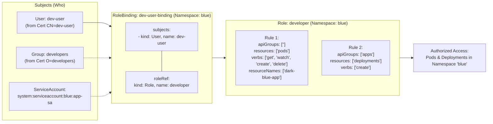
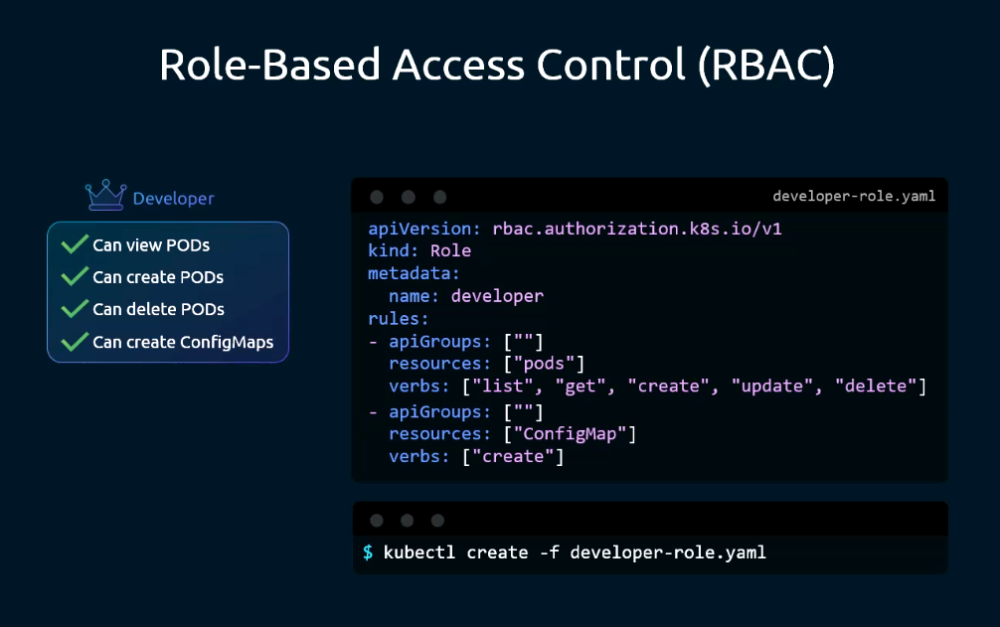
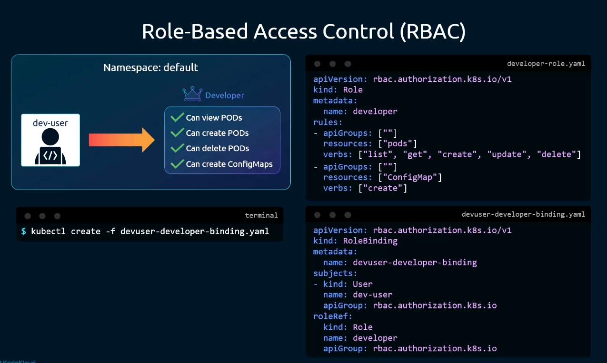
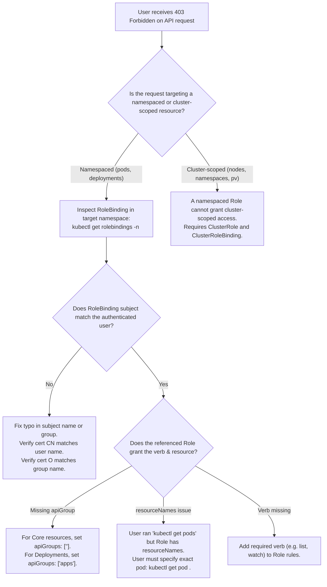

# Role-Based Access Control (RBAC) - CKA Exam Notes

> **Exam Domain**: Cluster Architecture, Installation & Configuration (25%) / Cluster Security  
> **Weight / Importance**: Critical (Top-tier hands-on CKA exam topic tested in nearly 100% of exams: creating Roles and RoleBindings, scoping permissions by namespace, restricting access via `resourceNames`, binding Users, Groups, and ServiceAccounts, and auditing permissions via `kubectl auth can-i`)  
> **Target Version**: Verified against v1.31 / v1.32 (Current CKA Curriculum)  
> **Allowed Docs Search Keywords**: `Using RBAC Authorization`, `Role`, `RoleBinding`, `ClusterRole`, `ClusterRoleBinding`, `kubectl create role`, `kubectl create rolebinding`  
> **Source**: Generated from `security/09-Role-Based-Access-Control-raw.md`

---

## 1. Quick-Reference Summary

- **The Core RBAC Decoupling Model**:
  - **`Role`**: Defines **what** actions can be performed (rules: `apiGroups`, `resources`, `verbs`, optional `resourceNames`) within a single namespace (`metadata.namespace`).
  - **`RoleBinding`**: Defines **who** can perform those actions by binding a `Role` (or `ClusterRole`) to a list of **`subjects`** (Users, Groups, or ServiceAccounts) within that namespace.
- **Rule Specification Schema**:
  - `apiGroups`: Use `[""]` for the Core API group (`pods`, `services`, `configmaps`, `secrets`). Use explicit names for other groups (e.g. `["apps"]` for `deployments`).
  - `resources`: Lowercase plural resource names (e.g., `["pods", "configmaps", "deployments"]`). Subresources use slashes (e.g., `["pods/log", "pods/exec"]`).
  - `verbs`: Permitted actions (`get`, `list`, `watch`, `create`, `update`, `patch`, `delete`, `deletecollection`).
  - `resourceNames`: (Optional) Restricts access to specific named instances (e.g., `resourceNames: ["dark-blue-app"]`).
- **Critical RBAC Constraints**:
  - **Additive Only (No Deny Rules)**: RBAC is strictly an allowlist. You cannot write a rule that explicitly denies access.
  - **`resourceNames` Limitations**: Only works with verbs that target a single object (`get`, `update`, `patch`, `delete`). **Cannot be used with `list` or `create`**.
  - **`roleRef` Immutability**: Once created, the `roleRef` on a `RoleBinding` cannot be modified. To change the bound role, the RoleBinding must be deleted and recreated.
  - **Users Do Not Exist in the API**: Kubernetes has no `kind: User` API resource. Users exist only as authenticated strings (from certificate `CN` or token identity).
- **Fast Imperative Creation**:
  ```bash
  # Create Role
  kubectl create role developer --verb=list,create,delete --resource=pods -n blue --dry-run=client -o yaml
  
  # Create RoleBinding
  kubectl create rolebinding dev-user-binding --role=developer --user=dev-user -n blue --dry-run=client -o yaml
  ```
- **Permission Verification**:
  ```bash
  kubectl auth can-i <verb> <resource> -n <namespace> --as=<user>
  ```

---

## 2. Conceptual Overview & Mental Model

### Dual-Layer Architectural Understanding

- **Simple English Explanation (How It Works)**:
  - Without RBAC, you would have to attach security rules directly to each person. If you had 50 developers, and you wanted to allow them to view pods, you would have to write 50 individual security entries. If permissions changed, you would have to edit 50 entries.
  - **RBAC decouples the job from the person**:
    1. First, you create a job description called a **`Role`** (e.g., `developer`), which lists allowed tasks (e.g., "Can list, get, and create pods in namespace `blue`").
    2. Second, you create a bridge called a **`RoleBinding`**, which assigns specific people (`dev-user`, `alice`) or teams (`dev-team`) to that `Role`.
    3. If permissions change tomorrow, you simply edit the `Role`. All 50 developers immediately inherit the update.
  - **Namespace Boundaries**: Both `Role` and `RoleBinding` are namespaced objects. If you create them in namespace `blue`, the permissions apply *strictly inside namespace `blue`*. A user with full developer permissions in `blue` has zero permissions in namespace `production` unless another RoleBinding is created there.
  - **Instance-Level Restrictions**: If you want a developer to manage only a specific critical application pod (`dark-blue-app`) and not other pods in the same namespace, you can add `resourceNames: ["dark-blue-app"]` to the rule.

- **Formal Kubernetes Definition**:
  - Role-Based Access Control (RBAC) is an authorization mechanism governed by the `rbac.authorization.k8s.io/v1` API group. Permissions are modeled as pure allowlists composed of `PolicyRule` records specifying sets of API groups, resources, subresources, and verbs. Authorization evaluation checks for the existence of an active `RoleBinding` linking the authenticated `Subject` (User, Group, or ServiceAccount) to a `Role` within the requested request namespace.

### Architectural Binding Model Diagram



---

## 3. Deep-Dive Technical Breakdown

### 1. Anatomy of a `Role` Resource



A `Role` contains an array of `rules`, each defining permissions within `metadata.namespace`:

```yaml
apiVersion: rbac.authorization.k8s.io/v1
kind: Role
metadata:
  name: developer
  namespace: blue
rules:
- apiGroups: [""]             # 1. Core group (empty string)
  resources: ["pods"]         # 2. Plural resource names
  verbs: ["get", "list", "watch", "create", "delete"] # 3. Permitted actions

- apiGroups: [""]
  resources: ["configmaps"]
  verbs: ["get", "create"]

- apiGroups: ["apps"]         # 4. Named API group
  resources: ["deployments"]
  verbs: ["create", "update"]
```

#### Field Specifications:
- **`metadata.namespace`**: Mandatory. Restricts rule application strictly to this namespace.
- **`apiGroups`**:
  - `[""]` for Core primitives (`pods`, `services`, `configmaps`, `secrets`, `pvc`).
  - `["apps"]` for `deployments`, `daemonsets`, `statefulsets`.
  - `["batch"]` for `jobs`, `cronjobs`.
  - `["networking.k8s.io"]` for `ingresses`, `networkpolicies`.
- **`resources`**: Pluralized API resource names. Subresources are written with slashes (`["pods/log", "pods/exec"]`).
- **`verbs`**: Actions allowed on the resources. Common verbs: `get`, `list`, `watch`, `create`, `update`, `patch`, `delete`, `deletecollection`.

---

### 2. Anatomy of a `RoleBinding` Resource



A `RoleBinding` links subjects to a Role:

```yaml
apiVersion: rbac.authorization.k8s.io/v1
kind: RoleBinding
metadata:
  name: dev-user-binding
  namespace: blue
subjects:
# 1. Target individual user (matches cert CN)
- kind: User
  name: dev-user
  apiGroup: rbac.authorization.k8s.io

# 2. Target group (matches cert O)
- kind: Group
  name: dev-team
  apiGroup: rbac.authorization.k8s.io

# 3. Target ServiceAccount (in-cluster pod identity)
- kind: ServiceAccount
  name: build-bot
  namespace: blue

roleRef:
  kind: Role
  name: developer
  apiGroup: rbac.authorization.k8s.io
```

#### Crucial Architectural Rules:
1. **`roleRef` is Immutable**: You cannot change `roleRef.name` or `roleRef.kind` after creation. If you bind the wrong role, you must delete the RoleBinding and create a new one.
2. **RoleBinding in a Namespace Binding a ClusterRole**: A `RoleBinding` can reference a `ClusterRole` (e.g. `kind: ClusterRole`, `name: view`). When bound via a `RoleBinding`, the permissions in the ClusterRole apply **only within the RoleBinding's namespace**! This allows defining common roles cluster-wide while scoping access locally.

---

### 3. Restricting Access to Specific Pods via `resourceNames`

In scenarios where a user should only have access to specific named instances of a resource, use the `resourceNames` list:

```yaml
apiVersion: rbac.authorization.k8s.io/v1
kind: Role
metadata:
  name: pod-manager
  namespace: blue
rules:
- apiGroups: [""]
  resources: ["pods"]
  resourceNames: ["dark-blue-app", "light-blue-app"]
  verbs: ["get", "watch", "update", "delete"]
```

#### Critical Behavioral Constraints of `resourceNames`:
- **Allowed Verbs**: `get`, `watch`, `update`, `patch`, `delete`.
- **Prohibited Verbs**:
  - **`create`**: At creation time, the object does not exist yet; the API server cannot validate its future name against `resourceNames`.
  - **`list`**: Listing queries the entire namespace collection, not a specific resource name. A user restricted by `resourceNames` will receive `403 Forbidden` on `kubectl get pods` unless they specify the exact pod name: `kubectl get pod dark-blue-app`.

---

### 4. Namespaced Scoping vs. User Identity

> [!NOTE]
> **Resolution of Raw Note Question**:  
> In the raw lecture note, the author asks: *"does 'them' mean User objects?"*  
> **Technical Fact**: **No.** In Kubernetes, there is no `User` object in the API server (you cannot run `kubectl get users` or `kubectl create user`).  
> Users exist purely as external identities authenticated via certificates (`CN`), OIDC tokens, or webhooks.  
> Therefore, **"them" refers to `Role` and `RoleBinding` objects**. To restrict a user to a specific namespace, you create the `Role` and `RoleBinding` inside that specific namespace (`metadata.namespace`).

---

## 4. Command Translation & Mapping Tables

### Table 1: RBAC Object Comparison Matrix

| Object Kind | API Scope | Created By / Managed By | Bound By | Primary Use Case |
| :--- | :--- | :--- | :--- | :--- |
| **`Role`** | Namespaced | `kubectl create role` | `RoleBinding` | Granting permissions within a single namespace |
| **`ClusterRole`** | Cluster-scoped | `kubectl create clusterrole` | `ClusterRoleBinding` OR `RoleBinding` | Granting permissions across the entire cluster or to non-namespaced resources (`nodes`, `pv`) |
| **`RoleBinding`** | Namespaced | `kubectl create rolebinding` | References `Role` or `ClusterRole` | Binds subjects to permissions within its namespace |
| **`ClusterRoleBinding`**| Cluster-scoped | `kubectl create clusterrolebinding`| References `ClusterRole` ONLY | Binds subjects to permissions across all namespaces cluster-wide |

---

### Table 2: Supported Subjects Configuration Schema

| Subject Kind | Identification Origin | YAML Syntax | Required Namespace Field? |
| :--- | :--- | :--- | :--- |
| **`User`** | Client cert `CN` or token `sub` | `kind: User`<br/>`name: dev-user`<br/>`apiGroup: rbac.authorization.k8s.io` | **No** (Users are cluster-wide) |
| **`Group`** | Client cert `O` or token `groups` | `kind: Group`<br/>`name: system:masters`<br/>`apiGroup: rbac.authorization.k8s.io` | **No** (Groups are cluster-wide) |
| **`ServiceAccount`**| Pod in-cluster identity | `kind: ServiceAccount`<br/>`name: my-sa`<br/>`namespace: blue` | **Yes** (ServiceAccounts are namespaced) |

---

### Table 3: Common Verb Groupings

| Security Profile | Standard Verbs | Primary Use Case |
| :--- | :--- | :--- |
| **Read-Only Viewer** | `["get", "list", "watch"]` | Auditors, monitoring dashboards, developer inspection |
| **Workload Operator** | `["get", "list", "watch", "create", "update", "patch"]` | Application deployment pipelines, CI/CD bots |
| **Full Admin** | `["*"]` | Team leads, namespace administrators |

---

## 5. High-Yield CLI & Imperative Commands

### 1. Generating Roles Imperatively
```bash
# 1. Create a Role granting pod read access in namespace 'blue'
kubectl create role pod-reader \
  --verb=get,list,watch \
  --resource=pods \
  -n blue

# 2. Create a Role granting deployment creation in 'apps' group
kubectl create role deploy-creator \
  --verb=create,get \
  --resource=deployments.apps \
  -n blue

# 3. Create a multi-resource Role with dry-run YAML output
kubectl create role app-admin \
  --verb=get,list,create,delete \
  --resource=pods,services,configmaps \
  -n blue \
  --dry-run=client -o yaml > app-admin-role.yaml
```

---

### 2. Generating RoleBindings Imperatively
```bash
# 1. Bind Role 'developer' to User 'dev-user' in namespace 'blue'
kubectl create rolebinding dev-user-binding \
  --role=developer \
  --user=dev-user \
  -n blue

# 2. Bind Role 'developer' to Group 'dev-team' in namespace 'blue'
kubectl create rolebinding dev-team-binding \
  --role=developer \
  --group=dev-team \
  -n blue

# 3. Bind Role 'developer' to a ServiceAccount 'app-sa' in namespace 'blue'
kubectl create rolebinding sa-binding \
  --role=developer \
  --serviceaccount=blue:app-sa \
  -n blue

# 4. Bind ClusterRole 'view' to User 'alice' within namespace 'blue' only
kubectl create rolebinding alice-view-blue \
  --clusterrole=view \
  --user=alice \
  -n blue
```

---

### 3. Auditing Permissions with `kubectl auth can-i`
```bash
# 1. Check if dev-user can list pods in namespace 'blue'
kubectl auth can-i list pods -n blue --as=dev-user

# 2. Check if dev-user can delete a specific pod instance
kubectl auth can-i delete pods/dark-blue-app -n blue --as=dev-user

# 3. Check if dev-user can create deployments in namespace 'blue'
kubectl auth can-i create deployments -n blue --as=dev-user

# 4. Check if dev-user has access in namespace 'default' (should return 'no')
kubectl auth can-i list pods -n default --as=dev-user
```

---

### 4. Inspecting Roles and RoleBindings
```bash
# List roles and bindings in namespace
kubectl get roles,rolebindings -n blue

# Describe a specific role to inspect rule matrix
kubectl describe role developer -n blue

# Describe a rolebinding to inspect subjects and roleRef
kubectl describe rolebinding dev-user-binding -n blue
```

---

## 6. Troubleshooting & Diagnostic Runbook

### Diagnostic Decision Tree



---

### Step-by-Step Triage Runbook

| Failure Symptom | Probable Root Cause | Diagnosis Command | Remediation Action |
| :--- | :--- | :--- | :--- |
| `User "dev" cannot list resource "pods"` despite Role allowing `pods` | Role configured with `apiGroups: ["core"]` instead of `[""]` | `kubectl describe role <role-name> -n <ns>` | Edit Role: change `apiGroups` to `[""]`. |
| User cannot view pod logs (`kubectl logs`) | Role granted `resources: ["pods"]` but omitted subresource `pods/log` | `kubectl auth can-i get pods/log -n <ns> --as=<user>` | Add `"pods/log"` to `resources` array in Role. |
| User receives `403` running `kubectl get pods` when `resourceNames` is set | `resourceNames` does not support `list` verb | `kubectl get pod <exact-name> -n <ns> --as=<user>` | Granting general `list` requires a separate rule without `resourceNames`. |
| `RoleBinding` update fails with `field is immutable` | Attempted to change `roleRef` on existing binding | `kubectl edit rolebinding <name>` | Delete the RoleBinding (`kubectl delete rolebinding <name>`) and re-create it. |
| ServiceAccount cannot access resources | RoleBinding subject missing `namespace: <sa-ns>` | `kubectl get rolebinding <name> -o yaml` | Ensure `subjects[0].namespace` is explicitly populated for `ServiceAccount`. |

---

## 7. CKA Exam Tips, Gotchas & Traps

> [!CAUTION]
> **Trap 1: Core Group `apiGroups: [""]`**  
> Never write `apiGroups: ["core"]` or `apiGroups: ["v1"]`!  
> For `pods`, `services`, `configmaps`, `secrets`, `pvc`, and `namespaces`, the API group **must be `[""]`**.

> [!IMPORTANT]
> **Trap 2: `roleRef` Immutability**  
> In the exam, if you bind a RoleBinding to the wrong Role, `kubectl edit` or `kubectl apply` will fail with an immutability error. **Do not waste time trying to force-edit it**. Immediately delete and re-create:
> ```bash
> kubectl delete rolebinding <name> -n <ns>
> kubectl create rolebinding <name> --role=<correct-role> --user=<user> -n <ns>
> ```

> [!WARNING]
> **Trap 3: ServiceAccounts Require Namespace in Subjects**  
> When binding a `ServiceAccount` in YAML, `subjects[0].namespace` is **mandatory**:
> ```yaml
> subjects:
> - kind: ServiceAccount
>   name: app-sa
>   namespace: blue    # Mandatory!
> ```
> If omitted, Kubernetes assumes the ServiceAccount lives in the RoleBinding's namespace or fails validation.

> [!TIP]
> **Exam Tip 4: Always Test with `kubectl auth can-i`**  
> After creating a Role and RoleBinding in an exam scenario, **always verify your solution** before moving to the next question:
> ```bash
> kubectl auth can-i create deployments -n blue --as=dev-user
> ```
> If it returns `yes`, your configuration is 100% correct.

> [!NOTE]
> **Trap 5: `resourceNames` Breaks `kubectl get pods`**  
> If an exam question asks to restrict access to a pod named `orange-app`, remember that `resourceNames: ["orange-app"]` prevents `kubectl get pods` (listing). The user can only run:
> ```bash
> kubectl get pod orange-app -n blue
> ```

---

## 8. Self-Test / Active Recall

<details>
<summary><strong>1. What is the fundamental difference between a <code>Role</code> and a <code>ClusterRole</code>?</strong></summary>

A `Role` is namespaced and grants permissions strictly within `metadata.namespace`. A `ClusterRole` is cluster-scoped and can grant permissions across all namespaces, cluster-scoped resources (`nodes`, `pv`, `namespaces`), or non-resource URLs (`/healthz`).
</details>

<details>
<summary><strong>2. Can a namespaced <code>RoleBinding</code> reference a <code>ClusterRole</code>? What is the effect?</strong></summary>

**Yes.** A `RoleBinding` can reference a `ClusterRole`. When this occurs, the permissions defined in the `ClusterRole` are granted **only within the namespace of the RoleBinding**. This allows defining common roles cluster-wide while restricting their scope locally.
</details>

<details>
<summary><strong>3. Why can <code>resourceNames</code> NOT be used with the <code>create</code> verb?</strong></summary>

Because at creation time (`POST`), the object does not exist yet on the cluster; the API server cannot validate its future name against the `resourceNames` whitelist before evaluating authorization.
</details>

<details>
<summary><strong>4. What happens if you attempt to edit the <code>roleRef</code> field of an existing <code>RoleBinding</code>?</strong></summary>

The update will fail with an error stating that `roleRef` is **immutable**. You must delete the RoleBinding and create a new one.
</details>

<details>
<summary><strong>5. How do you test whether user <code>john</code> can delete pods in namespace <code>marketing</code> without actually deleting any pods?</strong></summary>

```bash
kubectl auth can-i delete pods -n marketing --as=john
```
</details>

<details>
<summary><strong>6. Does Kubernetes support explicit "Deny" rules in RBAC?</strong></summary>

**No.** RBAC is strictly an additive allowlist model. All rules grant permissions; there is no syntax to explicitly deny an action.
</details>

<details>
<summary><strong>7. How do you grant permission to view container logs for a pod in RBAC?</strong></summary>

You must grant access to the `pods/log` subresource:
```yaml
rules:
- apiGroups: [""]
  resources: ["pods/log"]
  verbs: ["get"]
```
</details>

<details>
<summary><strong>8. In Kubernetes, can you create a resource with <code>kind: User</code>?</strong></summary>

**No.** Kubernetes does not have an API resource representing Users. User identities exist externally (authenticated via client certificates, tokens, or OIDC) and are referenced as string names in RoleBinding `subjects`.
</details>

<details>
<summary><strong>9. What imperative command creates a Role named <code>pod-manager</code> allowing <code>create</code> and <code>delete</code> on pods in namespace <code>finance</code>?</strong></summary>

```bash
kubectl create role pod-manager --verb=create,delete --resource=pods -n finance
```
</details>

<details>
<summary><strong>10. Which field in a client certificate maps to a RoleBinding subject with <code>kind: Group</code>?</strong></summary>

The certificate's **`Organization (O)`** attribute (e.g. `O=dev-team`).
</details>

---

## 9. Official Documentation Bookmarks

| Documentation Page | Official URL | Search Keywords | High-Yield Section for Exam |
| :--- | :--- | :--- | :--- |
| **Using RBAC Authorization** | `https://kubernetes.io/docs/reference/access-authn-authz/rbac/` | `Using RBAC Authorization`, `Role`, `RoleBinding` | Complete YAML examples for Role, RoleBinding, and subresources |
| **Default Roles and Role Bindings** | `https://kubernetes.io/docs/reference/access-authn-authz/rbac/#default-roles-and-role-bindings` | `default roles`, `cluster-admin`, `admin`, `edit`, `view` | Built-in cluster roles reference |
| **Checking API Access with kubectl** | `https://kubernetes.io/docs/reference/access-authn-authz/authorization/#checking-api-access` | `kubectl auth can-i` | Syntax and options for permission simulation |
| **Role and ClusterRole API Reference** | `https://kubernetes.io/docs/reference/kubernetes-api/authorization-resources/role-v1/` | `Role v1 API Reference` | Formal specification of rules, resources, and verbs |

