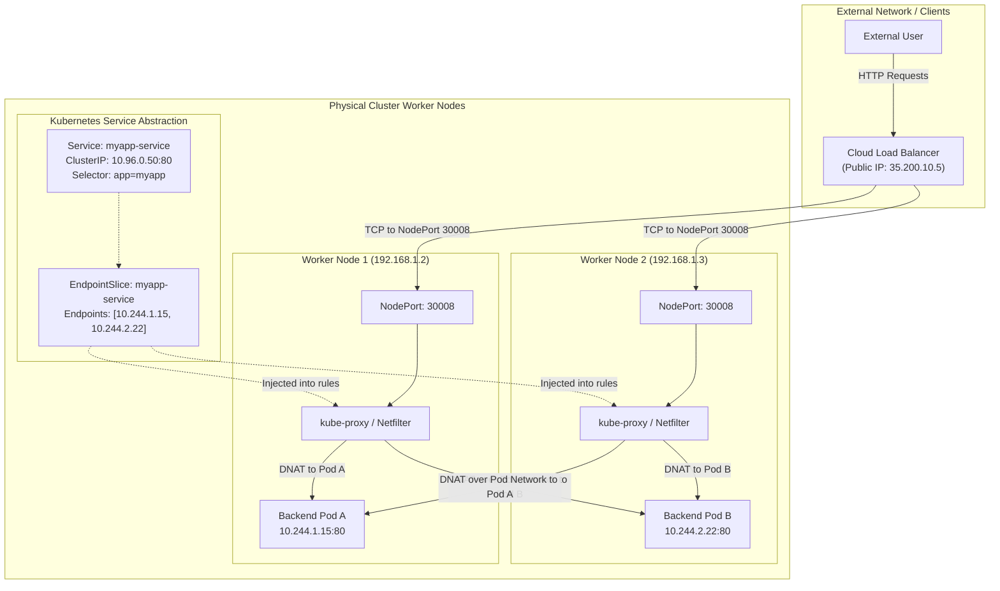
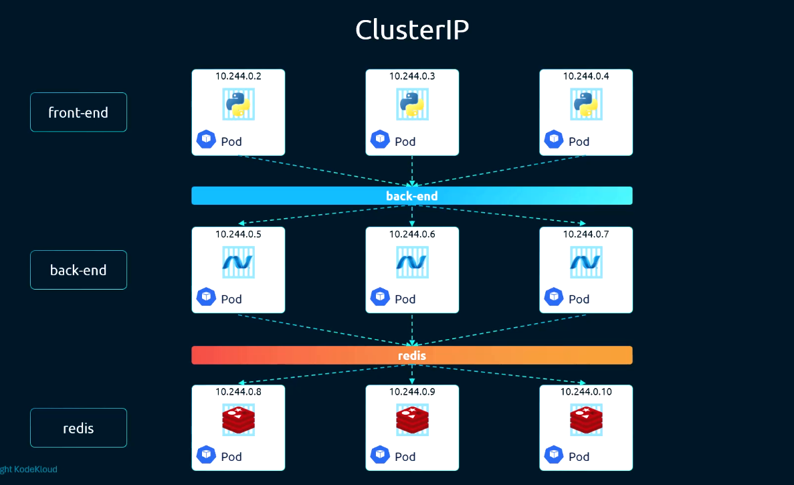
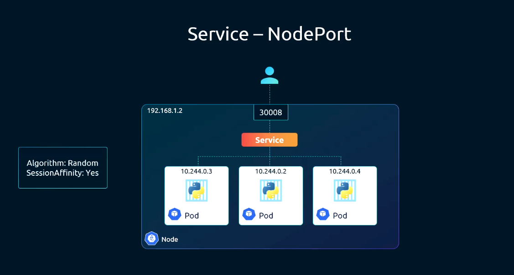
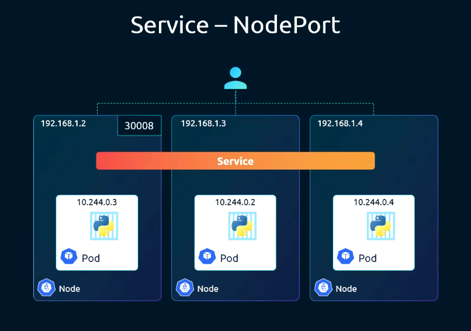
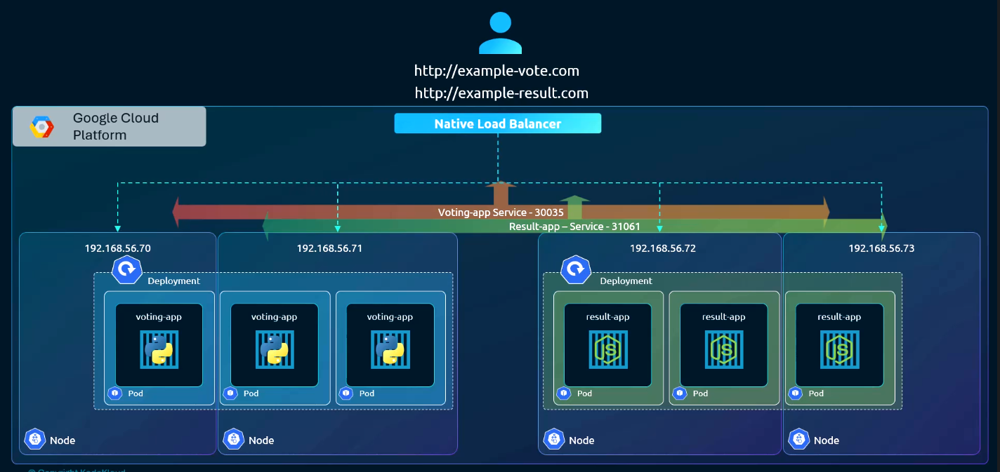
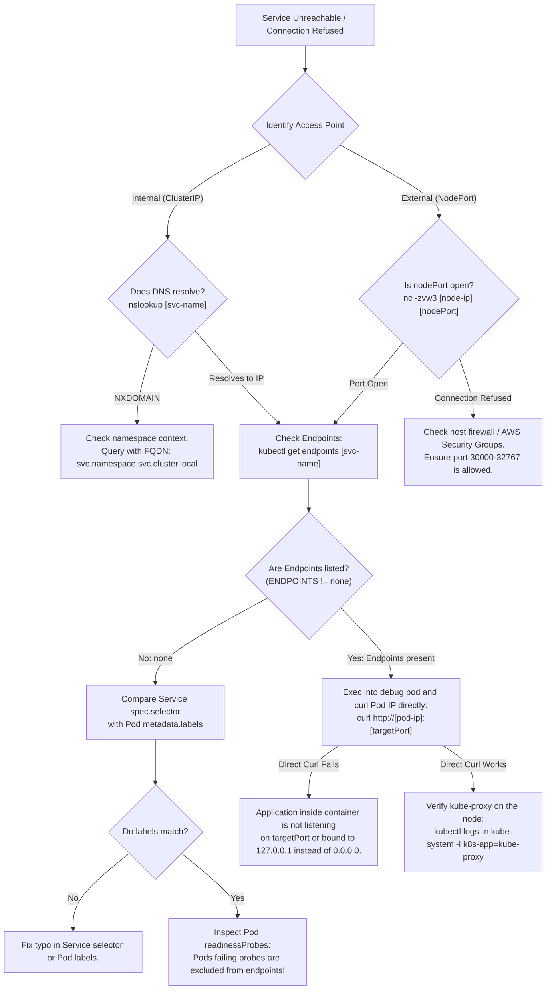

# Kubernetes Services & Networking - CKA Exam Notes

> **Exam Domain**: Services & Networking (20%) / Troubleshooting (30%)  
> **Weight / Importance**: Critical (Core networking and service discovery abstraction for the CKA exam)  
> **Target Version**: Verified against v1.31 / v1.32 (Current CKA Curriculum)  
> **Allowed Docs Search Keywords**: `service`, `services`, `nodeport`, `clusterip`, `loadbalancer`, `endpointslices`  
> **Source**: Generated from `services-raw.md`

---

## 1. Quick-Reference Summary

- **Primary Role**: An abstract API resource that defines a stable logical network endpoint (virtual IP and DNS name) fronting a dynamic set of Pods matching a label selector. Provides Layer 4 (TCP/UDP/SCTP) load balancing, service discovery, and traffic routing across ephemeral workloads.
- **The Core Service Types**:
  1. **`ClusterIP` (Default)**: Exposes the Service on an internal virtual IP reachable only from within the cluster.
  2. **`NodePort`**: Exposes the Service on a static high port (`30000–32767`) across **every node in the cluster**, accessible externally via `<NodeIP>:<NodePort>`.
  3. **`LoadBalancer`**: Requests an external cloud load balancer (e.g., AWS NLB, GCP Network LB) that routes public traffic into the automatically allocated `NodePort` and `ClusterIP`.
  4. **`ExternalName`**: Maps the Service directly to an external DNS CNAME record without proxying or IP allocation.
- **The Three Ports Trinity**:
  - **`targetPort`**: The port on which the container process inside the Pod listens (e.g., `8080`). Defaults to `port` if omitted.
  - **`port`**: The port exposed on the Service's virtual `ClusterIP` inside the cluster (e.g., `80`).
  - **`nodePort`**: The port opened on every physical/virtual worker node (range: `30000–32767`). Auto-allocated if not explicitly defined.
- **NodePort Spans ALL Nodes**: When a `NodePort` service is created, `kube-proxy` opens that port on **every node in the cluster**, regardless of whether that node currently runs a backend Pod.
- **Endpoint Discovery Architecture**: Services do not route traffic to Pods directly. The Service controller creates an **`EndpointSlice`** (`discovery.k8s.io/v1`) object containing the live, healthy Pod IPs. If a Pod fails its `readinessProbe`, it is immediately decoupled from the `EndpointSlice`.
- **ICMP Ping Truth**: A Service's `ClusterIP` **never responds to ICMP `ping` packets**. Connectivity must always be validated using transport-layer tools like `curl`, `nc`, or `wget`.

---

## 2. Conceptual Overview & Mental Model

### Dual-Layer Architectural Understanding

- **Simple English Explanation (How It Works)**:
  - **The Ephemeral Pod IP Problem**: In Kubernetes, Pods are temporary and disposable. When a Pod crashes, is rescheduled, or scales up during a deployment rollout, it receives a new, unpredictable private IP address from the Pod CIDR. If frontend applications hardcoded backend Pod IPs, every deployment or pod failure would break application connectivity.
  - **What a Service Actually Is**:
    A Kubernetes `Service` is **not** a physical network card, a virtual machine, or a software daemon running inside a container. It is a purely abstract record in `etcd`.
    1. When you create a Service with a label selector (e.g., `app=myapp, type=front-end`), Kubernetes assigns it a stable virtual IP from the `service-cluster-ip-range` (the `ClusterIP`) and registers a permanent DNS record in CoreDNS (e.g., `myapp-service.default.svc.cluster.local`).
    2. The Kubernetes control plane queries `etcd` for all Pods possessing matching labels and records their live IP addresses into an `EndpointSlice` object.
    3. The `kube-proxy` daemon running on every node detects the Service and programs the local Linux kernel network stack (using `iptables` or `IPVS`).
    4. When any client sends traffic to the virtual `ClusterIP` and port, the local host kernel intercepts the packet and translates the destination IP from the virtual `ClusterIP` to one of the healthy Pod IPs using Destination NAT (DNAT).
  - **Enabling Microservices**: This decoupling allows distinct application tiers (e.g., web frontend, Python backend, Redis cache) to scale, fail over, and redeploy independently. Clients connect exclusively to stable service names, while the underlying Pod IPs fluctuate freely.



- **Standard / Production Definition**:
  In Kubernetes, a Service is an abstract way to expose an application running on a set of Pods as a network service. Kubernetes gives Pods their own IP addresses and a single DNS name for a set of Pods, and can load-balance across them. A Service targets Pods using a label selector, and automatically manages `EndpointSlice` objects representing the network endpoints of the matching Pods.

---

## 3. Deep-Dive Technical Breakdown

### 3.1 The Three Ports Trinity

A major source of confusion in Kubernetes networking is distinguishing between the three port definitions in a Service manifest:

```
+-----------------------------------------------------------------------------------------+
|                                    The Three Ports                                      |
+-----------------------------------------------------------------------------------------+
| 1. nodePort:   30008  --> Port opened on the physical host/node (External access)       |
| 2. port:       80     --> Port opened on the virtual ClusterIP (Internal cluster access)|
| 3. targetPort: 8080   --> Port where the actual application process listens in the Pod  |
+-----------------------------------------------------------------------------------------+
```

```yaml
spec:
  type: NodePort
  ports:
  - port: 80            # Incoming requests sent to ClusterIP:80
    targetPort: 8080    # Forwarded to PodIP:8080 (where container listens)
    nodePort: 30008     # Exposed on NodeIP:30008 on every cluster node
```

- **`targetPort` Default Rule**: If `targetPort` is omitted from the manifest, Kubernetes automatically defaults it to the exact same value as `port`.
- **Named Ports**: `targetPort` can reference a string name defined in the Pod's `containerPort` (e.g., `targetPort: http-web`), allowing backend container ports to change without rewriting Service manifests.

---

### 3.2 Service Types Detailed

#### 1. ClusterIP (Default Service Type)
Allocates an internal virtual IP address from the cluster's CIDR range (`--service-cluster-ip-range`). It is accessible **only from within the cluster**:



```yaml
# service-clusterip.yaml
apiVersion: v1
kind: Service
metadata:
  name: backend-service
spec:
  type: ClusterIP       # Default type (can be omitted)
  ports:
  - port: 80
    targetPort: 8080
  selector:
    app: my-app
    type: back-end
```

- **Microservice Layering**: As illustrated in the architecture above, the `front-end` Pods connect to `http://backend-service:80`, and the `back-end` Pods connect to `http://redis-service:6379`. Neither Redis nor the backend database need to be exposed outside the cluster.

---

#### 2. NodePort (External Host-Level Access)
Allocates a dedicated port from the reserved range **`30000–32767`** and opens it on **every single node in the cluster**:





```yaml
# service-nodeport.yaml
apiVersion: v1
kind: Service
metadata:
  name: myapp-nodeport-service
spec:
  type: NodePort
  ports:
  - port: 80
    targetPort: 80
    nodePort: 30008     # Optional: if omitted, Kubernetes allocates one from 30000-32767
  selector:
    app: myapp
    type: front-end
```

#### The Multi-Node NodePort Reality (Verified Technical Fact):
When you create a NodePort service, **the port is opened on every node in the cluster**, even on nodes that do not run any backend Pods!
- If a user connects to `http://192.168.1.2:30008` (Node 1), but the Pod only runs on `192.168.1.4` (Node 3), `kube-proxy` on Node 1 routes the packet across the cluster overlay network to Node 3.
- **`externalTrafficPolicy` (CKA Critical)**:
  - **`Cluster` (Default)**: Traffic hitting any node is routed to all endpoints cluster-wide. Introduces a secondary network hop; source IP of the client is obscured by SNAT.
  - **`Local`**: Traffic hitting a node is routed **only to Pods running locally on that specific node**. Preserves the true client source IP; packets hitting a node with zero local pods are dropped!

---

#### 3. LoadBalancer (Cloud-Provider Integration)
Extends `NodePort` and `ClusterIP` by orchestrating external cloud infrastructure:



```yaml
# service-loadbalancer.yaml
apiVersion: v1
kind: Service
metadata:
  name: myapp-lb-service
spec:
  type: LoadBalancer
  ports:
  - port: 80
    targetPort: 80
    nodePort: 30008
  selector:
    app: myapp
    type: front-end
```

- **Cloud Controller Manager**: When deployed on managed Kubernetes (GCP GKE, AWS EKS, Azure AKS), the Cloud Controller Manager calls the cloud provider's API to provision a managed load balancer (e.g., Google Cloud Network LB, AWS Network Load Balancer).
- **Public IP Allocation**: The cloud load balancer receives a public IP address (reported under `status.loadBalancer.ingress`), which forwards incoming traffic across the cluster worker nodes on the allocated `nodePort`.
- **Bare-Metal & On-Premise Limitation**: In local test environments (e.g., Minikube, VirtualBox, bare-metal), Kubernetes cannot call a cloud API. The `EXTERNAL-IP` field will remain `<pending>` indefinitely unless a bare-metal controller like **MetalLB** or **kube-vip** is installed.

---

#### 4. Headless Services & ExternalName

##### Headless Service (`clusterIP: None`)
Used when clients need direct network access to individual Pods without virtual IP load balancing (standard for StatefulSets and database clustering):
```yaml
apiVersion: v1
kind: Service
metadata:
  name: database-headless
spec:
  clusterIP: None       # Declares this as a Headless Service
  ports:
  - port: 5432
  selector:
    app: postgres
```
- CoreDNS creates DNS **A records** pointing directly to each underlying Pod's real IP address instead of returning a virtual `ClusterIP`.

##### ExternalName Service
Redirects internal cluster DNS queries to an external third-party hostname:
```yaml
apiVersion: v1
kind: Service
metadata:
  name: external-db
spec:
  type: ExternalName
  externalName: db.production.aws.com
```

---

### 3.3 EndpointSlices (`discovery.k8s.io/v1`)

Kubernetes automatically manages `EndpointSlice` resources that link Services to live Pods:

```bash
kubectl get endpointslices -l kubernetes.io/service-name=backend-service
```

- **Health Gating**: Only Pods that report `Ready: True` (passing their `readinessProbe`) are listed as active endpoints.
- If all Pods fail their readiness probes, the `EndpointSlice` becomes empty, and `kube-proxy` immediately stops routing traffic to the backend, preventing user-facing 500 errors.

---

## 4. Command Translation & Operational Mapping Tables

### 4.1 Service Types Comparison

| Feature Dimension | `ClusterIP` | `NodePort` | `LoadBalancer` | `ExternalName` |
| :--- | :--- | :--- | :--- | :--- |
| **Accessibility** | Internal to cluster only | External via Node IP + Port | Public Internet via Cloud LB | Internal DNS redirect |
| **Allocates ClusterIP?**| Yes | Yes | Yes | No |
| **Allocates NodePort?** | No | Yes (`30000–32767`) | Yes (`30000–32767`) | No |
| **Cloud Provider Needed?**| No | No | **Yes** (or MetalLB) | No |
| **Typical Use Case** | Inter-service communication | Dev/testing, on-prem ingress| Production web applications | External DB / third-party API|

---

### 4.2 The Three Ports Reference

| Port Name | Location | Manifest Key | Default Behavior |
| :--- | :--- | :--- | :--- |
| **`port`** | On the virtual `ClusterIP` | `spec.ports[*].port` | **Mandatory**. |
| **`targetPort`**| Inside the container in the Pod | `spec.ports[*].targetPort` | Defaults to `port` if omitted. |
| **`nodePort`** | On the host OS of every node | `spec.ports[*].nodePort` | Auto-allocated (`30000–32767`) if omitted. |

---

### 4.3 Traffic Policies: `Cluster` vs. `Local`

| Dimension | `externalTrafficPolicy: Cluster` | `externalTrafficPolicy: Local` |
| :--- | :--- | :--- |
| **Traffic Distribution** | Routed across all cluster nodes | Routed **only** to pods on the receiving node |
| **Network Hops** | Potentially 2 hops (Node A $\to$ Node B) | 1 hop (Direct to local container) |
| **Client Source IP** | **Obscured** (replaced by Node SNAT IP) | **Preserved** (true client IP visible to app) |
| **Nodes without Pods** | Route traffic to other nodes | **Drop packets / reject connection** |

---

## 5. High-Yield CLI & Imperative Commands

### 5.1 Rapid Service Creation via `kubectl expose` (CKA Essential)

```bash
# 1. Alias dry-run flag for exam speed
export do="--dry-run=client -o yaml"

# 2. Expose a deployment as ClusterIP (default)
kubectl expose deployment web-app --name=web-service --port=80 --target-port=8080

# 3. Expose a deployment as a NodePort service
kubectl expose deployment web-app --name=web-nodeport --type=NodePort --port=80 --target-port=8080

# 4. Generate NodePort YAML without applying
kubectl expose deployment web-app --type=NodePort --port=80 --target-port=8080 $do > svc-nodeport.yaml

# 5. Expose as a LoadBalancer
kubectl expose deployment web-app --name=web-lb --type=LoadBalancer --port=443 --target-port=8443
```

---

### 5.2 Direct Service Generation via `kubectl create service`

```bash
# 1. Create a ClusterIP service imperatively
kubectl create service clusterip my-internal-svc --tcp=80:8080

# 2. Create a NodePort service imperatively (with explicit nodeport)
kubectl create service nodeport my-external-svc --tcp=80:8080 --node-port=30008

# 3. Create a Headless Service manifest
kubectl create service clusterip my-headless --clusterip="None" $do > headless.yaml
```

---

### 5.3 Inspection & Verification Commands

```bash
# 1. List services with cluster IPs and external ports
kubectl get services -o wide
# Shortcut:
kubectl get svc

# 2. Inspect active endpoints (live backend Pod IPs)
kubectl get endpoints <service-name>
kubectl get endpointslices -l kubernetes.io/service-name=<service-name>

# 3. Detailed inspection of selector, session affinity, and endpoints
kubectl describe service <service-name>

# 4. Test Layer 4 connection from inside a temporary debug pod
kubectl run test-conn --image=busybox:1.36 -it --rm -- nc -zvw3 web-service 80
```

---

## 6. Troubleshooting & Diagnostic Runbook

### Decision Tree: Service Traffic Failing or Unreachable



### Step-by-Step Triage Sequence

1. **Step 1: Check Endpoints First**:
   ```bash
   kubectl get endpoints <service-name>
   ```
   If `ENDPOINTS` is `<none>`, the Service has zero healthy Pods. Stop debugging the Service and inspect the Pods!

2. **Step 2: Verify Selector Alignment**:
   Compare the Service selector with actual Pod labels:
   ```bash
   # View Service selector
   kubectl get svc <service-name> -o jsonpath='{.spec.selector}'
   
   # View live Pod labels
   kubectl get pods --show-labels
   ```

3. **Step 3: Check Container Bind Address**:
   A common application bug is configuring the web server to listen on `127.0.0.1` (localhost only). Container processes **must listen on `0.0.0.0`** (all interfaces) to accept forwarded traffic from `kube-proxy`.

4. **Step 4: Verify Target Port**:
   Ensure `spec.ports[*].targetPort` matches the actual port the container application is listening on, not the Service port.

---

## 7. CKA Exam Tips, Gotchas & Traps

> [!WARNING]
> **The ICMP Ping Trap**:
> In the exam, **never use `ping <cluster-ip>` to test a Service**. A `ClusterIP` is a virtual Netfilter construct that operates only on Layer 4 (TCP/UDP). It does not have an ARP entry or ICMP responder. `ping` will always report 100% packet loss, even when the Service is completely healthy! Always test with `curl http://<cluster-ip>:<port>` or `nc -zvw3 <cluster-ip> <port>`.

> [!IMPORTANT]
> **NodePort Range Constraints**:
> NodePort values must strictly fall between **`30000` and `32767`**. If an exam task specifies assigning port `8080` as a `nodePort`, the API server will reject it with:
> `The Service "web" is invalid: spec.ports[0].nodePort: Invalid value: 8080: provided port is not in the valid range. The range of valid ports is 30000-32767`.

> [!TIP]
> **Use `kubectl expose` for Speed**:
> The fastest and least error-prone way to create a Service in the CKA exam is `kubectl expose`:
> ```bash
> kubectl expose deployment my-deploy --port=80 --target-port=8080 --type=NodePort
> ```
> This automatically copies the exact label selector from the Deployment, eliminating selector typos!

---

## 8. Self-Test / Active Recall

Test your comprehension before clicking to reveal the solutions:

1. **What is the difference between `port`, `targetPort`, and `nodePort` in a Service definition?**
2. **If a NodePort service is created with `nodePort: 31000` in a 5-node cluster, but backend Pods only run on Node 1, which nodes will listen on port 31000?**
3. **Why does running `ping <ClusterIP>` always fail, even when the Service is operating normally?**
4. **What happens to a Service's `EndpointSlice` if a backend Pod's `readinessProbe` fails?**
5. **What setting ensures that client requests from the same IP address are consistently routed to the same backend Pod?**
6. **How does `externalTrafficPolicy: Local` differ from `externalTrafficPolicy: Cluster` on a NodePort service?**
7. **What is a Headless Service, and how is it declared in YAML?**

<details>
<summary>Reveal Answers</summary>

1. **`port`** is the port on the Service's virtual ClusterIP. **`targetPort`** is the port on the Pod where the container application process listens. **`nodePort`** is the port opened on the host OS of every cluster node.
2. **All 5 nodes** in the cluster will listen on port 31000. `kube-proxy` opens the `nodePort` across every node in the cluster and routes traffic across the overlay network to Node 1.
3. Because a `ClusterIP` is a virtual IP implemented via Netfilter/IPVS rules that match only TCP/UDP ports. It is not an actual network interface and has no ICMP handler.
4. The failing Pod's IP is immediately **removed** from the `EndpointSlice`, and `kube-proxy` stops forwarding traffic to it until the probe passes again.
5. `spec.sessionAffinity: ClientIP`.
6. `Cluster` (default) routes traffic to Pods across any node (obscuring the client source IP via SNAT). `Local` routes traffic only to Pods running on the receiving node (preserving client IP and dropping packets on nodes with no local pods).
7. A Headless Service is a Service with **`spec.clusterIP: None`**. It allocates no virtual IP; CoreDNS returns direct DNS A records pointing to the individual Pod IPs.
</details>

---

### Official Documentation Bookmarks

Allowed for reference during the live exam at [kubernetes.io/docs](https://kubernetes.io/docs/home/):

| Topic | Direct Search Term | Recommended Anchor |
| :--- | :--- | :--- |
| **Services Overview** | `Service` | Concepts > Services, Load Balancing, and Networking > Service |
| **Service Types** | `Publishing Services (ServiceTypes)` | Concepts > Services, Load Balancing, and Networking > Service #publishing-services-service-types |
| **DNS for Services and Pods** | `DNS for Services and Pods` | Concepts > Services, Load Balancing, and Networking > DNS for Services and Pods |
| **Connecting Applications** | `Connecting Applications with Services` | Concepts > Services, Load Balancing, and Networking > Connecting Applications with Services |
| **EndpointSlices** | `EndpointSlices` | Concepts > Services, Load Balancing, and Networking > EndpointSlices |
