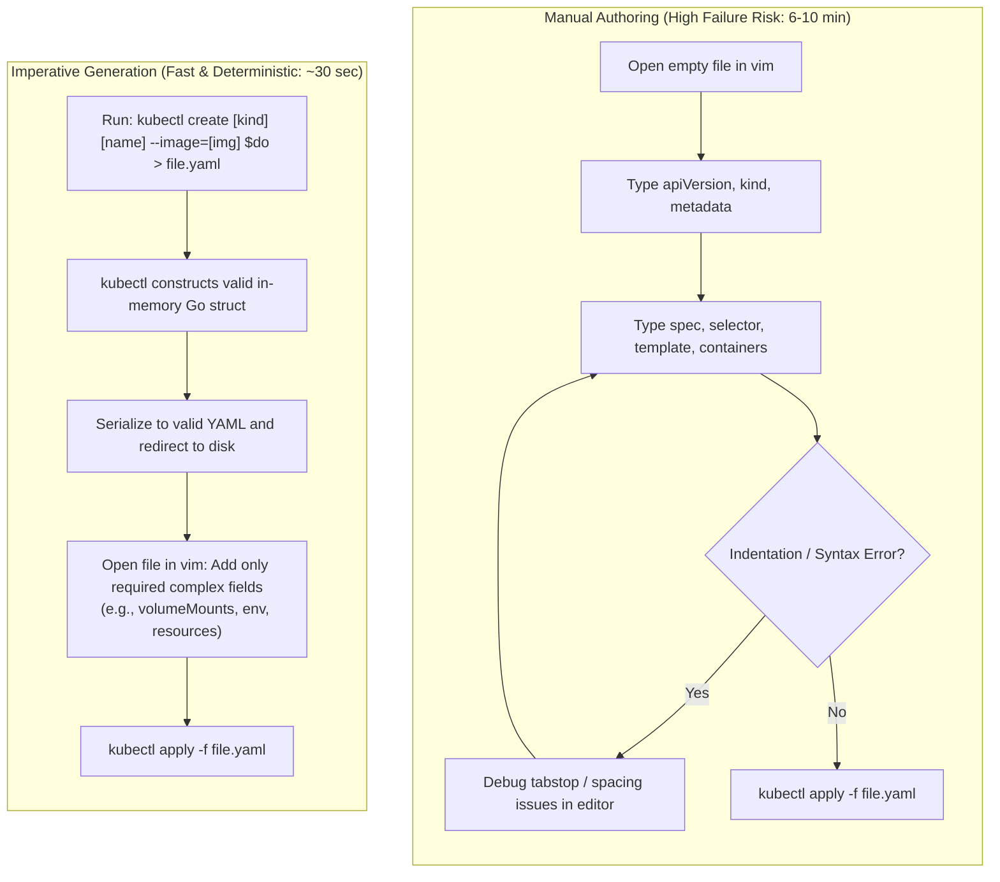
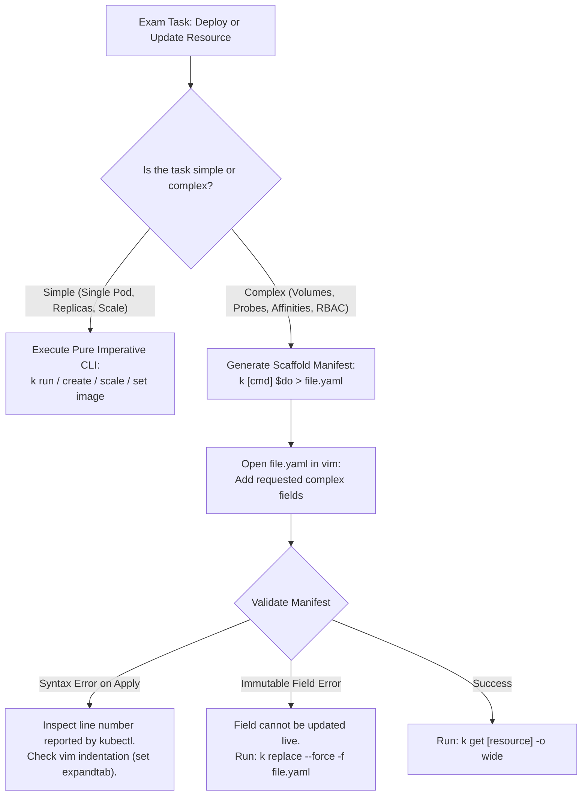

# Kubernetes Imperative CLI Shortcuts & Rapid Manifest Generation - CKA Exam Notes

> **Exam Domain**: Core Exam Strategy across All Domains (Cluster Architecture, Workloads, Services, Storage, Troubleshooting)  
> **Weight / Importance**: Critical (The single most decisive factor for completing the 2-hour CKA exam on time)  
> **Target Version**: Verified against v1.31 / v1.32 (Current CKA Curriculum)  
> **Allowed Docs Search Keywords**: `kubectl cheat sheet`, `imperative commands`, `kubectl run`, `kubectl create`  
> **Source**: Generated from `useful-shortcuts-raw.md`

---

## 1. Quick-Reference Summary

- **Primary Goal**: Minimize manual YAML writing and syntax debugging under the strict 120-minute CKA exam time limit. Use imperative CLI generation to produce 90% of boilerplate manifests in seconds.
- **The Core Boilerplate Generator**:
  ```bash
  export do="--dry-run=client -o yaml"
  ```
- **Instant Manifest Commands**:
  - **Pod**: `kubectl run nginx --image=nginx $do > pod.yaml`
  - **Deployment**: `kubectl create deployment web --image=nginx --replicas=3 $do > deploy.yaml`
  - **Service (ClusterIP)**: `kubectl expose deployment web --port=80 --target-port=8080 $do > svc.yaml`
  - **Service (NodePort)**: `kubectl create service nodeport web-np --tcp=80:8080 --node-port=30008 $do > np.yaml`
  - **Job**: `kubectl create job my-job --image=busybox $do -- /bin/sh -c "date" > job.yaml`
  - **CronJob**: `kubectl create cronjob my-cj --image=busybox --schedule="*/5 * * * *" $do -- date > cj.yaml`
  - **ConfigMap**: `kubectl create configmap app-cfg --from-literal=KEY=val $do > cm.yaml`
  - **Secret**: `kubectl create secret generic app-sec --from-literal=PASS=secret $do > sec.yaml`
  - **Role & RoleBinding**: `kubectl create role pod-reader --verb=get,list --resource=pods $do > role.yaml`
- **Instant Pod Deletion**:
  ```bash
  export now="--force --grace-period=0"
  kubectl delete pod <name> $now
  ```
- **Vim Configuration (`~/.vimrc`)**:
  ```vim
  set tabstop=2 shiftwidth=2 expandtab autoindent number
  ```

---

## 2. Conceptual Overview & Mental Model

### Dual-Layer Architectural Understanding

- **Simple English Explanation (How It Works)**:
  - **The Problem of Manual Authoring**: Kubernetes declarative manifests require strict YAML hierarchy, exact indentation, case-sensitive API group strings, and deeply nested lists of dictionaries. Manually typing a 40-line `Deployment` manifest into a text editor during a timed practical exam takes 5 to 8 minutes and frequently introduces syntax indentation errors that are time-consuming to isolate.
  - **What `--dry-run=client` Does in Memory**:
    When you pass `--dry-run=client` to `kubectl`, the command-line binary parses your CLI flags and constructs the full internal Go struct of the Kubernetes object entirely inside local memory.
    - It **does not send an HTTP request** to `kube-apiserver`.
    - It performs client-side field validation and populates mandatory parent keys (`apiVersion`, `kind`, `metadata`, `spec.template`, `spec.selector.matchLabels`).
  - **What `-o yaml` Does**:
    Instead of printing a standard console summary (e.g., `deployment.apps/nginx created`), `-o yaml` serializes the in-memory Go struct into formatted YAML and streams it to standard output (`stdout`).
  - **The Redirection Pattern (`> file.yaml`)**:
    Redirecting this stream to a local file creates a syntactically perfect, valid YAML template in under two seconds. The test-taker then opens the file to add only the specific advanced properties requested by the exam prompt (such as volume mounts, resource limits, readiness probes, or node affinities) before applying the file with `kubectl apply -f`.



- **Standard / Production Definition**:
  Imperative object generation is a hybrid operational workflow where the `kubectl` command-line interface builds and serializes complete API schema objects client-side without submitting state transitions to the API server. By capturing generated output via standard streams, operators decouple rapid scaffolding generation from declarative configuration management, combining imperative velocity with declarative reproducibility.

---

## 3. Deep-Dive Technical Breakdown

### 3.1 Terminal Environment & Shell Optimization

In the CKA exam terminal environment, you are given a bash shell on a Linux control plane or worker node. Setting up aliases and auto-completion in the first 30 seconds saves dozens of minutes over the course of the exam:

#### 1. Essential `.bashrc` Configurations
Execute or append to `~/.bashrc`:
```bash
# 1. Alias kubectl to k
alias k=kubectl

# 2. Enable autocomplete for the alias 'k'
source <(kubectl completion bash)
complete -o default -F __start_kubectl k

# 3. Environment shortcuts for dry-run and instant deletion
export do="--dry-run=client -o yaml"
export now="--force --grace-period=0"

# 4. Fast directory navigation and context verification
alias kgp="k get pods"
alias kgn="k get nodes"
alias kgs="k get svc"
alias kga="k get all"
```

#### 2. Essential `.vimrc` Configuration for YAML
Improper indentation is the most frequent cause of YAML parsing failures (`error: error parsing file.yaml: error converting YAML to JSON`). Configure `~/.vimrc`:
```vim
set tabstop=2
set shiftwidth=2
set expandtab
set autoindent
set smartindent
set number
```
- **`expandtab`**: Inserts spaces when the Tab key is pressed (YAML prohibits literal tab characters).
- **`shiftwidth=2`**: Indents lines by exactly 2 spaces on `>` or auto-indent.

---

### 3.2 Client-Side vs. Server-Side Dry-Run

Kubernetes supports two distinct dry-run flags:

| Dimension | `--dry-run=client` | `--dry-run=server` |
| :--- | :--- | :--- |
| **Execution Point** | Local `kubectl` binary process in terminal memory | `kube-apiserver` admission & validation pipeline |
| **Network Call?** | **No**. Can run completely offline without cluster access. | **Yes**. Sends HTTP POST request to API server. |
| **Admission Webhooks?**| No webhooks evaluated. | Validating admission controllers and webhooks run. |
| **Schema Validation** | Validates basic client-known flags and structure. | Validates cluster-side quotas, schema conflicts, and RBAC. |
| **Persists to etcd?** | **No**. | **No**. |
| **CKA Use Case** | **Generating starter YAML files locally**. | **Testing whether a manifest will be admitted without applying**. |

---

### 3.3 Core Resource Scaffolding Cheatsheet

#### 1. Pods (`kubectl run`)
```bash
# Basic Nginx Pod
k run nginx --image=nginx $do > pod.yaml

# Pod with custom port, labels, and environment variables
k run web-pod --image=nginx:alpine --port=80 -l "app=web,tier=frontend" --env="DB_HOST=mysql" $do > web-pod.yaml

# Pod with custom command and arguments
k run sleep-pod --image=busybox $do -- /bin/sh -c "sleep 3600" > sleep-pod.yaml

# Temporary interactive diagnostic pod (auto-deletes upon exit)
k run debug-pod --image=busybox:1.36 -it --rm -- sh
```

#### 2. Deployments (`kubectl create deployment`)
```bash
# Basic deployment with 3 replicas
k create deployment web-deploy --image=nginx:1.20 --replicas=3 $do > deploy.yaml

# Deployment with exposed container port
k create deployment api-deploy --image=python:3.9 --port=5000 --replicas=2 $do > api.yaml

# Scale an existing deployment immediately
k scale deployment web-deploy --replicas=5
```

#### 3. Services (`kubectl expose` and `kubectl create service`)
```bash
# Expose a deployment as ClusterIP (auto-copies label selector from deployment)
k expose deployment web-deploy --name=web-svc --port=80 --target-port=8080 $do > svc-clusterip.yaml

# Expose a deployment as NodePort
k expose deployment web-deploy --name=web-np --type=NodePort --port=80 --target-port=8080 $do > svc-nodeport.yaml

# Create a NodePort service with a specific nodePort imperatively
k create service nodeport web-np-direct --tcp=80:8080 --node-port=30008 $do > np-direct.yaml

# Create a Headless Service (clusterIP: None)
k create service clusterip my-headless --clusterip="None" $do > headless.yaml
```

#### 4. Batch Jobs and CronJobs (`kubectl create job / cronjob`)
```bash
# One-shot batch Job
k create job my-batch-job --image=busybox $do -- /bin/sh -c "echo 'Processing'; sleep 5" > job.yaml

# Recurring CronJob (schedule syntax: minute hour day-of-month month day-of-week)
k create cronjob backup-cj --image=busybox --schedule="*/15 * * * *" $do -- date > cronjob.yaml
```

#### 5. ConfigMaps and Secrets (`kubectl create configmap / secret`)
```bash
# ConfigMap from literal strings
k create configmap app-config --from-literal=ENV=production --from-literal=LOG_LEVEL=debug $do > cm.yaml

# ConfigMap from a local file
k create configmap nginx-conf --from-file=/etc/nginx/nginx.conf $do > cm-file.yaml

# Generic Secret from literal strings
k create secret generic db-secret --from-literal=password=SuperSecret123 $do > secret.yaml
```

#### 6. RBAC Objects (`kubectl create role / rolebinding / sa`)
```bash
# Create ServiceAccount
k create sa app-sa $do > sa.yaml

# Create a Role with specific verbs and resources
k create role pod-reader --verb=get,list,watch --resource=pods,pods/log $do > role.yaml

# Create a RoleBinding linking the Role to the ServiceAccount
k create rolebinding read-pods-binding --role=pod-reader --serviceaccount=default:app-sa $do > rb.yaml

# Create a ClusterRole and ClusterRoleBinding (cluster-wide)
k create clusterrole node-viewer --verb=get,list --resource=nodes $do > cr.yaml
k create clusterrolebinding view-nodes-binding --clusterrole=node-viewer --serviceaccount=default:app-sa $do > crb.yaml
```

---

## 4. Command Translation & Operational Mapping Tables

### 4.1 Resource Scaffolding Quick Reference

| Resource | Imperative Scaffold Command | Key Flags to Customize |
| :--- | :--- | :--- |
| **Pod** | `kubectl run <name> --image=<img涵盖> $do > pod.yaml` | `--port`, `-l`, `--env`, `-- <args>` |
| **Deployment** | `kubectl create deployment <name> --image= $do > deploy.yaml` | `--replicas=<N>`, `--port` |
| **Service (ClusterIP)** | `kubectl expose deployment <name> --port=<P> --target-port=<TP> $do > svc.yaml` | `--name`, `--port`, `--target-port` |
| **Service (NodePort)** | `kubectl create service nodeport <name> --tcp=<P>:<TP> --node-port=<NP> $do > np.yaml`| `--tcp`, `--node-port` |
| **Job** | `kubectl create job <name> --image= $do -- <cmd> > job.yaml` | `--`, commands/args |
| **CronJob** | `kubectl create cronjob <name> --image= --schedule="<cron>" $do -- <cmd>` | `--schedule` |
| **ConfigMap** | `kubectl create configmap <name> --from-literal=K=V $do > cm.yaml` | `--from-literal`, `--from-file` |
| **Secret** | `kubectl create secret generic <name> --from-literal=K=V $do > sec.yaml` | `--from-literal`, `--from-file` |
| **Role** | `kubectl create role <name> --verb=<v> --resource=<r> $do > role.yaml` | `--verb`, `--resource` |
| **RoleBinding** | `kubectl create rolebinding <name> --role=<R> --serviceaccount=<ns>:<sa> $do` | `--role`, `--serviceaccount` |

---

### 4.2 Output Formats & Formatting Flags

| Flag Syntax | Operational Result | Use Case |
| :--- | :--- | :--- |
| `-o yaml` | Prints the complete Kubernetes API object in YAML format | Scaffolding manifests and inspecting full specs |
| `-o json` | Prints the complete API object in JSON format | Piping into `jq` for advanced field extraction |
| `-o wide` | Displays additional columns (Node, Pod IP, Images, Selector) | Diagnosing node placement and pod IP assignments |
| `-o name` | Prints only the resource type and identifier (`pod/nginx`) | Passing directly to `kubectl delete $(...)` |
| `-o jsonpath='{...}'` | Extracts exact JSON fields via JSONPath expression | Querying internal status (e.g. node internal IPs) |

---

## 5. High-Yield CLI & Imperative Commands

### 5.1 JSONPath Power Commands for the CKA Exam

```bash
# 1. Extract all Node Internal IP addresses
k get nodes -o jsonpath='{.items[*].status.addresses[?(@.type=="InternalIP")].address}'

# 2. Extract container images from all running pods in a namespace
k get pods -o jsonpath='{.items[*].spec.containers[*].image}'

# 3. Sort nodes by OS image or kernel version
k get nodes --sort-by='{.status.nodeInfo.osImage}'

# 4. View the last-applied-configuration of a deployment
k get deployment web-deploy -o jsonpath='{.metadata.annotations.kubectl\.kubernetes\.io/last-applied-configuration}'
```

---

### 5.2 High-Speed Resource Modification Commands

```bash
# 1. Update container image without touching YAML
k set image deployment/web-deploy nginx-container=nginx:1.21

# 2. Scale deployment up or down
k scale deployment/web-deploy --replicas=6

# 3. Add or update labels on a running pod
k label pod nginx-pod tier=frontend --overwrite

# 4. Add an annotation
k annotate pod nginx-pod description="Production web frontend" --overwrite

# 5. Instantly force-delete a stuck or terminating pod
k delete pod stuck-pod --force --grace-period=0
```

---

## 6. Troubleshooting & Diagnostic Runbook

### Decision Tree: Rapid Resource Remediation in Exam



### Step-by-Step Triage Sequence

1. **Syntax Indentation Errors on `apply`**:
   - Error: `error converting YAML to JSON: yaml: line 14: did not find expected key`.
   - *Fix*: Open the file in `vim`, jump directly to line 14 (`:14`), verify that spaces (not literal tabs) are used, and ensure child keys are indented by exactly 2 spaces from their parent.

2. **Fixing Immutable Pod Specifications**:
   - Error: `The Pod "web" is invalid: spec: Forbidden: pod updates may not change fields other than ...`
   - *Fix*: Execute a force-replacement:
     ```bash
     k replace --force -f pod.yaml
     ```
     This triggers an immediate `DELETE` and `POST`, recreating the Pod with the revised spec.

3. **Verifying Permissions with `kubectl auth can-i`**:
   Before creating complex workloads or testing RBAC tasks:
   ```bash
   # Check if your user can create deployments
   k auth can-i create deployments
   
   # Check if a specific ServiceAccount can list secrets in a namespace
   k auth can-i list secrets --as=system:serviceaccount:default:app-sa -n default
   ```

---

## 7. CKA Exam Tips, Gotchas & Traps

> [!WARNING]
> **The `kubectl run` vs. `kubectl create deployment` Trap**:
> - `kubectl run web --image=nginx` creates a **single naked Pod** (`kind: Pod`).
> - `kubectl create deployment web --image=nginx` creates a **Deployment controller** (`kind: Deployment`).
> Read the question wording carefully: if it requests a *Pod*, do not create a Deployment; if it requests a *Deployment*, do not create a Pod.

> [!IMPORTANT]
> **Beware of `--dry-run` without `=client`**:
> In older Kubernetes versions, typing `--dry-run` without an argument defaulted to client mode. In modern Kubernetes (v1.31 / v1.32), omitting `=client` can trigger a server dry-run or throw a syntax warning. Always define your shell shortcut explicitly as:
> ```bash
> export do="--dry-run=client -o yaml"
> ```

> [!TIP]
> **Quick Pod Deletion**:
> Standard `kubectl delete pod <name>` initiates a 30-second graceful termination timeout (`terminationGracePeriodSeconds: 30`). In an exam with 120 minutes, waiting 30 seconds multiple times wastes critical time. Use:
> ```bash
> k delete pod <name> --force --grace-period=0
> ```
> To terminate and remove the object from `etcd` instantly.

---

## 8. Self-Test / Active Recall

Test your comprehension before clicking to reveal the solutions:

1. **What command-line arguments must be appended to `kubectl create deployment` to export a YAML manifest without creating the resource in the cluster?**
2. **What is the difference between `--dry-run=client` and `--dry-run=server`?**
3. **What two settings in `~/.vimrc` ensure that pressing the Tab key produces two spaces instead of a literal tab character?**
4. **How do you generate a NodePort Service YAML manifest imperatively with specific port numbers `80` (Service port) and `30008` (NodePort)?**
5. **What command allows you to verify whether a specific ServiceAccount named `app-sa` has permission to delete Pods in the `prod` namespace?**
6. **What command immediately deletes a Pod without waiting for the 30-second grace period?**
7. **What is the fastest way to extract only the internal IP addresses of all cluster nodes into a single string?**

<details>
<summary>Reveal Answers</summary>

1. `--dry-run=client -o yaml` (e.g., `kubectl create deployment web --image=nginx --dry-run=client -o yaml`).
2. `--dry-run=client` executes entirely in local `kubectl` memory without contacting `kube-apiserver` (best for scaffolding YAML). `--dry-run=server` sends an HTTP request to `kube-apiserver` to evaluate admission webhooks and cluster quotas without persisting state to `etcd`.
3. `set expandtab` (converts tabs to spaces) and `set shiftwidth=2` (or `set tabstop=2`).
4. `kubectl create service nodeport <name> --tcp=80:8080 --node-port=30008 --dry-run=client -o yaml`.
5. `kubectl auth can-i delete pods -n prod --as=system:serviceaccount:prod:app-sa`.
6. `kubectl delete pod <name> --force --grace-period=0`.
7. `kubectl get nodes -o jsonpath='{.items[*].status.addresses[?(@.type=="InternalIP")].address}'`.
</details>

---

### Official Documentation Bookmarks

Allowed for reference during the live exam at [kubernetes.io/docs](https://kubernetes.io/docs/home/):

| Topic | Direct Search Term | Recommended Anchor |
| :--- | :--- | :--- |
| **Kubectl Cheat Sheet** | `kubectl Cheat Sheet` | Reference > kubectl CLI > kubectl Cheat Sheet |
| **Imperative Commands** | `Managing Resources` | Tasks > Manage Kubernetes Objects > Managing Kubernetes Objects Using Imperative Commands |
| **JSONPath Support** | `JSONPath Support` | Reference > kubectl CLI > JSONPath Support |
| **API Resources Discovery** | `kubectl api-resources` | Reference > Command-Line Tools > kubectl > kubectl api-resources |

